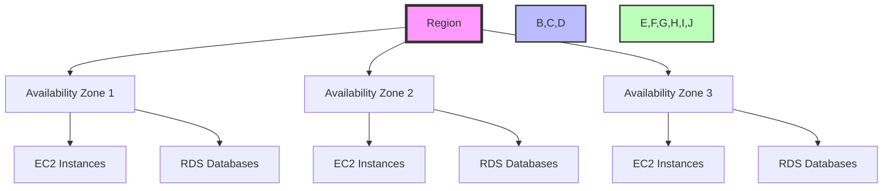
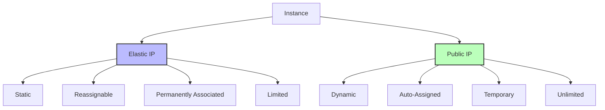

# AWS Fundamentals Questions and Answers

## 1. What is Amazon Web Services (AWS) and what are its key features?

Amazon Web Services (AWS) is a comprehensive cloud computing platform that offers over 200 fully featured services from data centers globally. It enables businesses to scale and grow more cost-effectively by providing a wide range of cloud services.

Key Features of AWS:
- **Scalability and Elasticity**: AWS provides tools for both vertical and horizontal scaling, allowing businesses to automatically adjust resources based on demand.
- **Global Reach**: With data centers in multiple geographic regions, AWS enables businesses to operate globally while maintaining compliance with local regulations.
- **Pay-As-You-Go Pricing**: This flexible pricing model allows users to pay only for the resources they consume, eliminating upfront costs and reducing operational expenses.
- **Security and Compliance**: AWS offers robust security tools and features, including encryption, identity management, and compliance with numerous industry standards (like SOC, PCI DSS, HIPAA).
- **Hybrid Capabilities**: AWS supports hybrid architectures, allowing seamless integration of on-premises solutions with cloud resources.
- **Artificial Intelligence and Machine Learning**: AWS provides powerful AI/ML services like Amazon SageMaker, Rekognition, and Comprehend, making it easier for businesses to implement intelligent applications.
- **Developer Tools**: Comprehensive suite of developer-centric services including code repository management (CodeCommit), continuous integration (CodePipeline), and deployment (CodeDeploy).
- **Internet of Things (IoT)**: AWS IoT services enable secure connection and interaction of devices with the cloud, supporting large-scale IoT deployments.

## 2. Concept of Regions and Availability Zones

AWS organizes its infrastructure into Regions and Availability Zones for high availability and disaster recovery:



- **Region**: A geographical location where AWS has data centers (e.g., US East, EU West). Each region is completely independent and isolated from other regions.
- **Availability Zone**: A data center location within a region. Key characteristics:
  - Each region typically has 2-3 AZs
  - AZs are isolated from each other to prevent failures from affecting multiple zones
  - Each AZ has its own power, cooling, and networking infrastructure
  - Used for high availability by deploying applications across multiple AZs
  - AZs are connected through low-latency links for fast communication

### Practical Example: Multi-AZ Deployment
```yaml
# AWS CloudFormation Template Example
Resources:
  WebServerGroup:
    Type: AWS::AutoScaling::AutoScalingGroup
    Properties:
      AvailabilityZones: ["us-east-1a", "us-east-1b", "us-east-1c"]
      MinSize: "2"
      MaxSize: "6"
      
  RDSInstance:
    Type: AWS::RDS::DBInstance
    Properties:
      MultiAZ: true
      BackupRetentionPeriod: 7
      
  LoadBalancer:
    Type: AWS::ElasticLoadBalancingV2::LoadBalancer
    Properties:
      Subnets:
        - subnet-1a
        - subnet-1b
        - subnet-1c
```

## 3. Amazon Machine Image (AMI)

An Amazon Machine Image (AMI) is a template that contains software configuration (operating system, application server, applications) for creating EC2 instances. Key aspects:

- **Components of AMI**:
  - Operating System (Linux, Windows, etc.)
  - Pre-configured software and applications
  - Data volumes
  - Security settings
  - Network configuration

- **Uses of AMI**:
  - Quick instance creation with pre-configured settings
  - Consistent environments across multiple instances
  - Backup and recovery of instances
  - Testing and development environments
  - Deployment of standardized applications
  - Migration of on-premises applications to AWS

## 4. Elastic IP vs Public IP

AWS provides two main types of IP addresses for internet connectivity:



- **Elastic IP (EIP)**:
  - Static IP address that remains associated with your AWS account
  - Can be reassigned between instances
  - Maintains the same IP address even when the instance is stopped
  - Limited number per account (typically 5-20)
  - Requires explicit allocation
  - Ideal for applications that need a consistent IP address

- **Public IP**:
  - Dynamic IP address assigned automatically to instances
  - Changes when the instance is stopped and started
  - Automatically assigned to instances with public subnet
  - No limit on number of addresses
  - Suitable for temporary or development environments
  - Automatically released when instance is terminated

### Practical Example: Using Elastic IP
```bash
# Allocate an Elastic IP
aws ec2 allocate-address

# Associate with an instance
aws ec2 associate-address --instance-id i-1234567890abcdef0 --allocation-id eipalloc-12345678

# Disassociate from an instance
aws ec2 disassociate-address --association-id eipassoc-12345678

# Release the Elastic IP
aws ec2 release-address --allocation-id eipalloc-12345678
```

## 5. AWS Management Console

The AWS Management Console is a web-based interface that provides complete control over AWS services. Key features:

- **Resource Management**:
  - Launch and manage EC2 instances, S3 buckets, RDS databases
  - Configure security groups and network settings
  - Manage CloudFormation templates and infrastructure

- **Monitoring and Analytics**:
  - Monitor resource usage and performance metrics
  - View CloudWatch logs and metrics
  - Track service health and availability
  - Set up alerts and notifications

- **Security Management**:
  - Configure IAM roles and permissions
  - Manage security groups and network access
  - Set up multi-factor authentication
  - Monitor security events and compliance

- **Cost Management**:
  - Track and analyze AWS spending
  - Set up budget alerts
  - View detailed billing reports
  - Manage cost allocation tags

- **Documentation and Support**:
  - Access comprehensive AWS documentation
  - Submit support tickets
  - View service health dashboard
  - Access training resources

- **Multi-account Management**:
  - Manage multiple AWS accounts from a single console
  - Set up consolidated billing
  - Configure cross-account access
  - Manage organization-wide policies

## 6. Elastic Computing

Elastic Computing in AWS refers to the ability to automatically adjust computing resources based on demand. Key aspects:

- **Auto Scaling**:
  - Automatically adjusts EC2 instances based on demand
  - Can scale both up and down
  - Uses CloudWatch metrics to trigger scaling events
  - Supports scheduled scaling based on predictable patterns

- **Instance Types**:
  - Various instance types optimized for different workloads
  - On-demand instances for immediate needs
  - Reserved instances for long-term commitments
  - Spot instances for cost-effective computing
  - Dedicated hosts for specific requirements

- **Load Balancing**:
  - Distributes incoming traffic across multiple instances
  - Supports HTTP/HTTPS, TCP, and UDP traffic
  - Provides health checks and automatic failover
  - Supports SSL termination and content caching

- **Cost Optimization**:
  - Pay only for what you use
  - No upfront costs
  - Flexible pricing options
  - Automatic optimization of resources

## 7. AWS Identity and Access Management (IAM)

IAM is a service that helps securely control access to AWS services and resources. Key features:

- **User Management**:
  - Create and manage AWS users
  - Assign roles and permissions
  - Manage access keys and credentials
  - Set up multi-factor authentication

- **Permission Control**:
  - Fine-grained access control using policies
  - Role-based access control
  - Resource-based permissions
  - Cross-account access management

- **Security Features**:
  - Multi-factor authentication
  - Password policies and rotation
  - Access key rotation
  - Security audit trails
  - Credential reports

- **Integration**:
  - Integrates with enterprise identity providers
  - Supports SAML 2.0 for single sign-on
  - Works with AWS Organizations
  - Supports custom identity providers

## 8. AWS Shared Responsibility Model

The AWS Shared Responsibility Model defines how security responsibilities are shared between AWS and its customers:

- **AWS Responsibilities**:
  - Security of the cloud (physical security of data centers)
  - Infrastructure security (network, hardware, software)
  - Compliance certifications
  - Data center operations
  - Physical and environmental controls

- **Customer Responsibilities**:
  - Security in the cloud (application security)
  - Data encryption and key management
  - Identity and access management
  - Network security configuration
  - Compliance with industry standards
  - Regular security audits

## 9. Vertical vs Horizontal Scaling

AWS provides two main approaches to scaling applications:

- **Vertical Scaling (Scale Up)**:
  - Increase resources of existing instances
  - Add more CPU, RAM, or storage
  - Limited by instance type specifications
  - Single point of failure if instance fails
  - Requires downtime for some upgrades
  - Suitable for predictable workloads

- **Horizontal Scaling (Scale Out)**:
  - Add more instances to handle load
  - Distributes load across multiple instances
  - Better fault tolerance through redundancy
  - More flexible and scalable
  - Uses load balancers for traffic distribution
  - Ideal for unpredictable or variable workloads
  - Supports automatic scaling based on demand

## 10. High Availability in AWS

High Availability in AWS ensures that applications remain operational even in the face of failures. Key concepts:

- **Multi-AZ Deployments**:
  - Deploy applications across multiple Availability Zones
  - Automatic failover between AZs
  - Redundant infrastructure for disaster recovery
  - Zero downtime during planned maintenance

- **Load Balancing**:
  - Distribute traffic across multiple instances
  - Automatic health checks and failover
  - Support for multiple protocols
  - Session persistence
  - SSL termination

- **Auto Scaling**:
  - Automatically adjust resources based on demand
  - Maintain minimum/maximum instance counts
  - Scale based on CloudWatch metrics
  - Support for scheduled scaling

- **Multi-Region Deployments**:
  - Deploy applications across different geographic regions
  - Regional failover capabilities
  - Global load balancing
  - Data replication across regions

- **Backup and Recovery**:
  - Automated backups using services like RDS
  - Point-in-time recovery
  - Cross-region replication
  - Disaster recovery planning

- **Health Monitoring**:
  - Continuous monitoring of application health
  - Automatic health checks
  - Alerting and notifications
  - Performance monitoring

- **Architectural Best Practices**:
  - Design for failure
  - Implement redundancy
  - Use managed services
  - Regular testing of failover scenarios
  - Documentation of recovery procedures

## 11. AWS Service Comparison and Pricing Considerations

### Key AWS Service Comparisons
- **Compute Options**: 
  - EC2 vs. Lambda: EC2 for persistent workloads, Lambda for event-driven tasks
  - Fargate vs. ECS: Fargate for serverless containers, ECS for more control
  - Lightsail vs. EC2: Lightsail for simpler management, EC2 for flexibility

### AWS Pricing Models
- **On-Demand**: Pay by the hour with no commitments
- **Reserved Instances**: 1-3 year commitments for up to 72% discount
- **Spot Instances**: Bid on unused capacity for up to 90% discount
- **Savings Plans**: Commitment to consistent usage for 1-3 years

### Cost Optimization Strategies
- Right-sizing instances
- Using Auto Scaling
- Implementing lifecycle policies
- Leveraging spot instances
- Monitoring with AWS Cost Explorer

---

Note: This document provides a comprehensive overview of AWS fundamentals. While it covers key concepts, AWS continuously evolves with new services and features. For the most up-to-date information, refer to AWS official documentation and best practices guides.
