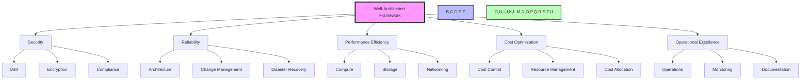

# AWS Advanced Topics and Best Practices

## 1. AWS Well-Architected Framework and its pillars

The AWS Well-Architected Framework is a set of best practices and guidelines that help organizations build secure, high-performing, resilient, and efficient infrastructure for their applications. It provides a consistent approach to evaluate architectures and implement designs that will scale over time.



### Five Pillars

1. **Security**
   - **Identity and Access Management**:
     - **IAM Roles and Policies**:
       - Role-based access control
       - Policy templates
       - Cross-account access
       - Service-linked roles
     - **Multi-factor Authentication**:
       - Hardware tokens
       - Virtual MFA devices
       - SMS-based MFA
       - Time-based one-time passwords
     - **Access Control**:
       - Resource-based policies
       - Organization policies
       - Service control policies
       - Permission boundaries

### Practical Example: Implementing Security Best Practices
```yaml
# CloudFormation Security Template
Resources:
  # IAM Role with least privilege
  AppRole:
    Type: AWS::IAM::Role
    Properties:
      AssumeRolePolicyDocument:
        Version: '2012-10-17'
        Statement:
          - Effect: Allow
            Principal:
              Service: ec2.amazonaws.com
            Action: sts:AssumeRole
      Policies:
        - PolicyName: AppPolicy
          PolicyDocument:
            Version: '2012-10-17'
            Statement:
              - Effect: Allow
                Action:
                  - s3:GetObject
                  - s3:PutObject
                Resource: arn:aws:s3:::my-app-bucket/*

  # Secure S3 Bucket
  AppBucket:
    Type: AWS::S3::Bucket
    Properties:
      BucketEncryption:
        ServerSideEncryptionConfiguration:
          - ServerSideEncryptionByDefault:
              SSEAlgorithm: AES256
      PublicAccessBlockConfiguration:
        BlockPublicAcls: true
        BlockPublicPolicy: true
        IgnorePublicAcls: true
        RestrictPublicBuckets: true

# Example Security Group
SecurityGroup:
  Type: AWS::EC2::SecurityGroup
  Properties:
    GroupDescription: Secure application access
    SecurityGroupIngress:
      - IpProtocol: tcp
        FromPort: 443
        ToPort: 443
        CidrIp: 10.0.0.0/16
      - IpProtocol: tcp
        FromPort: 22
        ToPort: 22
        CidrIp: 10.0.0.0/16

# Example KMS Key Policy
{
    "Version": "2012-10-17",
    "Statement": [
        {
            "Sid": "Enable IAM User Permissions",
            "Effect": "Allow",
            "Principal": {"AWS": "arn:aws:iam::123456789012:root"},
            "Action": "kms:*",
            "Resource": "*"
        },
        {
            "Sid": "Allow use of the key",
            "Effect": "Allow",
            "Principal": {"AWS": "arn:aws:iam::123456789012:user/app-user"},
            "Action": [
                "kms:Encrypt",
                "kms:Decrypt",
                "kms:ReEncrypt*",
                "kms:GenerateDataKey*",
                "kms:DescribeKey"
            ],
            "Resource": "*"
        }
    ]
}

# Example CloudTrail Configuration
{
    "CloudWatchLogsLogGroupArn": "arn:aws:logs:us-east-1:123456789012:log-group:/aws/cloudtrail/MyTrail",
    "CloudWatchLogsRoleArn": "arn:aws:iam::123456789012:role/CloudTrail_CloudWatchLogs_Role",
    "IncludeGlobalServiceEvents": true,
    "IsMultiRegionTrail": true,
    "KmsKeyId": "arn:aws:kms:us-east-1:123456789012:key/12345678-1234-1234-1234-123456789012",
    "S3BucketName": "my-cloudtrail-bucket",
    "S3KeyPrefix": "cloudtrail/",
    "SnsTopicName": "my-cloudtrail-topic"
}
```

   - **Data Protection**:
     - **Encryption**:
       - Data at rest
       - Data in transit
       - Key management
       - Encryption standards
     - **Data Lifecycle Management**:
       - Data classification
       - Data retention
       - Data archiving
       - Data deletion
     - **Access Control**:
       - Row-level security
       - Column-level security
       - Data masking
       - Tokenization

   - **Infrastructure Protection**:
     - **Network Security**:
       - VPC configuration
       - Network ACLs
       - Security groups
       - IP whitelisting
     - **Firewall Management**:
       - AWS WAF
       - Network firewalls
       - Application firewalls
       - Firewall rules
     - **Security Groups**:
       - Inbound rules
       - Outbound rules
       - Security group rules
       - Security group management

   - **Threat Detection**:
     - **Monitoring**:
       - CloudWatch metrics
       - CloudTrail logs
       - GuardDuty alerts
       - Security Hub findings
     - **Logging**:
       - Access logs
       - Audit logs
       - Security logs
       - Operational logs
     - **Alerting**:
       - CloudWatch alarms
       - SNS notifications
       - Custom alerts
       - Alert escalation

2. **Reliability**
   - **Foundational Design**:
     - **Architecture Design**:
       - Reference architectures
       - Design patterns
       - Anti-patterns
       - Best practices
     - **Service Selection**:
       - Service capabilities
       - Service limitations
       - Service dependencies
       - Service integration
     - **Availability Requirements**:
       - SLA requirements
       - RTO/RPO targets
       - Recovery objectives
       - Service levels

   - **Change Management**:
     - **Deployment Strategies**:
       - Blue/green deployments
       - Canary deployments
       - Rolling updates
       - In-place updates
     - **Rollback Procedures**:
       - Automated rollbacks
       - Manual rollbacks
       - Recovery procedures
       - Backup procedures
     - **Testing**:
       - Integration testing
       - Performance testing
       - Security testing
       - Disaster recovery testing

   - **Failure Management**:
     - **Recovery Planning**:
       - Recovery procedures
       - Recovery testing
       - Recovery validation
       - Recovery documentation
     - **Disaster Recovery**:
       - Backup strategies
       - Recovery time objectives
       - Recovery point objectives
       - Disaster recovery testing
     - **Backup Strategies**:
       - Backup frequency
       - Backup retention
       - Backup validation
       - Backup automation

   - **Monitoring**:
     - **Health Checks**:
       - Application health
       - Infrastructure health
       - Service health
       - System health
     - **Performance Monitoring**:
       - Performance metrics
       - Performance thresholds
       - Performance alerts
       - Performance optimization
     - **Alerting**:
       - Alert thresholds
       - Alert escalation
       - Alert validation
       - Alert automation

3. **Performance Efficiency**
   - **Compute Selection**:
     - **Instance Selection**:
       - Instance types
       - Instance sizing
       - Instance optimization
       - Instance comparison
     - **Auto Scaling**:
       - Scaling policies
       - Scaling metrics
       - Scaling thresholds
       - Scaling automation
     - **Spot Instances**:
       - Spot instance pricing
       - Spot instance lifecycle
       - Spot instance management
       - Spot instance optimization

   - **Storage Optimization**:
     - **Storage Selection**:
       - Storage types
       - Storage performance
       - Storage costs
       - Storage optimization
     - **Data Lifecycle**:
       - Data retention
       - Data archiving
       - Data deletion
       - Data management
     - **Caching Strategies**:
       - Cache implementation
       - Cache optimization
       - Cache management
       - Cache validation

   - **Networking**:
     - **Network Design**:
       - Network architecture
       - Network optimization
       - Network security
       - Network monitoring
     - **Content Delivery**:
       - CDN implementation
       - CDN optimization
       - CDN management
       - CDN monitoring
     - **DNS Management**:
       - DNS configuration
       - DNS optimization
       - DNS security
       - DNS monitoring

   - **Monitoring**:
     - **Performance Metrics**:
       - Compute metrics
       - Storage metrics
       - Network metrics
       - Application metrics
     - **Resource Utilization**:
       - Resource monitoring
       - Resource optimization
       - Resource management
       - Resource reporting
     - **Cost Optimization**:
       - Cost monitoring
       - Cost optimization
       - Cost management
       - Cost reporting

4. **Cost Optimization**
   - **Billing and Cost Management**:
     - **Cost Allocation**:
       - Cost allocation tags
       - Cost allocation reports
       - Cost allocation tracking
       - Cost allocation optimization
     - **Budgets**:
       - Budget creation
       - Budget monitoring
       - Budget alerts
       - Budget optimization
     - **Cost Alerts**:
       - Alert thresholds
       - Alert escalation
       - Alert validation
       - Alert automation

   - **Resource Management**:
     - **Right-sizing**:
       - Instance optimization
       - Storage optimization
       - Network optimization
       - Resource optimization
     - **Auto Scaling**:
       - Scaling automation
       - Scaling optimization
       - Scaling management
       - Scaling monitoring
     - **Resource Cleanup**:
       - Resource identification
       - Resource cleanup
       - Resource validation
       - Resource automation

   - **Cost Optimization Tools**:
     - **Cost Explorer**:
       - Cost analysis
       - Cost optimization
       - Cost reporting
       - Cost forecasting
     - **Savings Plans**:
       - Plan creation
       - Plan optimization
       - Plan management
       - Plan monitoring
     - **Reserved Instances**:
       - Instance optimization
       - Instance management
       - Instance monitoring
       - Instance reporting

   - **Pricing Strategies**:
     - **On-demand Pricing**:
       - Pricing optimization
       - Pricing management
       - Pricing monitoring
       - Pricing reporting
     - **Savings Plans**:
       - Plan optimization
       - Plan management
       - Plan monitoring
       - Plan reporting
     - **Reserved Instances**:
       - Instance optimization
       - Instance management
       - Instance monitoring
       - Instance reporting

5. **Operational Excellence**
   - **Operations Management**:
     - **Change Management**:
       - Change procedures
       - Change validation
       - Change automation
       - Change monitoring
     - **Incident Management**:
       - Incident procedures
       - Incident validation
       - Incident automation
       - Incident monitoring
     - **Service Management**:
       - Service procedures
       - Service validation
       - Service automation
       - Service monitoring

   - **Documentation**:
     - **Runbooks**:
       - Runbook creation
       - Runbook validation
       - Runbook automation
       - Runbook monitoring
     - **Standard Operating Procedures**:
       - SOP creation
       - SOP validation
       - SOP automation
       - SOP monitoring
     - **Knowledge Management**:
       - Knowledge creation
       - Knowledge validation
       - Knowledge automation
       - Knowledge monitoring

   - **Monitoring**:
     - **Metrics Collection**:
       - Metric creation
       - Metric validation
       - Metric automation
       - Metric monitoring
     - **Log Management**:
       - Log creation
       - Log validation
       - Log automation
       - Log monitoring
     - **Alerting**:
       - Alert creation
       - Alert validation
       - Alert automation
       - Alert monitoring

   - **Continuous Improvement**:
     - **Process Improvement**:
       - Process optimization
       - Process validation
       - Process automation
       - Process monitoring
     - **Automation**:
       - Automation implementation
       - Automation optimization
       - Automation validation
       - Automation monitoring
     - **Best Practices**:
       - Practice implementation
       - Practice optimization
       - Practice validation
       - Practice monitoring

### Best Practices

1. **Security**
   - **Identity and Access**:
     - **Implementation**:
       - Use IAM roles instead of root access
       - Implement MFA for all users
       - Regularly rotate credentials
       - Use least privilege principle
     - **Validation**:
       - Regular security audits
       - Credential validation
       - Access validation
       - Role validation
     - **Automation**:
       - Automated credential rotation
       - Automated access validation
       - Automated role validation
       - Automated security checks

   - **Data Protection**:
     - **Implementation**:
       - Encrypt all sensitive data
       - Implement proper access controls
       - Regular backups
       - Data classification
     - **Validation**:
       - Regular encryption validation
       - Access validation
       - Backup validation
       - Classification validation
     - **Automation**:
       - Automated encryption
       - Automated access control
       - Automated backup
       - Automated classification

   - **Infrastructure Security**:
     - **Implementation**:
       - Secure network boundaries
       - Regular security audits
       - Patch management
       - Security validation
     - **Validation**:
       - Network validation
       - Audit validation
       - Patch validation
       - Security validation
     - **Automation**:
       - Automated network security
       - Automated audits
       - Automated patching
       - Automated security

2. **Reliability**
   - **Architecture Design**:
     - **Implementation**:
       - Design for failure
       - Implement redundancy
       - Use appropriate services
       - Design validation
     - **Validation**:
       - Design validation
       - Redundancy validation
       - Service validation
       - Design testing
     - **Automation**:
       - Automated design validation
       - Automated redundancy
       - Automated service implementation
       - Automated design testing

   - **Change Management**:
     - **Implementation**:
       - Automated deployments
       - Rollback procedures
       - Testing environments
       - Change validation
     - **Validation**:
       - Deployment validation
       - Rollback validation
       - Testing validation
       - Change validation
     - **Automation**:
       - Automated deployments
       - Automated rollbacks
       - Automated testing
       - Automated change management

   - **Monitoring**:
     - **Implementation**:
       - Comprehensive monitoring
       - Alert thresholds
       - Regular reviews
       - Monitoring validation
     - **Validation**:
       - Monitoring validation
       - Alert validation
       - Review validation
       - Monitoring testing
     - **Automation**:
       - Automated monitoring
       - Automated alerts
       - Automated reviews
       - Automated monitoring testing

3. **Performance Efficiency**
   - **Compute Optimization**:
     - **Implementation**:
       - Right-size instances
       - Use appropriate instance types
       - Implement auto scaling
       - Compute validation
     - **Validation**:
       - Instance validation
       - Type validation
       - Scaling validation
       - Compute testing
     - **Automation**:
       - Automated instance sizing
       - Automated type selection
       - Automated scaling
       - Automated compute testing

   - **Storage Optimization**:
     - **Implementation**:
       - Use appropriate storage types
       - Implement caching
       - Regular cleanup
       - Storage validation
     - **Validation**:
       - Type validation
       - Cache validation
       - Cleanup validation
       - Storage testing
     - **Automation**:
       - Automated storage selection
       - Automated caching
       - Automated cleanup
       - Automated storage testing

   - **Monitoring**:
     - **Implementation**:
       - Performance metrics
       - Resource utilization
       - Cost optimization
       - Monitoring validation
     - **Validation**:
       - Metric validation
       - Utilization validation
       - Cost validation
       - Monitoring testing
     - **Automation**:
       - Automated metrics
       - Automated utilization
       - Automated cost optimization
       - Automated monitoring testing

4. **Cost Optimization**
   - **Resource Management**:
     - **Implementation**:
       - Regular audits
       - Right-sizing
       - Cleanup unused resources
       - Resource validation
     - **Validation**:
       - Audit validation
       - Sizing validation
       - Cleanup validation
       - Resource testing
     - **Automation**:
       - Automated audits
       - Automated sizing
       - Automated cleanup
       - Automated resource testing

   - **Pricing Strategies**:
     - **Implementation**:
       - Use appropriate pricing models
       - Implement savings plans
       - Use reserved instances
       - Pricing validation
     - **Validation**:
       - Model validation
       - Plan validation
       - Instance validation
       - Pricing testing
     - **Automation**:
       - Automated pricing
       - Automated savings
       - Automated instances
       - Automated pricing testing

   - **Monitoring**:
     - **Implementation**:
       - Cost tracking
       - Budget alerts
       - Regular reviews
       - Cost validation
     - **Validation**:
       - Tracking validation
       - Alert validation
       - Review validation
       - Cost testing
     - **Automation**:
       - Automated tracking
       - Automated alerts
       - Automated reviews
       - Automated cost testing

5. **Operational Excellence**
   - **Documentation**:
     - **Implementation**:
       - Maintain runbooks
       - Document procedures
       - Regular updates
       - Documentation validation
     - **Validation**:
       - Runbook validation
       - Procedure validation
       - Update validation
       - Documentation testing
     - **Automation**:
       - Automated documentation
       - Automated updates
       - Automated validation
       - Automated testing

   - **Monitoring**:
     - **Implementation**:
       - Comprehensive monitoring
       - Alert thresholds
       - Regular reviews
       - Monitoring validation
     - **Validation**:
       - Monitoring validation
       - Alert validation
       - Review validation
       - Monitoring testing
     - **Automation**:
       - Automated monitoring
       - Automated alerts
       - Automated reviews
       - Automated monitoring testing

   - **Automation**:
     - **Implementation**:
       - Automate repetitive tasks
       - Implement CI/CD
       - Use infrastructure as code
       - Automation validation
     - **Validation**:
       - Task validation
       - CI/CD validation
       - Code validation
       - Automation testing
     - **Automation**:
       - Automated tasks
       - Automated CI/CD
       - Automated code
       - Automated testing

## 2. AWS Serverless Application Repository

The AWS Serverless Application Repository is a managed repository for serverless applications that enables you to find, deploy, and publish serverless applications.

### Key Features

1. **Application Discovery**
   - **Search and Filter**:
     - Search by keywords
     - Filter by category
     - View ratings
   - **Application Details**:
     - Documentation
     - Dependencies
     - Source code
   - **Deployment Information**:
     - Resource requirements
     - Permissions
     - Configuration

2. **Deployment**
   - **One-Click Deployment**:
     - Simple deployment
     - Resource creation
     - Configuration
   - **Custom Deployment**:
     - Parameter customization
     - Resource configuration
     - Permission management
   - **Version Management**:
     - Version tracking
     - Rollback capabilities
     - Change history

3. **Publishing**
   - **Application Creation**:
     - Application packaging
     - Resource definition
     - Documentation
   - **Version Management**:
     - Version control
     - Change tracking
     - Release management
   - **Distribution**:
     - Public sharing
     - Private sharing
     - License management

### Best Practices

1. **Application Development**
   - **Code Organization**:
     - Modular design
     - Clear documentation
     - Version control
   - **Resource Management**:
     - Resource optimization
     - Cost management
     - Security considerations
   - **Testing**:
     - Comprehensive testing
     - Performance testing
     - Security testing

2. **Deployment**
   - **Parameter Management**:
     - Clear parameter definitions
     - Default values
     - Validation
   - **Resource Management**:
     - Resource optimization
     - Cost management
     - Security considerations
   - **Monitoring**:
     - Performance metrics
     - Error tracking
     - Resource utilization

3. **Publishing**
   - **Documentation**:
     - Clear documentation
     - Usage examples
     - Security considerations
   - **Version Management**:
     - Version control
     - Change tracking
     - Release management
   - **Distribution**:
     - License management
     - Usage tracking
     - Feedback collection

## 3. AWS Outposts

AWS Outposts is a fully managed service that extends AWS infrastructure, services, APIs, and tools to virtually any data center, co-location space, or on-premises facility.

### Key Features

1. **Infrastructure**
   - **Hardware**:
     - AWS-designed servers
     - Local compute and storage
     - Networking equipment
   - **Services**:
     - EC2
     - EBS
     - S3
     - RDS
     - VPC
   - **Management**:
     - AWS Console access
     - AWS CLI support
     - AWS SDK compatibility

2. **Integration**
   - **AWS Services**:
     - VPC integration
     - IAM integration
     - CloudFormation support
   - **On-Premises**:
     - Local network integration
     - Existing infrastructure
     - Existing security
   - **Cloud Integration**:
     - AWS Cloud integration
     - Hybrid cloud capabilities
     - Data replication

3. **Management**
   - **Monitoring**:
     - CloudWatch metrics
     - AWS Systems Manager
     - AWS CloudTrail
   - **Security**:
     - AWS security controls
     - Local security
     - Network isolation
   - **Operations**:
     - Automated updates
     - Patch management
     - Backup management

### Use Cases

1. **Local Processing**
   - **Low Latency**:
     - Real-time applications
     - Edge computing
     - IoT devices
   - **Data Processing**:
     - Local data processing
     - Local analytics
     - Local storage
   - **Local Storage**:
     - Local caching
     - Local backup
     - Local archiving

2. **Hybrid Cloud**
   - **Hybrid Applications**:
     - Hybrid architectures
     - Hybrid data processing
     - Hybrid storage
   - **Migration**:
     - On-premises migration
     - Hybrid migration
     - Cloud migration
   - **Integration**:
     - Hybrid integration
     - Hybrid networking
     - Hybrid security

3. **Edge Computing**
   - **Edge Applications**:
     - Edge processing
     - Edge analytics
     - Edge storage
   - **Edge Devices**:
     - Edge devices
     - Edge sensors
     - Edge cameras
   - **Edge Services**:
     - Edge services
     - Edge APIs
     - Edge functions

## 4. AWS Wavelength

AWS Wavelength is a service that places AWS compute and storage services at the edge of 5G networks, enabling developers to build applications that require ultra-low latency and high bandwidth.

### Key Features

1. **Compute**
   - **Edge Compute**:
     - Local compute
     - Local storage
     - Local networking
   - **Instance Types**:
     - EC2 instances
     - Lambda functions
     - Container support
   - **Performance**:
     - Ultra-low latency
     - High bandwidth
     - Local processing

2. **Networking**
   - **5G Integration**:
     - 5G connectivity
     - 5G optimization
     - 5G security
   - **Local Networking**:
     - Local network
     - Local routing
     - Local DNS
   - **Security**:
     - Network isolation
     - Security controls
     - Access control

3. **Integration**
   - **AWS Services**:
     - VPC integration
     - IAM integration
     - CloudFormation support
   - **5G Services**:
     - 5G network
     - 5G security
     - 5G management
   - **Developer Tools**:
     - AWS Console
     - AWS CLI
     - AWS SDK

### Benefits

1. **Performance**
   - **Latency**:
     - Ultra-low latency
     - Local processing
     - Local storage
   - **Bandwidth**:
     - High bandwidth
     - Local networking
     - Local optimization
   - **Processing**:
     - Local processing
     - Local storage
     - Local networking

2. **Cost**
   - **Bandwidth**:
     - Reduced bandwidth
     - Local processing
     - Local storage
   - **Compute**:
     - Local compute
     - Local storage
     - Local networking
   - **Storage**:
     - Local storage
     - Local processing
     - Local networking

3. **Security**
   - **Network**:
     - Network isolation
     - Security controls
     - Access control
   - **Data**:
     - Data encryption
     - Data protection
     - Data management
   - **Access**:
     - Access control
     - Authentication
     - Authorization

## 5. AWS Local Zones

AWS Local Zones are AWS infrastructure deployments that place compute, storage, database, and other select services closer to end users to run workloads that require single-digit millisecond latency to end users.

### Key Features

1. **Infrastructure**
   - **Compute**:
     - EC2 instances
     - Local compute
     - Local storage
   - **Storage**:
     - Local storage
     - Local caching
     - Local backup
   - **Database**:
     - Local databases
     - Local caching
     - Local replication

2. **Networking**
   - **Local Networking**:
     - Local network
     - Local routing
     - Local DNS
   - **Security**:
     - Network isolation
     - Security controls
     - Access control
   - **Integration**:
     - VPC integration
     - IAM integration
     - CloudFormation support

3. **Management**
   - **Monitoring**:
     - CloudWatch metrics
     - AWS Systems Manager
     - AWS CloudTrail
   - **Security**:
     - AWS security controls
     - Local security
     - Network isolation
   - **Operations**:
     - Automated updates
     - Patch management
     - Backup management

### Use Cases

1. **Low Latency Applications**
   - **Media Processing**:
     - Video processing
     - Image processing
     - Audio processing
   - **Gaming**:
     - Game servers
     - Game streaming
     - Game processing
   - **AR/VR**:
     - AR applications
     - VR applications
     - Mixed reality

2. **Local Processing**
   - **Data Processing**:
     - Local data processing
     - Local analytics
     - Local storage
   - **Machine Learning**:
     - Local ML models
     - Local inference
     - Local training
   - **IoT**:
     - IoT devices
     - IoT processing
     - IoT storage

3. **Content Delivery**
   - **CDN**:
     - Local caching
     - Local delivery
     - Local optimization
   - **Streaming**:
     - Local streaming
     - Local processing
     - Local optimization
   - **Content**:
     - Local content
     - Local delivery
     - Local optimization

## 6. AWS CloudFormation Custom Resources

AWS CloudFormation Custom Resources allow you to extend CloudFormation's capabilities by creating custom resources that can be used in your CloudFormation templates.

### Key Features

1. **Resource Types**
   - **Custom Resources**:
     - Custom resource types
     - Custom properties
     - Custom attributes
   - **Resource Handlers**:
     - Create handler
     - Update handler
     - Delete handler
   - **Resource Management**:
     - Resource creation
     - Resource updates
     - Resource deletion

2. **Implementation**
   - **Lambda Functions**:
     - Custom resource handlers
     - Custom logic
     - Custom validation
   - **External Services**:
     - External API calls
     - External integrations
     - External resources
   - **Resource Management**:
     - Resource creation
     - Resource updates
     - Resource deletion

3. **Management**
   - **Resource Management**:
     - Resource tracking
     - Resource cleanup
     - Resource validation
   - **Error Handling**:
     - Error detection
     - Error handling
     - Error recovery
   - **Monitoring**:
     - Resource metrics
     - Resource logging
     - Resource alerts

### Best Practices

1. **Resource Design**
   - **Resource Properties**:
     - Clear property definitions
     - Property validation
     - Property documentation
   - **Resource Handlers**:
     - Clear handler logic
     - Error handling
     - Resource cleanup
   - **Resource Management**:
     - Resource tracking
     - Resource cleanup
     - Resource validation

2. **Implementation**
   - **Lambda Functions**:
     - Proper error handling
     - Resource cleanup
     - Logging
   - **External Services**:
     - Proper error handling
     - Resource cleanup
     - Logging
   - **Resource Management**:
     - Resource tracking
     - Resource cleanup
     - Resource validation

3. **Monitoring**
   - **Resource Metrics**:
     - Resource utilization
     - Resource errors
     - Resource performance
   - **Resource Logging**:
     - Resource creation
     - Resource updates
     - Resource deletion
   - **Resource Alerts**:
     - Resource errors
     - Resource performance
     - Resource utilization

## 7. AWS Elastic Beanstalk Blue/Green Deployments

Blue/green deployment is a strategy that reduces downtime and risk by running two identical production environments called blue and green.

### Key Features

1. **Deployment Process**
   - **Blue Environment**:
     - Current production
     - Live traffic
     - Stable version
   - **Green Environment**:
     - New version
     - Testing
     - Validation
   - **Traffic Management**:
     - Traffic routing
     - Load balancing
     - Health checks

2. **Rollback Capabilities**
   - **Quick Rollback**:
     - Immediate rollback
     - Traffic redirection
     - Resource cleanup
   - **Resource Management**:
     - Resource tracking
     - Resource cleanup
     - Resource validation
   - **Error Handling**:
     - Error detection
     - Error handling
     - Error recovery

3. **Monitoring**
   - **Resource Metrics**:
     - Resource utilization
     - Resource errors
     - Resource performance
   - **Health Checks**:
     - Application health
     - Resource health
     - Environment health
   - **Logging**:
     - Application logs
     - Resource logs
     - Environment logs

### Benefits

1. **Reduced Downtime**
   - **Zero Downtime**:
     - Continuous operation
     - Traffic routing
     - Resource management
   - **Quick Recovery**:
     - Immediate rollback
     - Traffic redirection
     - Resource cleanup
   - **Risk Reduction**:
     - Testing environment
     - Validation
     - Error detection

2. **Improved Reliability**
   - **Stable Environment**:
     - Current production
     - Live traffic
     - Stable version
   - **Testing Environment**:
     - New version
     - Testing
     - Validation
   - **Monitoring**:
     - Resource metrics
     - Health checks
     - Logging

3. **Cost Optimization**
   - **Resource Management**:
     - Resource tracking
     - Resource cleanup
     - Resource validation
   - **Traffic Management**:
     - Traffic routing
     - Load balancing
     - Health checks
   - **Monitoring**:
     - Resource metrics
     - Health checks
     - Logging

## 8. AWS Global Accelerator

AWS Global Accelerator is a service that improves the availability and performance of applications with users worldwide by routing traffic through AWS's global network.

### Key Features

1. **Network Optimization**
   - **Global Network**:
     - AWS global network
     - Edge locations
     - Network optimization
   - **Traffic Management**:
     - Traffic routing
     - Load balancing
     - Health checks
   - **Performance**:
     - Reduced latency
     - Improved performance
     - Better reliability

2. **Endpoint Management**
   - **Endpoint Types**:
     - Network Load Balancer
     - Application Load Balancer
     - EC2 instances
   - **Endpoint Groups**:
     - Regional groups
     - Weighted endpoints
     - Health checks
   - **Endpoint Health**:
     - Health checks
     - Automatic failover
     - Traffic routing

3. **Integration**
   - **AWS Services**:
     - VPC integration
     - IAM integration
     - CloudFormation support
   - **Third-Party Services**:
     - External integrations
     - Custom integrations
     - API integrations
   - **Developer Tools**:
     - AWS Console
     - AWS CLI
     - AWS SDK

### Benefits

1. **Performance**
   - **Latency**:
     - Reduced latency
     - Improved performance
     - Better reliability
   - **Bandwidth**:
     - Increased bandwidth
     - Better throughput
     - Improved performance
   - **Availability**:
     - Improved availability
     - Better reliability
     - Better performance

2. **Cost**
   - **Bandwidth**:
     - Reduced bandwidth
     - Better throughput
     - Improved performance
   - **Compute**:
     - Reduced compute
     - Better utilization
     - Improved performance
   - **Storage**:
     - Reduced storage
     - Better utilization
     - Improved performance

3. **Security**
   - **Network**:
     - Network isolation
     - Security controls
     - Access control
   - **Data**:
     - Data encryption
     - Data protection
     - Data management
   - **Access**:
     - Access control
     - Authentication
     - Authorization

## 9. AWS Control Tower

AWS Control Tower is a service that helps organizations set up and govern a secure, multi-account AWS environment based on AWS best practices.

### Key Features

1. **Account Management**
   - **Account Creation**:
     - Automated account creation
     - Custom account configurations
     - Account naming conventions
   - **Account Organization**:
     - Organizational units
     - Account grouping
     - Account hierarchy
   - **Account Governance**:
     - Account policies
     - Account permissions
     - Account auditing

2. **Security**
   - **Guardrails**:
     - Preventive guardrails
     - Detective guardrails
     - Corrective guardrails
   - **Compliance**:
     - Compliance policies
     - Compliance monitoring
     - Compliance reporting
   - **Audit**:
     - Audit trails
     - Audit logs
     - Audit reports

3. **Management**
   - **Dashboard**:
     - Account overview
     - Security status
     - Compliance status
   - **Automation**:
     - Account creation
     - Policy deployment
     - Resource tagging
   - **Monitoring**:
     - Account monitoring
     - Security monitoring
     - Compliance monitoring

### Benefits

1. **Account Management**
   - **Automation**:
     - Automated account creation
     - Automated policy deployment
     - Automated resource tagging
   - **Governance**:
     - Account policies
     - Account permissions
     - Account auditing
   - **Security**:
     - Security policies
     - Security monitoring
     - Security reporting

2. **Security**
   - **Guardrails**:
     - Preventive guardrails
     - Detective guardrails
     - Corrective guardrails
   - **Compliance**:
     - Compliance policies
     - Compliance monitoring
     - Compliance reporting
   - **Audit**:
     - Audit trails
     - Audit logs
     - Audit reports

3. **Cost**
   - **Cost Management**:
     - Cost allocation
     - Cost monitoring
     - Cost optimization
   - **Resource Management**:
     - Resource tracking
     - Resource cleanup
     - Resource optimization
   - **Monitoring**:
     - Cost metrics
     - Resource metrics
     - Usage metrics

## 10. AWS Savings Plans

AWS Savings Plans are a pricing model that provides significant savings over On-Demand prices in exchange for a commitment to use specific AWS services for a period of time.

### Key Features

1. **Pricing**
   - **Savings**:
     - Up to 72% savings
     - Volume discounts
     - Term discounts
   - **Commitment**:
     - 1-year terms
     - 3-year terms
     - Flexible commitment
   - **Coverage**:
     - EC2 instances
     - Lambda functions
     - Fargate tasks

2. **Management**
   - **Savings Plans Console**:
     - Savings plans management
     - Usage tracking
     - Cost optimization
   - **Cost Explorer**:
     - Cost analysis
     - Savings analysis
     - Optimization recommendations
   - **Budgets**:
     - Cost budgets
     - Usage budgets
     - Savings budgets

3. **Integration**
   - **AWS Services**:
     - Cost Explorer
     - Budgets
     - Organizations
   - **Third-Party Tools**:
     - Custom integrations
     - API integrations
     - Custom tools
   - **Developer Tools**:
     - AWS Console
     - AWS CLI
     - AWS SDK

### Benefits

1. **Cost**
   - **Savings**:
     - Up to 72% savings
     - Volume discounts
     - Term discounts
   - **Optimization**:
     - Cost optimization
     - Usage optimization
     - Resource optimization
   - **Management**:
     - Cost management
     - Usage management
     - Resource management

2. **Flexibility**
   - **Service Coverage**:
     - EC2 instances
     - Lambda functions
     - Fargate tasks
   - **Term Options**:
     - 1-year terms
     - 3-year terms
     - Flexible commitment
   - **Usage Flexibility**:
     - Instance flexibility
     - Region flexibility
     - Usage flexibility

3. **Management**
   - **Savings Plans Console**:
     - Savings plans management
     - Usage tracking
     - Cost optimization
   - **Cost Explorer**:
     - Cost analysis
     - Savings analysis
     - Optimization recommendations
   - **Budgets**:
     - Cost budgets
     - Usage budgets
     - Savings budgets
