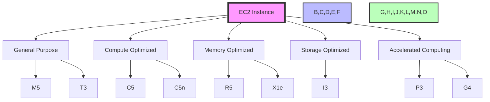

# AWS Compute Services Questions and Answers

## 1. What is Amazon Elastic Compute Cloud (EC2) and what are its key features?

Amazon Elastic Compute Cloud (EC2) is a web service that provides resizable compute capacity in the cloud. It enables users to launch and manage virtual servers (instances) on demand. EC2 offers a wide range of instance types and features to meet various computing needs.



Key Features of EC2:

### Instance Types and Pricing Models
- **Flexible Instance Types**:
  - **Current Generation**: M5, C5, R5, I3, P3, G4, etc.
  - **Previous Generation**: M4, C4, R4, etc.
  - **Instance Families**:
    - General Purpose
    - Compute Optimized
    - Memory Optimized
    - Storage Optimized
    - Accelerated Computing

### Practical Example: Setting up an EC2 Instance
```bash
# Launch an EC2 instance using AWS CLI
aws ec2 run-instances \
    --image-id ami-0c55b159cbfafe1f0 \
    --instance-type t3.micro \
    --key-name MyKeyPair \
    --security-group-ids sg-0123456789abcdef0 \
    --subnet-id subnet-0123456789abcdef0 \
    --tag-specifications 'ResourceType=instance,Tags=[{Key=Name,Value=WebServer}]'

# Create a Security Group
aws ec2 create-security-group \
    --group-name WebServerSG \
    --description "Security group for web servers" \
    --vpc-id vpc-0123456789abcdef0

# Add SSH and HTTP rules
aws ec2 authorize-security-group-ingress \
    --group-id sg-0123456789abcdef0 \
    --protocol tcp \
    --port 22 \
    --cidr 0.0.0.0/0

aws ec2 authorize-security-group-ingress \
    --group-id sg-0123456789abcdef0 \
    --protocol tcp \
    --port 80 \
    --cidr 0.0.0.0/0
```

- **Pricing Models**:
  - **On-Demand**: Pay per second for immediate needs
  - **Reserved Instances**: 
    - Up to 75% cost savings
    - 1-year or 3-year terms
    - Standard, Convertible, or Scheduled
  - **Spot Instances**: 
    - Up to 90% cost savings
    - Bid-based pricing
    - Interruptible instances
  - **Dedicated Hosts**: 
    - Physical server control
    - Bring-your-own-license (BYOL)
    - Compliance requirements
  - **Savings Plans**: 
    - Commitment-based discounts
    - Up to 72% cost savings
    - Flexible usage

### Scalability Features
- **Auto-scaling**:
  - Dynamic scaling based on metrics
  - Scheduled scaling
  - Step scaling
  - Target tracking scaling
  - Multiple scaling policies

- **Load Balancing**:
  - Application Load Balancer (ALB)
  - Network Load Balancer (NLB)
  - Classic Load Balancer (CLB)
  - Multi-AZ deployment support

- **Instance Management**:
  - Elastic IP addresses
  - Security groups
  - Key pairs for SSH access
  - Instance metadata
  - User data scripts
  - Instance tags
  - Instance types conversion

### Security and Compliance
- **Security Features**:
  - Security groups (virtual firewalls)
  - Network ACLs (network-level firewall)
  - IAM roles and permissions
  - VPC isolation
  - Key pair authentication
  - SSL/TLS certificates
  - Security audit trails

- **Compliance**:
  - SOC 1, 2, 3
  - ISO 27001, 27017, 27018
  - PCI DSS Level 1
  - HIPAA compliance
  - FedRAMP
  - GDPR compliance

### Storage Options
- **Persistent Storage**:
  - **Elastic Block Store (EBS)**:
    - General Purpose SSD (gp2, gp3)
    - Provisioned IOPS SSD (io1, io2)
    - Throughput Optimized HDD (st1)
    - Cold HDD (sc1)
  - **EBS Snapshots**:
    - Point-in-time backups
    - Cross-region replication
    - Automated lifecycle policies

- **Temporary Storage**:
  - **Instance Store**:
    - Local SSD storage
    - High I/O performance
    - Data persistence only during instance lifetime
  - **EFS**:
    - Shared file system
    - POSIX-compliant
    - Elastic scaling
    - Multiple availability zones support

- **Object Storage**:
  - **S3 Integration**:
    - Object storage
    - Versioning
    - Lifecycle management
    - Cross-region replication
    - Encryption options

## 2. Different EC2 Instance Types and Their Use Cases

### General Purpose Instances
- **M5/M6 Instances**:
  - **Characteristics**:
    - Balanced CPU-to-memory ratio
    - Intel Cascade Lake processors
    - Up to 96 vCPUs and 384 GiB RAM
    - Network performance up to 25 Gbps
    - EBS optimization
  - **Use Cases**:
    - Web applications
    - Development environments
    - Small to medium databases
    - Test and staging environments
    - Application servers
    - Microservices
    - Medium-sized data processing tasks

- **T3/T4 Instances**:
  - **Characteristics**:
    - Burstable performance
    - CPU credits system
    - Cost-effective for variable workloads
    - Up to 64 vCPUs and 256 GiB RAM
  - **Use Cases**:
    - Low to moderate CPU usage applications
    - Small websites
    - Development environments
    - Microservices
    - Small databases
    - Test environments

### Compute Optimized Instances
- **C5/C6 Instances**:
  - **Characteristics**:
    - High CPU-to-memory ratio
    - Intel Skylake/Cascade Lake processors
    - Up to 96 vCPUs and 192 GiB RAM
    - Network performance up to 100 Gbps
    - Enhanced networking
  - **Use Cases**:
    - High-performance web servers
    - Batch processing
    - Media transcoding
    - Scientific modeling
    - Dedicated gaming servers
    - Ad serving
    - High-performance computing (HPC)
    - CPU-intensive applications

- **C5n/C6n Instances**:
  - **Characteristics**:
    - Network-optimized variant
    - Up to 96 vCPUs
    - 100 Gbps network bandwidth
    - Enhanced networking
  - **Use Cases**:
    - Network-intensive applications
    - Big data processing
    - Distributed computing
    - Real-time data processing
    - Network appliances
    - High-performance computing

### Memory Optimized Instances
- **R5/R6 Instances**:
  - **Characteristics**:
    - High memory-to-CPU ratio
    - Intel Cascade Lake processors
    - Up to 96 vCPUs and 768 GiB RAM
    - Network performance up to 50 Gbps
    - Enhanced networking
  - **Use Cases**:
    - Memory-intensive applications
    - SAP HANA
    - In-memory databases
    - Cache clusters
    - Real-time big data analytics
    - Memory-intensive enterprise applications

- **X1e Instances**:
  - **Characteristics**:
    - Highest memory capacity
    - Up to 128 vCPUs and 3,904 GiB RAM
    - Network performance up to 25 Gbps
  - **Use Cases**:
    - SAP HANA
    - Oracle databases
    - In-memory databases
    - Large-scale enterprise applications
    - High-performance computing

### Storage Optimized Instances
- **I3/I4 Instances**:
  - **Characteristics**:
    - High local storage
    - NVMe SSD storage
    - Up to 64 vCPUs and 512 GiB RAM
    - Network performance up to 25 Gbps
  - **Use Cases**:
    - NoSQL databases
    - Data warehousing
    - Cache servers
    - Big data processing
    - High I/O applications
    - Log processing

- **D2 Instances**:
  - **Characteristics**:
    - High-density storage
    - HDD-based storage
    - Up to 36 vCPUs and 244 GiB RAM
  - **Use Cases**:
    - Big data processing
    - Data warehousing
    - Log processing
    - File servers
    - Data processing

### Accelerated Computing Instances
- **P3 Instances**:
  - **Characteristics**:
    - NVIDIA V100 GPUs
    - Up to 8 GPUs per instance
    - Up to 96 vCPUs and 768 GiB RAM
  - **Use Cases**:
    - Machine learning training
    - Deep learning
    - Scientific computing
    - Financial modeling
    - Video transcoding
    - Computational fluid dynamics

- **G4 Instances**:
  - **Characteristics**:
    - NVIDIA T4 GPUs
    - Cost-effective GPU computing
    - Up to 4 GPUs per instance
  - **Use Cases**:
    - Machine learning inference
    - Graphics rendering
    - Video transcoding
    - 3D visualization
    - Stream processing
    - Financial risk analysis

### Best Practices for Instance Selection
1. **Workload Analysis**:
   - CPU requirements
   - Memory needs
   - Storage patterns
   - Network bandwidth
   - I/O requirements

2. **Cost Optimization**:
   - Start with smaller instances
   - Use Spot Instances for non-critical workloads
   - Consider Reserved Instances for steady workloads
   - Implement Auto-scaling
   - Use Savings Plans for long-term commitments

3. **Performance Considerations**:
   - Network bandwidth requirements
   - Storage IOPS needs
   - Memory requirements
   - CPU performance
   - Latency requirements

4. **Security Requirements**:
   - Compliance needs
   - Data encryption
   - Network isolation
   - Access controls
   - Audit requirements

5. **Monitoring and Management**:
   - CloudWatch metrics
   - Automated backups
   - Health checks
   - Auto-scaling policies
   - Cost monitoring

---

Note: This comprehensive guide provides detailed information about EC2 features and instance types. For the most up-to-date specifications and pricing, refer to the AWS official documentation and pricing calculator.

- **Memory Optimized Instances (R5, R6)**:
  - Large memory capacity
  - Ideal for memory-intensive applications
  - In-memory databases (Redis, Memcached)
  - SAP HANA
  - Big data processing

- **Storage Optimized Instances (I3, I4)**:
  - High local storage
  - Ideal for I/O intensive workloads
  - NoSQL databases
  - Data warehousing
  - Cache servers

- **Accelerated Computing Instances (P3, G4)**:
  - GPU acceleration
  - Machine learning
  - Graphics rendering
  - Video transcoding
  - Scientific computing

## 3. Amazon Elastic Container Service (ECS)

Amazon ECS is a fully managed container orchestration service that helps run and scale containerized applications.

Key Features:
- **Container Orchestration**:
  - Manage containerized applications
  - Automatic scaling
  - Load balancing
  - Service discovery

- **Deployment Options**:
  - EC2 Linux + Windows
  - AWS Fargate
  - Kubernetes with EKS

- **Integration**:
  - ECR for container images
  - CloudWatch for monitoring
  - IAM for security
  - VPC for networking

- **Use Cases**:
  - Microservices architecture
  - Batch processing
  - Web applications
  - Development environments
  - CI/CD pipelines

## 4. Difference between Amazon EC2 and AWS Lambda

- **Amazon EC2**:
  - Traditional virtual servers
  - Persistent infrastructure
  - Full control over OS and configuration
  - Pay for compute time
  - Suitable for long-running applications
  - Ideal for stateful applications

- **AWS Lambda**:
  - Serverless compute service
  - Event-driven architecture
  - No infrastructure management
  - Pay only for execution time
  - Automatic scaling
  - Ideal for:
    - Event processing
    - Data processing
    - API backends
    - Scheduled tasks
    - Real-time file processing

## 5. AWS Elastic Beanstalk

Elastic Beanstalk is a fully managed service that makes it easy to deploy and run applications in multiple languages.

Key Features:
- **Supported Platforms**:
  - Java
  - .NET
  - PHP
  - Node.js
  - Python
  - Ruby
  - Go
  - Docker

- **Automatic Management**:
  - Infrastructure provisioning
  - Load balancing
  - Auto-scaling
  - Application health monitoring

- **Use Cases**:
  - Web applications
  - APIs
  - Microservices
  - Batch processing
  - Development environments

## 6. Auto Scaling in AWS

Auto Scaling helps maintain application availability and optimize resource usage by automatically adjusting capacity.

Key Components:
- **EC2 Auto Scaling**:
  - Scale EC2 instances based on demand
  - Set minimum/maximum instance counts
  - Use CloudWatch metrics for scaling
  - Support for scheduled scaling

- **Application Auto Scaling**:
  - Scale DynamoDB tables
  - Scale Aurora databases
  - Scale ECS services
  - Scale other AWS resources

- **Scaling Policies**:
  - Target tracking scaling
  - Step scaling
  - Scheduled scaling
  - Simple scaling

## 7. Amazon Elastic Kubernetes Service (EKS)

EKS is a managed Kubernetes service that makes it easy to run Kubernetes on AWS.

Key Benefits:
- **Managed Control Plane**:
  - No need to manage Kubernetes masters
  - Automatic updates and patching
  - High availability across multiple AZs

- **Integration**:
  - VPC networking
  - IAM authentication
  - ECR for container images
  - CloudWatch for monitoring

- **Use Cases**:
  - Container orchestration
  - Microservices architecture
  - CI/CD pipelines
  - Hybrid cloud deployments
  - Multi-tenant environments

## 8. Spot Instances

Spot Instances allow users to bid on unused EC2 capacity at a discount.

Key Features:
- **Cost Savings**:
  - Up to 90% discount compared to On-Demand
  - Pay the current Spot price
  - No upfront commitment

- **Use Cases**:
  - Batch processing
  - Big data analytics
  - Development environments
  - Image processing
  - Test environments

- **Best Practices**:
  - Use stateless applications
  - Implement graceful shutdown
  - Use Spot Fleet for multiple instance types
  - Set maximum price
  - Use Spot Instance interruption notices

## 9. AWS Fargate vs Amazon ECS

- **AWS Fargate**:
  - Serverless compute engine for containers
  - No need to manage EC2 instances
  - Pay only for resources used
  - Automatic scaling
  - Ideal for:
    - Microservices
    - Batch jobs
    - Development environments

- **Amazon ECS**:
  - Traditional container orchestration
  - Requires EC2 instance management
  - More control over infrastructure
  - Lower cost for long-running workloads
  - Ideal for:
    - Stateful applications
    - Custom infrastructure needs
    - Hybrid workloads

## 10. Amazon EC2 Container Registry (ECR)

ECR is a fully managed container registry that stores, manages, and deploys Docker container images.

Key Features:
- **Image Management**:
  - Secure storage of Docker images
  - Integration with ECS and EKS
  - Lifecycle policies for image cleanup
  - Cross-region replication

- **Security**:
  - IAM integration
  - VPC endpoints
  - Encryption at rest
  - Image scanning

- **Performance**:
  - High availability
  - Global distribution
  - Fast image downloads
  - Large image support

- **Use Cases**:
  - CI/CD pipelines
  - Container deployment
  - Image versioning
  - Multi-region deployments
  - Private container registry

---

Note: This document provides a comprehensive overview of AWS compute services. For more detailed information about specific services and their features, refer to AWS official documentation and best practices guides.
