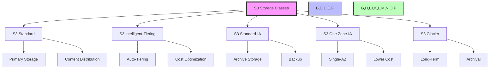

# AWS Storage and Database Services Questions and Answers

## 1. What is Amazon Simple Storage Service (S3) and its key features?

Amazon S3 is a highly scalable, durable, and secure object storage service that provides a foundation for virtually any cloud application. It's designed to store and retrieve any amount of data from anywhere on the web with 99.999999999% durability and 99.99% availability.



### Storage Classes and Their Use Cases

1. **S3 Standard**
   - **Characteristics**:
     - 99.99% availability
     - 99.999999999% durability
     - 5000 GET requests per second per prefix
     - 1000 PUT/LIST/DELETE requests per second per prefix
     - Data stored across multiple facilities
   - **Use Cases**:
     - Primary storage for applications
     - Content distribution
     - Data lakes
     - Analytics data
     - Frequently accessed data
     - Static website hosting
   - **Example**: Hosting a high-traffic e-commerce website's images and media files

### Practical Example: Setting up S3 Lifecycle Policy
```json
{
    "Rules": [
        {
            "ID": "Archive and Delete Policy",
            "Status": "Enabled",
            "Prefix": "logs/",
            "Transitions": [
                {
                    "Days": 30,
                    "StorageClass": "STANDARD_IA"
                },
                {
                    "Days": 90,
                    "StorageClass": "GLACIER"
                }
            ],
            "Expiration": {
                "Days": 365
            }
        }
    ]
}

# Using AWS CLI to create a bucket and set lifecycle policy
aws s3api create-bucket --bucket my-logs-bucket --region us-east-1
aws s3api put-bucket-lifecycle-configuration --bucket my-logs-bucket --lifecycle-configuration file://lifecycle-policy.json

# Upload a file and check its lifecycle
aws s3 cp my-log-file.txt s3://my-logs-bucket/logs/
aws s3api list-objects --bucket my-logs-bucket --query "Contents[?StorageClass=='STANDARD']"
```

2. **S3 Intelligent-Tiering**
   - **Characteristics**:
     - Automatically moves objects between tiers
     - No retrieval fees
     - Minimum storage duration: 30 days
     - Monitors access patterns
   - **Use Cases**:
     - Data with unpredictable access patterns
     - Archival data with occasional access
     - Backup data
     - Log data
   - **Example**: Storing application logs that may need to be accessed for troubleshooting

3. **S3 Standard-IA**
   - **Characteristics**:
     - 99.9% availability
     - Lower cost than Standard
     - Minimum storage duration: 30 days
     - Retrieval fee applies
   - **Use Cases**:
     - Long-term storage
     - Backup data
     - Archive data
     - Disaster recovery
   - **Example**: Storing historical financial records accessed quarterly

4. **S3 One Zone-IA**
   - **Characteristics**:
     - Single-AZ storage
     - Lower cost than Standard-IA
     - Minimum storage duration: 30 days
     - Retrieval fee applies
   - **Use Cases**:
     - Non-critical data
     - Backup data
     - Archive data
     - Test environments
   - **Example**: Storing test environment data that can be recreated

5. **S3 Glacier**
   - **Characteristics**:
     - Lowest cost storage
     - Retrieval times from minutes to hours
     - Multiple retrieval options
     - Minimum storage duration: 90 days
   - **Use Cases**:
     - Long-term backups
     - Archival data
     - Compliance data
     - Historical records
   - **Example**: Storing historical medical records required for compliance

### Comprehensive Security Features

1. **Data Encryption**
   - **Server-Side Encryption (SSE)**:
     - SSE-S3: Uses S3-managed keys
     - SSE-KMS: Uses AWS KMS-managed keys
     - SSE-C: Uses customer-provided keys
   - **Client-Side Encryption**:
     - Encrypt data before upload
     - Use AWS KMS or custom keys
     - Encrypt metadata
   - **Data in Transit**:
     - SSL/TLS encryption
     - HTTPS endpoints
     - VPC endpoints
     - PrivateLink support

2. **Access Control**
   - **Bucket Policies**:
     - Fine-grained access control
     - Cross-account access
     - IP-based restrictions
     - Protocol restrictions
   - **IAM Policies**:
     - User and role permissions
     - Conditional access
     - Resource-based policies
     - Cross-account permissions
   - **ACLs (Access Control Lists)**:
     - Object-level permissions
     - Bucket-level permissions
     - Grantee types
     - Permission types
   - **VPC Endpoints**:
     - Private access to S3
     - Network isolation
     - Route table management
     - Security groups

3. **Audit and Monitoring**
   - **CloudTrail Integration**:
     - API activity tracking
     - Management events
     - Data events
     - Trail configuration
   - **S3 Access Logs**:
     - Request details
     - Response status
     - Request time
     - Access patterns
   - **Inventory Reports**:
     - Object lists
     - Bucket metrics
     - Storage class distribution
     - Object size distribution
   - **Analytics**:
     - Storage class analysis
     - Access patterns
     - Cost optimization
     - Usage trends

### Advanced Management Features

1. **Lifecycle Policies**
   - **Object Transitions**:
     - Move objects between storage classes
     - Archive objects
     - Delete objects
     - Set rules based on age
   - **Expiration Rules**:
     - Delete objects after specific period
     - Clean up old versions
     - Remove incomplete multipart uploads
     - Archive objects
   - **Archive Transitions**:
     - Move objects to Glacier
     - Set transition periods
     - Multiple transition rules
     - Cross-region replication
   - **Cleanup Policies**:
     - Remove old versions
     - Clean up incomplete uploads
     - Delete expired objects
     - Archive objects

2. **Versioning**
   - **Protection**:
     - Prevent accidental deletions
     - Store historical versions
     - Cross-region replication
     - MFA delete protection
   - **Version Management**:
     - Version IDs
     - Version-specific operations
     - Version-specific permissions
     - Version-specific lifecycle
   - **Cross-Region Replication**:
     - Automatic data replication
     - Different regions
     - Versioning support
     - S3 Transfer Acceleration
   - **MFA Delete**:
     - Two-factor authentication
     - Bucket protection
     - Version protection
     - Compliance requirement

3. **Cross-Region Replication**
   - **Automatic Replication**:
     - Real-time data replication
     - Cross-region data distribution
     - Versioning support
     - Encryption support
   - **Region Selection**:
     - Choose target regions
     - Regional compliance
     - Latency optimization
     - Cost optimization
   - **Replication Rules**:
     - Prefix-based rules
     - Tag-based rules
     - Size-based rules
     - Encryption requirements
   - **S3 Transfer Acceleration**:
     - Faster data transfers
     - Global edge locations
     - Reduced latency
     - Cost-effective

### Performance Optimization Features

1. **Transfer Acceleration**
   - **Global Edge Locations**:
     - AWS edge locations worldwide
     - Reduced latency
     - Faster uploads/downloads
     - Cost-effective
   - **Performance Benefits**:
     - Faster data transfers
     - Reduced latency
     - Better throughput
     - Cost savings
   - **Use Cases**:
     - Large file transfers
     - Global content distribution
     - Real-time data ingestion
     - Cross-region transfers

2. **Multi-Part Upload**
   - **Large Object Handling**:
     - Upload objects in parts
     - Parallel uploads
     - Upload resumption
     - Upload validation
   - **Performance Benefits**:
     - Faster uploads
     - Better reliability
     - Resume capability
     - Parallel processing
   - **Best Practices**:
     - Use for large files
     - Implement parallel uploads
     - Set proper part sizes
     - Handle failures gracefully

3. **Object Lock**
   - **WORM Compliance**:
     - Write Once Read Many
     - Compliance mode
     - Retention periods
     - Legal holds
   - **Retention Settings**:
     - Days or years
     - Minimum retention
     - Maximum retention
     - Legal holds
   - **Compliance Features**:
     - Regulatory compliance
     - Data retention
     - Legal holds
     - Audit trails
   - **Use Cases**:
     - Regulatory compliance
     - Legal requirements
     - Data retention
     - Audit trails

### Best Practices for S3 Implementation

1. **Data Organization**
   - Use proper prefixes
   - Implement proper naming conventions
   - Use versioning
   - Implement lifecycle policies
   - Use proper metadata

2. **Cost Optimization**
   - Use appropriate storage class
   - Implement lifecycle policies
   - Use inventory reports
   - Monitor usage patterns
   - Use S3 Intelligent-Tiering

3. **Security Implementation**
   - Enable encryption
   - Use proper access controls
   - Implement proper permissions
   - Use MFA delete
   - Enable logging

4. **Performance Optimization**
   - Use Transfer Acceleration
   - Implement proper caching
   - Use multipart uploads
   - Optimize object sizes
   - Use proper bucket region

5. **Monitoring and Management**
   - Enable CloudTrail
   - Use S3 analytics
   - Monitor access patterns
   - Use inventory reports
   - Implement proper logging

### Real-World Use Cases

1. **E-commerce Platform**
   - Store product images
   - Product catalog
   - User-generated content
   - Static website hosting
   - Content delivery

2. **Healthcare Application**
   - Medical records storage
   - HIPAA compliance
   - Data retention
   - Audit trails
   - Secure access

3. **Financial Services**
   - Transaction records
   - Compliance data
   - Backup storage
   - Data analytics
   - Secure access

4. **Media Platform**
   - Video storage
   - Content delivery
   - Archive storage
   - Analytics data
   - Content distribution

5. **Backup Solution**
   - Application backups
   - Database backups
   - Archive storage
   - Disaster recovery
   - Compliance storage

---

Note: This comprehensive guide provides detailed information about Amazon S3 features and best practices. For the most up-to-date specifications and pricing, refer to the AWS official documentation and pricing calculator.

## 2. Difference between Amazon S3 and Amazon EBS

### Amazon S3
- **Purpose**: Object storage
- **Access**: HTTP/HTTPS
- **Use Cases**: 
  - Data archiving
  - Backup and recovery
  - Content distribution
  - Data lakes
  - Static website hosting

### Amazon EBS
- **Purpose**: Block storage
- **Access**: Block device interface
- **Use Cases**:
  - Boot volumes
  - File systems
  - Databases
  - Application data
  - High-performance storage

### Key Differences
- **Data Model**:
  - S3: Object-based
  - EBS: Block-based

- **Persistence**:
  - S3: Persistent across instances
  - EBS: Persistent unless deleted

- **Performance**:
  - S3: Variable based on object size
  - EBS: Consistent IOPS

- **Integration**:
  - S3: REST API, SDKs
  - EBS: OS-level access

## 3. Amazon RDS and Supported Database Engines

Amazon RDS is a managed database service that makes it easy to set up, operate, and scale databases in the cloud.

### Supported Engines
1. **MySQL**:
   - Open-source relational database
   - ACID compliance
   - High performance
   - Large community

2. **PostgreSQL**:
   - Advanced features
   - JSON support
   - Complex queries
   - Open-source

3. **Oracle**:
   - Enterprise-grade
   - Advanced security
   - PL/SQL support
   - Large enterprise applications

4. **SQL Server**:
   - Microsoft ecosystem
   - T-SQL support
   - Integration services
   - Windows applications

5. **MariaDB**:
   - MySQL-compatible
   - Open-source
   - High performance
   - Community-driven

### Key Features
- **Managed Service**:
  - Automated backups
  - Point-in-time recovery
  - Patch management
  - Monitoring and metrics

- **High Availability**:
  - Multi-AZ deployments
  - Read replicas
  - Automatic failover
  - Cross-region replication

- **Performance**:
  - Instance classes
  - Provisioned IOPS
  - Cache support
  - Performance insights

- **Security**:
  - VPC support
  - Encryption
  - IAM integration
  - Security groups

## 4. Amazon S3 Buckets and Objects

### Buckets
- **Characteristics**:
  - Container for objects
  - Globally unique name
  - Region-specific
  - Access control
  - Versioning

- **Bucket Operations**:
  - Create/delete
  - List objects
  - Set permissions
  - Configure logging
  - Set lifecycle rules

### Objects
- **Components**:
  - Key (unique identifier)
  - Value (data)
  - Metadata
  - Access control
  - Version ID

- **Object Operations**:
  - Upload/download
  - Delete
  - Copy
  - Move
  - Version management

### Best Practices
1. **Naming**:
   - Lowercase letters
   - No special characters
   - Globally unique
   - DNS-compliant

2. **Security**:
   - Private by default
   - Use bucket policies
   - Enable encryption
   - Use IAM roles
   - Configure logging

3. **Performance**:
   - Use Transfer Acceleration
   - Implement multipart uploads
   - Use proper bucket region
   - Implement caching
   - Use lifecycle policies

## 5. Amazon DynamoDB

Amazon DynamoDB is a fully managed NoSQL database service that provides fast and predictable performance with seamless scalability.

### Key Features
- **NoSQL Database**:
  - Document-based
  - Key-value store
  - Schema-less
  - Distributed

- **Performance**:
  - Single-digit millisecond latency
  - Throughput capacity
  - Auto-scaling
  - Global tables

- **Data Model**:
  - Tables
  - Items (documents)
  - Primary keys
  - Secondary indexes
  - Streams

### Use Cases
1. **Web Applications**:
   - User profiles
   - Session management
   - Shopping carts
   - Real-time analytics

2. **Mobile Applications**:
   - User data
   - Game state
   - Social features
   - Location data

3. **IoT Applications**:
   - Device data
   - Telemetry
   - Configuration
   - State management

4. **Gaming**:
   - Leaderboards
   - Game state
   - Player data
   - Session management

### Best Practices
1. **Data Modeling**:
   - Denormalization
   - Composite keys
   - Sparse indexes
   - Global secondary indexes

2. **Performance**:
   - Proper capacity planning
   - Use DynamoDB Streams
   - Implement caching
   - Use batch operations
   - Optimize queries

3. **Cost Optimization**:
   - On-demand capacity
   - Provisioned capacity
   - Auto-scaling
   - Global tables
   - Data tiering

## 6. Amazon RDS vs Amazon Aurora

### Amazon RDS
- **Architecture**:
  - Traditional relational database
  - Single instance or Multi-AZ
  - Various database engines
  - Standard replication

- **Performance**:
  - Standard IOPS
  - Read replicas
  - Instance classes
  - Manual scaling

- **Cost**:
  - Pay per instance
  - Storage costs
  - Backup costs
  - Standard licensing

### Amazon Aurora
- **Architecture**:
  - MySQL/PostgreSQL compatible
  - Distributed storage
  - Up to 15 replicas
  - Self-healing

- **Performance**:
  - 5x faster than MySQL
  - 3x faster than PostgreSQL
  - Automatic scaling
  - Global databases

- **Cost**:
  - Pay per storage
  - No upfront costs
  - Automatic scaling
  - No licensing fees

### Key Differences
- **Scalability**:
  - RDS: Manual scaling
  - Aurora: Automatic scaling

- **Performance**:
  - RDS: Standard performance
  - Aurora: Optimized performance

- **Cost**:
  - RDS: Instance-based
  - Aurora: Storage-based

- **Architecture**:
  - RDS: Traditional
  - Aurora: Distributed

## 7. Amazon EFS and Its Use Cases

Amazon EFS is a fully managed elastic file system that provides simple, scalable, and elastic file storage for Linux-based workloads.

### Key Features
- **Scalability**:
  - Elastic storage
  - Automatic scaling
  - Petabyte-scale capacity
  - Performance scaling

- **Access**:
  - POSIX-compliant
  - Multiple EC2 instances
  - NFS protocol
  - VPC integration

- **Performance**:
  - Throughput modes
  - Bursting capabilities
  - IOPS optimization
  - Consistent performance

### Use Cases
1. **Web Applications**:
   - Shared content
   - User uploads
   - Application logs
   - Session data

2. **Big Data**:
   - Analytics data
   - Processing pipelines
   - Data lakes
   - ETL processes

3. **Content Management**:
   - Media storage
   - Image processing
   - Video processing
   - Asset management

4. **Development Environments**:
   - Shared code repositories
   - Build environments
   - Test environments
   - Development tools

### Best Practices
1. **Performance**:
   - Choose appropriate throughput mode
   - Monitor IOPS
   - Use burst credits effectively
   - Implement caching

2. **Security**:
   - Use security groups
   - Enable encryption
   - Configure IAM roles
   - Set proper permissions

3. **Cost Optimization**:
   - Use appropriate throughput mode
   - Monitor usage patterns
   - Implement lifecycle policies
   - Use proper instance sizing

## 8. S3 Data Durability and Availability

### Durability
- **99.999999999%** (11 9's) durability
- **Data Replication**:
  - Multiple data centers
  - Multiple devices
  - Cross-region replication
  - Versioning

- **Data Protection**:
  - Object Lock
  - MFA delete
  - Versioning
  - Cross-region replication

### Availability
- **99.99%** availability
- **Global Infrastructure**:
  - Multiple regions
  - Edge locations
  - Transfer acceleration
  - Cross-region replication

- **Data Access**:
  - Multiple access points
  - Global distribution
  - Transfer acceleration
  - Edge locations

### Best Practices
1. **Data Protection**:
   - Enable versioning
   - Use cross-region replication
   - Implement MFA delete
   - Use object lock

2. **Data Management**:
   - Use lifecycle policies
   - Implement proper access controls
   - Monitor usage patterns
   - Use inventory reports

3. **Performance**:
   - Use Transfer Acceleration
   - Implement proper caching
   - Use multipart uploads
   - Optimize object sizes

## 9. Amazon Redshift vs Amazon RDS

### Amazon Redshift
- **Purpose**: 
  - Data warehousing
  - Analytics
  - Large datasets
  - Complex queries

- **Architecture**:
  - Massively parallel processing (MPP)
  - Columnar storage
  - Distributed architecture
  - SQL-based

- **Performance**:
  - Petabyte-scale analytics
  - Complex queries
  - Real-time analytics
  - Data warehousing

### Amazon RDS
- **Purpose**:
  - Transactional databases
  - OLTP systems
  - Web applications
  - Business applications

- **Architecture**:
  - Traditional relational database
  - Instance-based
  - Multiple database engines
  - Standard replication

### Key Differences
- **Use Cases**:
  - Redshift: Analytics, data warehousing
  - RDS: Transactional databases, applications

- **Performance**:
  - Redshift: Massively parallel processing
  - RDS: Standard database performance

- **Scalability**:
  - Redshift: Petabyte-scale
  - RDS: Instance-based scaling

- **Cost**:
  - Redshift: Pay per node
  - RDS: Pay per instance

## 10. Amazon S3 Glacier and Its Use Cases

Amazon S3 Glacier is a secure, durable, and extremely low-cost storage service for data archiving and long-term backup.

### Storage Tiers
- **Glacier Instant Retrieval**:
  - Millisecond retrieval
  - Lowest cost
  - Ideal for archival data

- **Glacier Flexible Retrieval**:
  - Minutes to hours retrieval
  - Lower cost
  - Ideal for long-term backups

- **Glacier Deep Archive**:
  - 12+ hours retrieval
  - Lowest cost
  - Ideal for very cold data

### Use Cases
1. **Data Archival**:
   - Long-term backups
   - Historical data
   - Compliance data
   - Legal records

2. **Disaster Recovery**:
   - Offsite backups
   - Point-in-time recovery
   - Business continuity
   - Data redundancy

3. **Cold Data Storage**:
   - Historical logs
   - Archived emails
   - Old documents
   - Legacy data

4. **Legal and Regulatory**:
   - Compliance data
   - Audit logs
   - Legal records
   - Regulatory requirements

### Best Practices
1. **Data Management**:
   - Use lifecycle policies
   - Implement proper tagging
   - Use inventory reports
   - Monitor retrieval patterns

2. **Cost Optimization**:
   - Choose appropriate tier
   - Implement proper retention
   - Use bulk retrieval
   - Monitor usage patterns

3. **Security**:
   - Enable encryption
   - Use access controls
   - Implement proper permissions
   - Use MFA delete

---

Note: This document provides a comprehensive overview of AWS storage and database services. For the most up-to-date specifications and pricing, refer to the AWS official documentation and pricing calculator.
