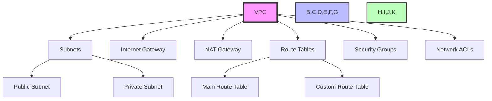
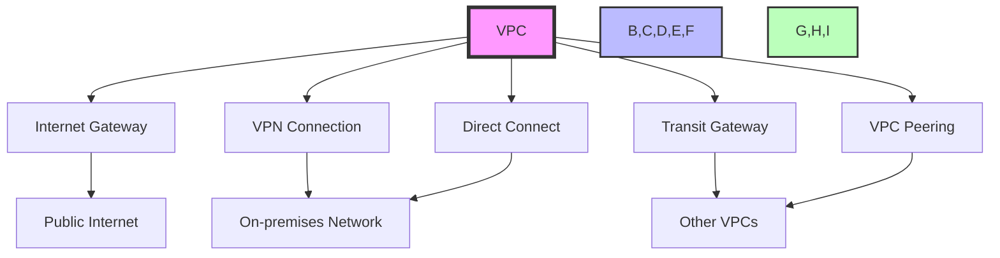
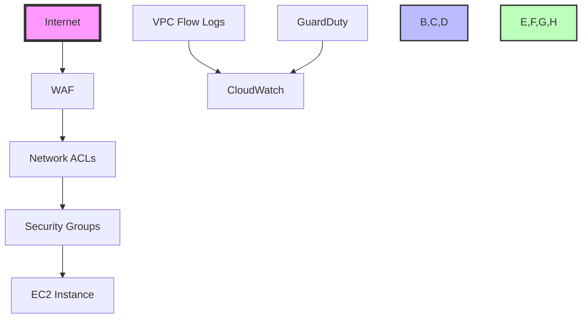

# AWS Networking and Content Delivery Questions and Answers

## 1. What is Amazon Virtual Private Cloud (VPC) and its key components?

Amazon VPC is a logically isolated virtual network in AWS that enables you to launch AWS resources in a virtual network that you define. It provides complete control over your virtual networking environment.



### Core Components

1. **VPC**
   - **Characteristics**:
     - Private network environment
     - Custom IP address range (16-bit CIDR block)
     - Multiple availability zones
     - Internet connectivity options
     - IPv4 and IPv6 support
     - Custom routing tables
     - Network ACLs
     - Security groups
     - DNS resolution

### Practical Example: Setting up a VPC with Public and Private Subnets
```bash
# Create VPC
aws ec2 create-vpc --cidr-block 10.0.0.0/16 --tag-specifications 'ResourceType=vpc,Tags=[{Key=Name,Value=MyVPC}]'

# Create subnets
aws ec2 create-subnet --vpc-id vpc-0123456789abcdef0 --cidr-block 10.0.1.0/24 --availability-zone us-east-1a --tag-specifications 'ResourceType=subnet,Tags=[{Key=Name,Value=PublicSubnet}]'
aws ec2 create-subnet --vpc-id vpc-0123456789abcdef0 --cidr-block 10.0.2.0/24 --availability-zone us-east-1a --tag-specifications 'ResourceType=subnet,Tags=[{Key=Name,Value=PrivateSubnet}]'

# Create Internet Gateway
aws ec2 create-internet-gateway --tag-specifications 'ResourceType=internet-gateway,Tags=[{Key=Name,Value=MyIGW}]'
aws ec2 attach-internet-gateway --internet-gateway-id igw-0123456789abcdef0 --vpc-id vpc-0123456789abcdef0

# Create NAT Gateway
aws ec2 create-nat-gateway --subnet-id subnet-0123456789abcdef0 --allocation-id eipalloc-0123456789abcdef0 --tag-specifications 'ResourceType=natgateway,Tags=[{Key=Name,Value=MyNAT}]'

# Configure Route Tables
aws ec2 create-route --route-table-id rtb-0123456789abcdef0 --destination-cidr-block 0.0.0.0/0 --gateway-id igw-0123456789abcdef0
aws ec2 create-route --route-table-id rtb-0123456789abcdef0 --destination-cidr-block 0.0.0.0/0 --nat-gateway-id nat-0123456789abcdef0
```
   - **Features**:
     - IPv4 range: 10.0.0.0/16, 172.16.0.0/12, 192.168.0.0/16
     - IPv6 range: /56 prefix
     - Maximum 5 VPCs per region
     - Default VPC in each region
     - Custom DNS configuration
   - **Use Cases**:
     - Enterprise networks
     - Multi-tier applications
     - Hybrid cloud environments
     - Development environments
     - Production environments
   - **Example Configuration**:
     ```
     VPC: 10.0.0.0/16
     IPv6: 2001:db8:1234:1a00::/56
     ```

2. **Subnets**
   - **Types**:
     - Public subnets: Direct internet access
     - Private subnets: No direct internet access
     - Dedicated subnets: Specific workloads
   - **Characteristics**:
     - Single availability zone
     - Unique IP range
     - Route table association
     - Network ACLs
     - Security groups
     - Maximum 200 subnets per VPC
     - Custom IP ranges
     - IPv6 support
   - **Best Practices**:
     - Use multiple AZs for high availability
     - Separate public and private subnets
     - Proper IP range planning
     - Implement proper security controls
     - Regular subnet monitoring
   - **Example Configuration**:
     ```
     Public Subnet: 10.0.1.0/24 (AZ1)
     Private Subnet: 10.0.2.0/24 (AZ1)
     Public Subnet: 10.0.3.0/24 (AZ2)
     Private Subnet: 10.0.4.0/24 (AZ2)
     ```

3. **Internet Gateway**
   - **Purpose**:
     - Connect VPC to internet
     - Route internet traffic
     - Enable public IP addresses
     - Provide NAT functionality
   - **Features**:
     - One per VPC
     - Automatic scaling
     - High availability
     - Network address translation
     - Elastic IP support
     - Route table integration
   - **Best Practices**:
     - Use proper route table configuration
     - Implement proper security controls
     - Monitor internet traffic
     - Regular maintenance
     - Security group configuration
   - **Example Configuration**:
     ```
     Route Table:
     Destination: 0.0.0.0/0
     Target: igw-12345678
     ```

4. **NAT Gateway**
   - **Purpose**:
     - Enable private subnet internet access
     - Network address translation
     - Outbound internet access
     - Centralized internet access
   - **Features**:
     - High availability
     - Automatic scaling
     - Bandwidth allocation
     - Multiple availability zones
     - Elastic IP support
     - Route table integration
   - **Best Practices**:
     - Deploy in public subnet
     - Use proper security groups
     - Monitor bandwidth usage
     - Regular maintenance
     - Cost optimization
   - **Example Configuration**:
     ```
     Private Subnet Route Table:
     Destination: 0.0.0.0/0
     Target: nat-12345678
     ```

### Security Components

1. **Security Groups**
   - **Purpose**:
     - Act as virtual firewalls
     - Control inbound/outbound traffic
     - Instance-level security
     - Microsegmentation
   - **Features**:
     - Stateful rules
     - Protocol-based rules
     - Port-based rules
     - Source/destination IPs
     - Maximum 50 security groups per network interface
     - Maximum 60 rules per security group
     - IPv4 and IPv6 support
   - **Best Practices**:
     - Start with deny all
     - Add rules as needed
     - Regular security audits
     - Security group hierarchy
     - Regular updates
   - **Example Rules**:
     ```
     Allow HTTP: 0.0.0.0/0:80
     Allow HTTPS: 0.0.0.0/0:443
     Allow SSH: 10.0.0.0/16:22
     ```

2. **Network ACLs**
   - **Purpose**:
     - Subnet-level firewall
     - Stateless rules
     - Additional security layer
     - Network traffic control
   - **Features**:
     - Numbered rules
     - Explicit allow/deny
     - Inbound/outbound rules
     - Default deny
     - Maximum 20 rules per NACL
     - IPv4 and IPv6 support
   - **Best Practices**:
     - Start with allow all
     - Add deny rules as needed
     - Regular security audits
     - NACL hierarchy
     - Regular updates
   - **Example Rules**:
     ```
     Allow HTTP: 100: Allow 0.0.0.0/0:80
     Deny SSH: 110: Deny 0.0.0.0/0:22
     Allow All: 200: Allow 0.0.0.0/0:0-65535
     ```

3. **VPC Flow Logs**
   - **Purpose**:
     - Monitor network traffic
     - Security analysis
     - Traffic patterns
     - Network troubleshooting
   - **Features**:
     - Traffic capture
     - CloudWatch integration
     - S3 export
     - Detailed logging
     - Real-time monitoring
   - **Best Practices**:
     - Enable flow logs
     - Regular monitoring
     - Security analysis
     - Network troubleshooting
     - Regular updates
   - **Example Usage**:
     ```
     Monitor traffic patterns
     Detect security threats
     Analyze network performance
     Troubleshoot network issues
     ```

### Routing Components

1. **Route Tables**
   - **Purpose**:
     - Control traffic routing
     - Define network paths
     - Subnet routing
     - Network optimization
   - **Features**:
     - Main route table
     - Custom route tables
     - Route propagation
     - Route priorities
     - Maximum 50 route tables per VPC
   - **Best Practices**:
     - Proper route configuration
     - Regular updates
     - Network optimization
     - Security considerations
     - Regular monitoring
   - **Example Configuration**:
     ```
     Route Table:
     Destination: 10.0.0.0/16 (local)
     Destination: 0.0.0.0/0 (internet gateway)
     Destination: 10.1.0.0/16 (peering connection)
     ```

2. **Peering Connections**
   - **Purpose**:
     - Connect VPCs
     - Cross-account connectivity
     - Cross-region connectivity
     - Network optimization
   - **Features**:
     - Private IP routing
     - No transitive peering
     - Route table management
     - Network ACLs
     - Maximum 50 peering connections per VPC
   - **Best Practices**:
     - Proper route configuration
     - Security considerations
     - Network optimization
     - Regular monitoring
     - Regular updates
   - **Example Configuration**:
     ```
     VPC1: 10.0.0.0/16
     VPC2: 10.1.0.0/16
     Peering Connection: pcx-12345678
     ```

3. **Transit Gateway**
   - **Purpose**:
     - Centralized routing
     - Multiple VPC connectivity
     - On-premises connectivity
     - Network optimization
   - **Features**:
     - Route propagation
     - Attachment management
     - Network optimization
     - Multi-account support
     - Maximum 5000 attachments per gateway
   - **Best Practices**:
     - Proper attachment configuration
     - Security considerations
     - Network optimization
     - Regular monitoring
     - Regular updates
   - **Example Configuration**:
     ```
     Transit Gateway: tgw-12345678
     Attachments:
     - VPC1 (10.0.0.0/16)
     - VPC2 (10.1.0.0/16)
     - Direct Connect (dx-12345678)
     ```

### Best Practices

1. **Network Design**
   - **Planning**:
     - Multiple availability zones
     - Public/private subnets
     - Proper IP addressing
     - Route table optimization
     - Security considerations
   - **Implementation**:
     - Proper subnet configuration
     - Route table management
     - Security group configuration
     - Network ACL configuration
     - Regular updates
   - **Monitoring**:
     - Network traffic monitoring
     - Security monitoring
     - Performance monitoring
     - Regular updates
     - Regular maintenance
   - **Example Design**:
     ```
     VPC: 10.0.0.0/16
     Public Subnets: 10.0.1.0/24, 10.0.2.0/24
     Private Subnets: 10.0.3.0/24, 10.0.4.0/24
     ```

2. **Security**
   - **Implementation**:
     - Security groups
     - Network ACLs
     - Flow logs
     - VPC endpoints
     - Regular security audits
   - **Monitoring**:
     - Security group monitoring
     - NACL monitoring
     - Flow log analysis
     - Security threat detection
     - Regular updates
   - **Best Practices**:
     - Regular security updates
     - Security group hierarchy
     - NACL configuration
     - Flow log analysis
     - Regular security audits
   - **Example Security**:
     ```
     Security Group: sg-12345678
     Rules:
     - Allow HTTP: 0.0.0.0/0:80
     - Allow HTTPS: 0.0.0.0/0:443
     ```

3. **Monitoring**
   - **Implementation**:
     - CloudWatch metrics
     - Flow logs
     - Route table monitoring
     - Security group monitoring
     - Regular updates
   - **Analysis**:
     - Network traffic analysis
     - Security threat detection
     - Performance monitoring
     - Regular updates
     - Regular maintenance
   - **Best Practices**:
     - Regular monitoring
     - Security analysis
     - Performance optimization
     - Regular updates
     - Regular maintenance
   - **Example Monitoring**:
     ```
     CloudWatch Metrics:
     - Network traffic
     - Security threats
     - Performance metrics
     - Regular updates
     - Regular maintenance
     ```

### Real-World Use Cases

1. **Enterprise Network**
   - **Implementation**:
     - Multiple VPCs
     - Peering connections
     - Transit gateway
     - Security groups
     - Network ACLs
   - **Benefits**:
     - Network isolation
     - Security controls
     - Network optimization
     - Regular updates
     - Regular maintenance
   - **Example Configuration**:
     ```
     VPC1: Development (10.0.0.0/16)
     VPC2: Production (10.1.0.0/16)
     Peering: pcx-12345678
     ```

2. **Hybrid Cloud**
   - **Implementation**:
     - Direct Connect
     - VPN connections
     - Transit gateway
     - Security groups
     - Network ACLs
   - **Benefits**:
     - Network optimization
     - Security controls
     - Network isolation
     - Regular updates
     - Regular maintenance
   - **Example Configuration**:
     ```
     On-Premises: 192.168.0.0/16
     VPC: 10.0.0.0/16
     Direct Connect: dx-12345678
     ```

3. **Multi-Region**
   - **Implementation**:
     - Multiple VPCs
     - Peering connections
     - Transit gateway
     - Security groups
     - Network ACLs
   - **Benefits**:
     - Network optimization
     - Security controls
     - Network isolation
     - Regular updates
     - Regular maintenance
   - **Example Configuration**:
     ```
     VPC1 (US-East): 10.0.0.0/16
     VPC2 (EU-West): 10.1.0.0/16
     Peering: pcx-12345678
     ```

### Cost Optimization

1. **Implementation**
   - **Strategies**:
     - Proper subnet configuration
     - Route table optimization
     - Security group optimization
     - Network ACL optimization
     - Regular updates
   - **Best Practices**:
     - Regular cost analysis
     - Resource optimization
     - Regular updates
     - Regular maintenance
     - Regular monitoring
   - **Example Optimization**:
     ```
     NAT Gateway: Single per AZ
     Route Tables: Minimum required
     Security Groups: Proper configuration
     ```

2. **Monitoring**
   - **Implementation**:
     - Cost monitoring
     - Resource optimization
     - Regular updates
     - Regular maintenance
     - Regular monitoring
   - **Best Practices**:
     - Regular cost analysis
     - Resource optimization
     - Regular updates
     - Regular maintenance
     - Regular monitoring
   - **Example Monitoring**:
     ```
     Cost Metrics:
     - NAT Gateway usage
     - Route table usage
     - Security group usage
     ```

3. **Best Practices**
   - **Implementation**:
     - Regular cost analysis
     - Resource optimization
     - Regular updates
     - Regular maintenance
     - Regular monitoring
   - **Best Practices**:
     - Regular cost analysis
     - Resource optimization
     - Regular updates
     - Regular maintenance
     - Regular monitoring
   - **Example Practices**:
     ```
     Cost Analysis:
     - Monthly cost review
     - Resource optimization
     - Cost savings implementation
     ```

---

Note: This comprehensive guide provides detailed information about Amazon VPC features and best practices. For the most up-to-date specifications and pricing, refer to the AWS official documentation and pricing calculator.

## 2. Difference between Security Groups and Network ACLs

### Security Groups
- **Purpose**:
  - Instance-level firewall
  - Control inbound/outbound traffic
  - Microsegmentation
- **Characteristics**:
  - Stateful rules
  - Protocol-based
  - Port-based
  - Source/destination IPs
  - Multiple instances
- **Use Cases**:
  - Web servers
  - Database servers
  - Application servers
  - Microservices

### Network ACLs
- **Purpose**:
  - Subnet-level firewall
  - Additional security layer
  - Stateless rules
- **Characteristics**:
  - Numbered rules
  - Explicit allow/deny
  - Inbound/outbound rules
  - Default deny
  - Single subnet
- **Use Cases**:
  - Public subnets
  - Private subnets
  - DMZ networks
  - Security zones

### Key Differences
1. **Scope**:
   - Security Groups: Instance-level
   - Network ACLs: Subnet-level

2. **Rules**:
   - Security Groups: Stateful
   - Network ACLs: Stateless

3. **Processing**:
   - Security Groups: First
   - Network ACLs: Second

4. **Management**:
   - Security Groups: Simple
   - Network ACLs: Complex

## 3. Amazon Route 53 and How It Works

Route 53 is a highly available and scalable DNS web service that performs two main functions:

1. **DNS Service**
   - **Purpose**:
     - Domain name resolution
     - Traffic routing
     - Health checks
   - **Features**:
     - DNS record management
     - Health checks
     - Traffic flow
     - DNS failover

2. **DNS Records**
   - **Types**:
     - A/AAAA: IP addresses
     - CNAME: Domain aliases
     - MX: Mail servers
     - TXT: Text records
     - SRV: Service records
   - **Management**:
     - DNS record creation
     - Record updates
     - Record deletion
     - Record validation

3. **Health Checks**
   - **Purpose**:
     - Monitor endpoints
     - Check availability
     - Monitor performance
   - **Features**:
     - HTTP/HTTPS checks
     - TCP checks
     - Custom checks
     - Alarm integration

4. **Traffic Flow**
   - **Routing Policies**:
     - Simple routing
     - Weighted routing
     - Latency-based
     - Geolocation
     - Multi-value
   - **Features**:
     - Traffic distribution
     - Failover routing
     - Weighted routing
     - Latency optimization

### Use Cases
1. **Website Hosting**
   - Domain name resolution
   - Traffic routing
   - Health checks
   - DNS failover

2. **Application Routing**
   - Load balancing
   - Traffic distribution
   - Performance optimization
   - Regional routing

3. **Disaster Recovery**
   - Failover routing
   - Health checks
   - Backup routing
   - Recovery procedures

4. **Content Delivery**
   - CDN integration
   - Edge locations
   - Traffic optimization
   - Performance monitoring

## 4. Subnets in AWS VPC

### Types of Subnets
1. **Public Subnets**
   - **Characteristics**:
     - Direct internet access
     - Internet gateway
     - Public IP addresses
     - Route table with internet gateway
   - **Use Cases**:
     - Web servers
     - Application servers
     - API endpoints
     - Public services

2. **Private Subnets**
   - **Characteristics**:
     - No direct internet access
     - NAT gateway required
     - Private IP addresses
     - Route table with NAT gateway
   - **Use Cases**:
     - Database servers
     - Application servers
     - Internal services
     - Protected resources

3. **Dedicated Subnets**
   - **Characteristics**:
     - Specific workloads
     - Custom IP ranges
     - Custom routing
     - Specialized security
   - **Use Cases**:
     - Security zones
     - Compliance zones
     - Development environments
     - Test environments

### Best Practices
1. **Design**:
   - Multiple AZs
   - Proper IP addressing
   - Route table management
   - Security group configuration

2. **Security**:
   - Network ACLs
   - Security groups
   - Flow logs
   - VPC endpoints

3. **Monitoring**:
   - Traffic monitoring
   - Security monitoring
   - Performance monitoring
   - Resource monitoring

## 5. Amazon CloudFront and Its Benefits

CloudFront is a fast content delivery network (CDN) service that securely delivers data, videos, applications, and APIs to customers globally.

### Key Benefits
1. **Performance**:
   - Global edge locations
   - Low latency
   - High throughput
   - Optimized routing

2. **Security**:
   - SSL/TLS encryption
   - WAF integration
   - Custom SSL certificates
   - Origin access identity

3. **Cost Optimization**:
   - Pay-per-use pricing
   - Automatic scaling
   - Cache optimization
   - Edge locations

### Features
1. **Content Delivery**:
   - Static content
   - Dynamic content
   - Video streaming
   - API distribution

2. **Security Features**:
   - WAF integration
   - SSL/TLS
   - Custom SSL
   - Access control

3. **Performance Optimization**:
   - Edge locations
   - Cache control
   - Compression
   - Routing optimization

### Use Cases
1. **Website Delivery**
   - Static content
   - Dynamic content
   - Website acceleration
   - Global reach

2. **Video Delivery**
   - Video streaming
   - Live streaming
   - Video on demand
   - Content protection

3. **API Distribution**
   - API acceleration
   - API security
   - API caching
   - Regional distribution

## 6. Elastic Load Balancing (ELB)

ELB automatically distributes incoming application traffic across multiple targets, such as EC2 instances, containers, and IP addresses.

### Types of Load Balancers
1. **Application Load Balancer (ALB)**
   - **Purpose**:
     - HTTP/HTTPS traffic
     - Layer 7 load balancing
     - Request routing
   - **Features**:
     - Path-based routing
     - Host-based routing
     - SSL/TLS termination
     - WebSocket support

2. **Network Load Balancer (NLB)**
   - **Purpose**:
     - TCP/UDP traffic
     - Layer 4 load balancing
     - High performance
   - **Features**:
     - Static IP addresses
     - High packet rate
     - Cross-zone load balancing
     - IP-based routing

3. **Classic Load Balancer (CLB)**
   - **Purpose**:
     - Legacy applications
     - Basic load balancing
     - HTTP/HTTPS/TCP
   - **Features**:
     - Basic routing
     - SSL termination
     - Health checks
     - Session stickiness

### Key Features
1. **Health Checks**
   - **Types**:
     - HTTP/HTTPS
     - TCP
     - SSL
   - **Parameters**:
     - Response timeout
     - Healthy threshold
     - Unhealthy threshold
     - Interval

2. **Security**:
   - **Features**:
     - SSL/TLS
     - Security groups
     - WAF integration
     - Access logs

3. **Monitoring**:
   - **Metrics**:
     - Request count
     - Latency
     - Healthy hosts
     - Unhealthy hosts

### Best Practices
1. **Configuration**:
   - Proper target groups
   - Health check settings
   - Security groups
   - SSL certificates

2. **Performance**:
   - Instance sizing
   - Cross-zone load balancing
   - Connection draining
   - Session stickiness

3. **Security**:
   - SSL/TLS
   - Security groups
   - WAF integration
   - Access controls

## 7. AWS Direct Connect

Direct Connect provides a dedicated network connection from your premises to AWS, bypassing the internet.

### Key Features
1. **Connection Types**
   - **1 Gbps**: Standard connection
   - **10 Gbps**: High-speed connection
   - **Multi-Connection**: Multiple connections
   - **Cross-Connect**: Shared connections

2. **Benefits**
   - **Performance**:
     - Reduced latency
     - Consistent performance
     - Higher throughput
   - **Cost**:
     - Reduced internet costs
     - Predictable pricing
     - Bandwidth optimization
   - **Security**:
     - Private connection
     - No internet exposure
     - Dedicated bandwidth

### Use Cases
1. **Enterprise Applications**
   - Large data transfers
   - High-performance applications
   - Critical business applications
   - Database replication

2. **Data Migration**
   - Large data sets
   - Time-sensitive data
   - Compliance data
   - Backup data

3. **Disaster Recovery**
   - Backup connectivity
   - Failover scenarios
   - Business continuity
   - Recovery procedures

### Best Practices
1. **Planning**:
   - Bandwidth requirements
   - Redundancy planning
   - Connection design
   - Cost optimization

2. **Implementation**:
   - Proper configuration
   - Security measures
   - Monitoring setup
   - Testing procedures

3. **Maintenance**:
   - Regular monitoring
   - Performance tuning
   - Security updates
   - Connection management

## 8. Amazon VPC Peering

VPC peering enables you to connect two VPCs and route traffic between them using private IP addresses.

### Key Features
1. **Connectivity**
   - **Types**:
     - Cross-account peering
     - Cross-region peering
     - Same-account peering
   - **Requirements**:
     - Non-overlapping CIDR blocks
     - Route table configuration
     - Security group configuration
     - Network ACL configuration

2. **Benefits**
   - **Performance**:
     - Private connection
     - No internet exposure
     - Consistent performance
   - **Security**:
     - Private IP routing
     - Network isolation
     - Security controls
     - Traffic monitoring

### Use Cases
1. **Multi-Environment**
   - Development environments
   - Test environments
   - Production environments
   - Staging environments

2. **Multi-Region**
   - Regional redundancy
   - Cross-region access
   - Disaster recovery
   - Global distribution

3. **Multi-Account**
   - Organizational VPCs
   - Departmental VPCs
   - Business unit VPCs
   - Shared services

### Best Practices
1. **Design**:
   - Proper CIDR planning
   - Route table configuration
   - Security group setup
   - Network ACL configuration

2. **Security**:
   - Network isolation
   - Traffic monitoring
   - Security controls
   - Access controls

3. **Monitoring**:
   - Traffic monitoring
   - Connection monitoring
   - Performance monitoring
   - Security monitoring

## 9. Amazon API Gateway

API Gateway is a fully managed service that makes it easy for developers to create, publish, maintain, monitor, and secure APIs.

### Key Features
1. **API Management**
   - **Features**:
     - API creation
     - API deployment
     - API versioning
     - API documentation
   - **Types**:
     - REST APIs
     - WebSocket APIs
     - HTTP APIs
     - Private APIs

2. **Security**
   - **Features**:
     - API keys
     - IAM roles
     - OAuth 2.0
     - Custom authorizers
   - **Integration**:
     - Cognito
     - Lambda
     - IAM
     - Custom

3. **Performance**
   - **Features**:
     - Caching
     - Throttling
     - Rate limiting
     - Request validation
   - **Optimization**:
     - Cache management
     - Response optimization
     - Request optimization
     - Performance monitoring

### Use Cases
1. **Microservices**
   - API orchestration
   - Service integration
   - API management
   - Service discovery

2. **Mobile Applications**
   - Backend integration
   - API management
   - Authentication
   - Authorization

3. **Web Applications**
   - Backend services
   - API management
   - Authentication
   - Authorization

### Best Practices
1. **Design**:
   - API versioning
   - Resource design
   - Method design
   - Integration design

2. **Security**:
   - Authentication
   - Authorization
   - Rate limiting
   - API keys

3. **Performance**:
   - Caching
   - Throttling
   - Request validation
   - Response optimization

## 10. AWS Transit Gateway

Transit Gateway provides a central hub to connect and manage network traffic between VPCs, on-premises networks, and AWS services.

### Key Features
1. **Connectivity**
   - **Types**:
     - VPC attachments
     - Direct Connect attachments
     - VPN attachments
     - Peering attachments
   - **Benefits**:
     - Centralized routing
     - Simplified management
     - Network optimization
     - Multi-account support

2. **Routing**
   - **Features**:
     - Route propagation
     - Route management
     - Route tables
     - Route priorities
   - **Integration**:
     - VPC routing
     - Direct Connect routing
     - VPN routing
     - Peering routing

3. **Security**
   - **Features**:
     - Network ACLs
     - Security groups
     - Flow logs
     - Access controls
   - **Integration**:
     - VPC security
     - Direct Connect security
     - VPN security
     - Peering security

### Use Cases
1. **Enterprise Networks**
   - Multi-VPC connectivity
   - Multi-region connectivity
   - Multi-account connectivity
   - Hybrid connectivity

2. **Hybrid Cloud**
   - On-premises connectivity
   - VPC connectivity
   - Direct Connect integration
   - VPN integration

3. **Disaster Recovery**
   - **Backup Connectivity**:
     - Multiple attachment points
     - Redundant connections
     - Automatic failover
     - Connection health monitoring
   - **Failover Scenarios**:
     - Network failure detection
     - Automatic rerouting
     - Connection recovery
     - Health check integration
   - **Business Continuity**:
     - Continuous operations
     - Zero downtime
     - Automatic recovery
     - Connection resilience
   - **Recovery Procedures**:
     - Automated recovery
     - Manual intervention
     - Connection restoration
     - Service restoration

### Best Practices
1. **Design**
   - **Planning**:
     - Multiple attachment points
     - Route table optimization
     - Security group configuration
     - Network ACL setup
   - **Implementation**:
     - Proper attachment configuration
     - Route table management
     - Security group management
     - Network ACL management
   - **Monitoring**:
     - Connection health monitoring
     - Performance monitoring
     - Security monitoring
     - Regular maintenance
   - **Example Configuration**:
     ```
     Transit Gateway: tgw-12345678
     Attachments:
     - VPC1 (10.0.0.0/16)
     - VPC2 (10.1.0.0/16)
     - Direct Connect (dx-12345678)
     - VPN Connection (vpn-12345678)
     ```

2. **Security**
   - **Network Isolation**:
     - Traffic isolation
     - Security controls
     - Access restrictions
     - Network segmentation
   - **Traffic Monitoring**:
     - Connection monitoring
     - Performance monitoring
     - Security monitoring
     - Regular audits
   - **Security Controls**:
     - Access controls
     - Security policies
     - Encryption requirements
     - Security monitoring
   - **Access Controls**:
     - IAM integration
     - Security groups
     - Network ACLs
     - Connection controls

3. **Monitoring**
   - **Traffic Monitoring**:
     - Connection monitoring
     - Performance monitoring
     - Security monitoring
     - Regular audits
   - **Connection Monitoring**:
     - Health checks
     - Connection status
     - Performance metrics
     - Security monitoring
   - **Performance Monitoring**:
     - Connection latency
     - Packet loss
     - Bandwidth usage
     - Connection quality
   - **Security Monitoring**:
     - Security events
     - Connection security
     - Regular audits
     - Security alerts

### Real-World Use Cases

1. **Enterprise Network**
   - **Implementation**:
     - Multiple VPCs
     - Peering connections
     - Transit gateway
     - Security groups
   - **Benefits**:
     - Network isolation
     - Security controls
     - Network optimization
     - Regular updates
   - **Example Configuration**:
     ```
     VPC1: Development (10.0.0.0/16)
     VPC2: Production (10.1.0.0/16)
     Peering: pcx-12345678
     ```

2. **Hybrid Cloud**
   - **Implementation**:
     - Direct Connect
     - VPN connections
     - Transit gateway
     - Security groups
   - **Benefits**:
     - Network optimization
     - Security controls
     - Network isolation
     - Regular updates
   - **Example Configuration**:
     ```
     On-Premises: 192.168.0.0/16
     VPC: 10.0.0.0/16
     Direct Connect: dx-12345678
     ```

3. **Multi-Region**
   - **Implementation**:
     - Multiple VPCs
     - Peering connections
     - Transit gateway
     - Security groups
   - **Benefits**:
     - Network optimization
     - Security controls
     - Network isolation
     - Regular updates
   - **Example Configuration**:
     ```
     VPC1 (US-East): 10.0.0.0/16
     VPC2 (EU-West): 10.1.0.0/16
     Peering: pcx-12345678
     ```

### Cost Optimization

1. **Implementation**
   - **Strategies**:
     - Proper attachment configuration
     - Route table optimization
     - Security group optimization
     - Network ACL optimization
   - **Best Practices**:
     - Regular cost analysis
     - Resource optimization
     - Regular updates
     - Regular maintenance
   - **Example Optimization**:
     ```
     Transit Gateway: Single per region
     Attachments: Minimum required
     Security Groups: Proper configuration
     ```

2. **Monitoring**
   - **Implementation**:
     - Cost monitoring
     - Resource optimization
     - Regular updates
     - Regular maintenance
   - **Best Practices**:
     - Regular cost analysis
     - Resource optimization
     - Regular updates
     - Regular maintenance
   - **Example Monitoring**:
     ```
     Cost Metrics:
     - Attachment usage
     - Route table usage
     - Security group usage
     ```

3. **Best Practices**
   - **Implementation**:
     - Regular cost analysis
     - Resource optimization
     - Regular updates
     - Regular maintenance
   - **Best Practices**:
     - Regular cost analysis
     - Resource optimization
     - Regular updates
     - Regular maintenance
   - **Example Practices**:
     ```
     Cost Analysis:
     - Monthly cost review
     - Resource optimization
     - Cost savings implementation
     ```

---

Note: This comprehensive guide provides detailed information about AWS Transit Gateway features and best practices. For the most up-to-date specifications and pricing, refer to the AWS official documentation and pricing calculator.

## Network Architecture Patterns

### VPC Connectivity Options



### Network Security Layers



## Common Networking Interview Questions

### 1. What is the difference between Security Groups and Network ACLs?
- **Security Groups**:
  - Instance level firewall
  - Stateful (return traffic automatically allowed)
  - Allow rules only
  - Evaluated as a whole
  - Applied to instances
- **Network ACLs**:
  - Subnet level firewall
  - Stateless (return traffic must be explicitly allowed)
  - Allow and deny rules
  - Processed in order
  - Applied to subnets

### 2. How would you design a highly available network architecture in AWS?
- Deploy resources across multiple Availability Zones
- Use Elastic Load Balancers for traffic distribution
- Implement auto-scaling groups
- Configure redundant NAT Gateways
- Use Route 53 for DNS failover
- Implement VPC endpoints for AWS services
