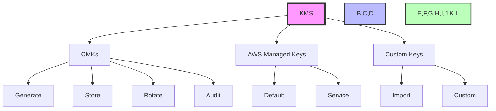

# AWS Security and Compliance Questions and Answers

## 1. What is AWS Key Management Service (KMS) and how does it work?

AWS KMS is a managed service that helps you create and control the encryption keys used to encrypt your data.



### Key Features
1. **Encryption Keys**
   - **Types**:
     - Customer Master Keys (CMKs)
     - AWS Managed Keys
     - Custom Keys
   - **Functionality**:
     - Generate encryption keys
     - Store encryption keys
     - Rotate encryption keys
     - Audit encryption keys

### Practical Example: Setting up KMS for S3 Bucket Encryption
```bash
# Create a KMS Key
aws kms create-key --description "Key for S3 bucket encryption" --tags TagKey=Name,TagValue=S3EncryptionKey

# Get the key ID
aws kms list-keys --query "Keys[?Description=='Key for S3 bucket encryption'].KeyId" --output text

# Create an IAM policy for S3 encryption
{
    "Version": "2012-10-17",
    "Statement": [
        {
            "Sid": "AllowS3Encryption",
            "Effect": "Allow",
            "Action": [
                "kms:GenerateDataKey",
                "kms:Decrypt"
            ],
            "Resource": "arn:aws:kms:region:account-id:key/key-id"
        }
    ]
}

# Configure S3 bucket encryption
aws s3api put-bucket-encryption --bucket my-encrypted-bucket --server-side-encryption-configuration '{
    "Rules": [
        {
            "ApplyServerSideEncryptionByDefault": {
                "SSEAlgorithm": "aws:kms",
                "KMSMasterKeyID": "arn:aws:kms:region:account-id:key/key-id"
            }
        }
    ]
}'
```

2. **Key Management**
   - **Functions**:
     - Create and delete keys
     - Enable and disable keys
     - Schedule key rotation
     - Configure key policies
   - **Best Practices**:
     - Regular key rotation
     - Strong key policies
     - Access controls
     - Regular audits

3. **Integration**
   - **Services**:
     - S3 (for file encryption)
     - RDS (for database encryption)
     - EBS (for volume encryption)
     - Redshift (for data encryption)
   - **Benefits**:
     - Centralized key management
     - Consistent encryption
     - Easy integration
     - Secure key storage

### Real-World Example
```plaintext
Scenario: Encrypting sensitive data in S3
1. Create CMK in KMS
2. Configure S3 bucket to use CMK
3. Upload encrypted files
4. Manage key rotation
5. Monitor key usage
```

## 2. Explain the concept of AWS CloudTrail and its benefits

CloudTrail is a service that helps you monitor and log AWS account activity.

### Key Features
1. **Logging**
   - **Types**:
     - API calls
     - Console actions
     - AWS service actions
     - Management events
   - **Details**:
     - Who did what
     - When it was done
     - What was changed
     - Where it was done

2. **Security**
   - **Monitoring**:
     - User activity
     - Resource changes
     - API usage
     - Security events
   - **Alerts**:
     - Suspicious activity
     - Policy changes
     - Resource modifications
     - Security breaches

3. **Compliance**
   - **Audit Trails**:
     - Detailed logs
     - Activity tracking
     - Change history
     - User actions
   - **Reports**:
     - Activity reports
     - Compliance reports
     - Security reports
     - Audit reports

### Real-World Example
```plaintext
Scenario: Monitoring security changes
1. Enable CloudTrail
2. Configure logging
3. Set up alerts
4. Monitor activity
5. Generate reports
```

## 3. What is AWS Web Application Firewall (WAF) and its use cases?

AWS WAF is a web application firewall that helps protect your web applications from common web exploits.

### Key Features
1. **Protection**
   - **Against**:
     - SQL injection
     - Cross-site scripting
     - Bad bots
     - DDoS attacks
   - **Rules**:
     - IP-based rules
     - Rate-based rules
     - String-based rules
     - Geo-based rules

2. **Integration**
   - **With**:
     - CloudFront (CDN)
     - Application Load Balancer
     - API Gateway
     - AppSync
   - **Benefits**:
     - Centralized protection
     - Easy configuration
     - Real-time protection
     - Automatic updates

3. **Management**
   - **Rules**:
     - Create rules
     - Manage rules
     - Test rules
     - Update rules
   - **Best Practices**:
     - Regular updates
     - Rule testing
     - Regular audits
     - Security monitoring

### Real-World Example
```plaintext
Scenario: Protecting a web application
1. Set up WAF rules
2. Configure protection
3. Monitor traffic
4. Block malicious requests
5. Update rules
```

## 4. Describe the purpose of AWS Shield and its features

AWS Shield is a managed DDoS protection service that safeguards applications running on AWS.

### Key Features
1. **Protection**
   - **Against**:
     - Network attacks
     - Application attacks
     - Volumetric attacks
     - Protocol attacks
   - **Types**:
     - Shield Standard (free)
     - Shield Advanced (paid)
     - Always On Protection

2. **Detection**
   - **Methods**:
     - Real-time monitoring
     - Traffic analysis
     - Pattern recognition
     - Automatic detection
   - **Responses**:
     - Automatic mitigation
     - Traffic filtering
     - Rate limiting
     - IP blocking

3. **Support**
   - **Features**:
     - 24/7 support
     - Attack analysis
     - Post-attack report
     - Security recommendations
   - **Benefits**:
     - Continuous protection
     - Automatic response
     - Expert support
     - Cost-effective

### Real-World Example
```plaintext
Scenario: Protecting against DDoS
1. Enable Shield
2. Configure protection
3. Monitor traffic
4. Automatic mitigation
5. Post-attack analysis
```

## 5. What is AWS Secrets Manager and how does it help secure sensitive information?

Secrets Manager helps you protect access to your applications, services, and IT resources without upfront investment and on-going maintenance costs of operating your own infrastructure.

### Key Features
1. **Secrets Management**
   - **Types**:
     - Database credentials
     - API keys
     - OAuth tokens
     - SSH keys
   - **Functions**:
     - Store secrets
     - Rotate secrets
     - Retrieve secrets
     - Audit secrets

2. **Security**
   - **Features**:
     - Encryption at rest
     - Access controls
     - Audit logging
     - Rotation policies
   - **Best Practices**:
     - Regular rotation
     - Strong encryption
     - Access controls
     - Regular audits

3. **Integration**
   - **With**:
     - RDS databases
     - Redshift clusters
     - Elasticache
     - Custom applications
   - **Benefits**:
     - Centralized management
     - Automatic rotation
     - Secure storage
     - Easy integration

### Real-World Example
```plaintext
Scenario: Managing database credentials
1. Store credentials in Secrets Manager
2. Configure rotation policy
3. Integrate with RDS
4. Monitor access
5. Audit usage
```

## 6. Explain the concept of AWS Compliance Programs

AWS Compliance Programs help you meet various industry-specific security and compliance requirements.

### Key Programs
1. **Industry Standards**
   - **Includes**:
     - ISO 27001
     - SOC 1, 2, 3
     - PCI DSS
     - HIPAA
     - GDPR
   - **Benefits**:
     - Pre-certified infrastructure
     - Compliance documentation
     - Regular audits
     - Security controls

2. **Regional Programs**
   - **Includes**:
     - FedRAMP
     - IRAP
     - ITAR
     - FISMA
     - DoD
   - **Benefits**:
     - Region-specific compliance
     - Government requirements
     - Security standards
     - Audit requirements

3. **Industry-Specific**
   - **Includes**:
     - Healthcare (HIPAA)
     - Finance (PCI DSS)
     - Government (FedRAMP)
     - Education (FERPA)
     - Retail (PCI DSS)
   - **Benefits**:
     - Industry-specific controls
     - Sector-specific requirements
     - Compliance documentation
     - Security standards

### Real-World Example
```plaintext
Scenario: Meeting healthcare compliance
1. Enable HIPAA compliance
2. Configure security controls
3. Implement audit logging
4. Monitor compliance
5. Generate reports
```

## 7. What is AWS Config and how does it help with compliance and governance?

AWS Config is a service that helps you assess, audit, and evaluate the configurations of your AWS resources.

### Key Features
1. **Configuration Management**
   - **Functions**:
     - Track resource configurations
     - Monitor changes
     - Record history
     - Generate reports
   - **Resources**:
     - EC2 instances
     - S3 buckets
     - RDS databases
     - Security groups

2. **Compliance**
   - **Features**:
     - Rules evaluation
     - Compliance checks
     - Audit trails
     - Resource tracking
   - **Benefits**:
     - Automated compliance
     - Real-time monitoring
     - Historical data
     - Audit reports

3. **Governance**
   - **Features**:
     - Resource tagging
     - Cost allocation
     - Usage tracking
     - Policy enforcement
   - **Best Practices**:
     - Regular audits
     - Policy updates
     - Resource tracking
     - Cost optimization

### Real-World Example
```plaintext
Scenario: Managing EC2 instances
1. Enable Config
2. Set up rules
3. Monitor instances
4. Generate reports
5. Enforce policies
```

## 8. Describe the role of AWS GuardDuty in security monitoring

GuardDuty is a threat detection service that continuously monitors for malicious activity and unauthorized behavior.

### Key Features
1. **Detection**
   - **Threats**:
     - Malware
     - Port scanning
     - Brute force attacks
     - Credential leaks
   - **Sources**:
     - VPC Flow Logs
     - CloudTrail events
     - DNS logs
     - S3 bucket events

2. **Analysis**
   - **Methods**:
     - Machine learning
     - Anomaly detection
     - Threat intelligence
     - Pattern recognition
   - **Benefits**:
     - Real-time detection
     - Automated analysis
     - Threat intelligence
     - Custom rules

3. **Response**
   - **Actions**:
     - Alert generation
     - Threat isolation
     - Incident response
     - Remediation guidance
   - **Integration**:
     - Security Hub
     - CloudWatch
     - SNS
     - Lambda

### Real-World Example
```plaintext
Scenario: Detecting unauthorized access
1. Enable GuardDuty
2. Configure data sources
3. Monitor alerts
4. Analyze threats
5. Implement response
```

## 9. What is AWS Security Hub and its key features?

Security Hub is a service that provides a comprehensive view of your security and compliance posture across AWS accounts.

### Key Features
1. **Centralization**
   - **Functions**:
     - Aggregate findings
     - Standardize results
     - Prioritize issues
     - Generate reports
   - **Sources**:
     - GuardDuty
     - Inspector
     - Macie
     - CloudTrail

2. **Compliance**
   - **Standards**:
     - CIS AWS Foundations
     - PCI DSS
     - AWS Foundational Security Best Practices
     - ISO 27001
   - **Benefits**:
     - Automated assessment
     - Continuous monitoring
     - Compliance reporting
     - Security recommendations

3. **Integration**
   - **With**:
     - AWS services
     - Third-party solutions
     - SIEM systems
     - Ticketing systems
   - **Features**:
     - Custom actions
     - Automated workflows
     - API access
     - Custom rules

### Real-World Example
```plaintext
Scenario: Managing security posture
1. Enable Security Hub
2. Configure standards
3. Monitor findings
4. Generate reports
5. Implement remediation
```

## 10. Explain the concept of AWS Artifact and its purpose

AWS Artifact is a service that provides on-demand access to AWS security and compliance documentation.

### Key Features
1. **Documentation**
   - **Types**:
     - Compliance reports
     - Security certifications
     - Audit reports
     - Compliance guides
   - **Access**:
     - On-demand download
     - Secure storage
     - Version control
     - Audit trail

2. **Compliance**
   - **Standards**:
     - ISO 27001
     - SOC 1, 2, 3
     - PCI DSS
     - HIPAA
     - GDPR
   - **Benefits**:
     - Pre-certified infrastructure
     - Compliance documentation
     - Regular updates
     - Security controls

3. **Management**
   - **Features**:
     - Document access
     - Version control
     - Audit logging
     - Permission management
   - **Best Practices**:
     - Regular updates
     - Secure access
     - Document tracking
     - Audit logging

### Real-World Example
```plaintext
Scenario: Meeting compliance requirements
1. Access Artifact
2. Download documentation
3. Review compliance
4. Generate reports
5. Update records
```

---

Note: This document provides a comprehensive overview of AWS security and compliance services. For the most up-to-date specifications and pricing, refer to the AWS official documentation and pricing calculator.

## Best Practices

1. **Security**
   - Implement strong encryption
   - Use multi-factor authentication
   - Regular security audits
   - Security monitoring
   - Regular updates

2. **Compliance**
   - Regular compliance checks
   - Documentation maintenance
   - Audit trails
   - Security policies
   - Regular updates

3. **Monitoring**
   - Real-time monitoring
   - Security alerts
   - Regular audits
   - Performance monitoring
   - Regular updates

4. **Cost Optimization**
   - Service selection
   - Resource optimization
   - Regular reviews
   - Cost monitoring
   - Regular updates

5. **Implementation**
   - Proper configuration
   - Security policies
   - Regular updates
   - Regular maintenance
   - Regular monitoring

## Common Use Cases

1. **Enterprise Security**
   - Multi-layer security
   - Compliance requirements
   - Security monitoring
   - Regular audits
   - Regular updates

2. **Compliance Management**
   - Industry standards
   - Regional requirements
   - Security policies
   - Regular updates
   - Regular maintenance

3. **Security Monitoring**
   - Real-time monitoring
   - Security alerts
   - Regular audits
   - Performance monitoring
   - Regular updates

4. **Cost Management**
   - Service selection
   - Resource optimization
   - Regular reviews
   - Cost monitoring
   - Regular updates

## Security Recommendations

1. **Encryption**
   - Strong encryption keys
   - Regular key rotation
   - Access controls
   - Regular audits
   - Regular updates

2. **Access Control**
   - Strong authentication
   - Role-based access
   - Regular audits
   - Security policies
   - Regular updates

3. **Monitoring**
   - Real-time monitoring
   - Security alerts
   - Regular audits
   - Performance monitoring
   - Regular updates

4. **Compliance**
   - Regular checks
   - Documentation
   - Audit trails
   - Security policies
   - Regular updates

## Cost Optimization Strategies

1. **Service Selection**
   - Right services
   - Proper configuration
   - Regular reviews
   - Cost monitoring
   - Regular updates

2. **Resource Management**
   - Resource optimization
   - Regular audits
   - Cost monitoring
   - Regular updates
   - Regular maintenance

3. **Monitoring**
   - Cost monitoring
   - Regular reviews
   - Resource optimization
   - Regular updates
   - Regular maintenance

---

Note: This comprehensive guide provides detailed information about AWS security and compliance services. For the most up-to-date specifications and pricing, refer to the AWS official documentation and pricing calculator.
