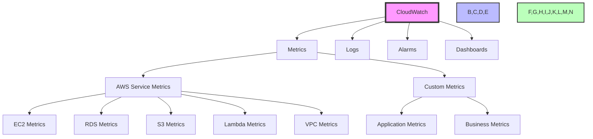
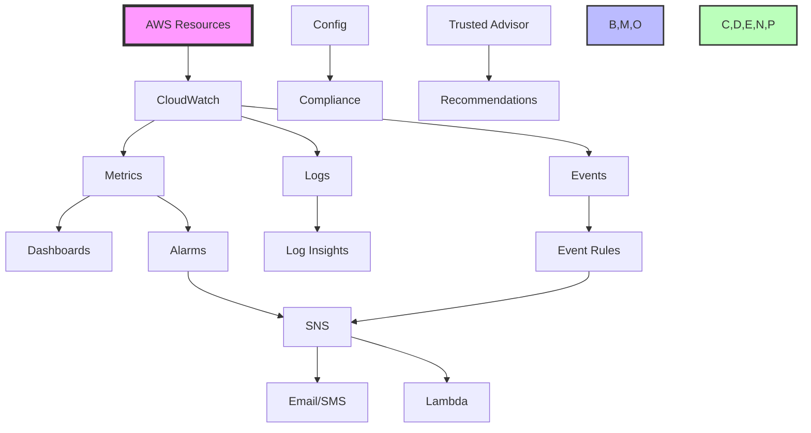
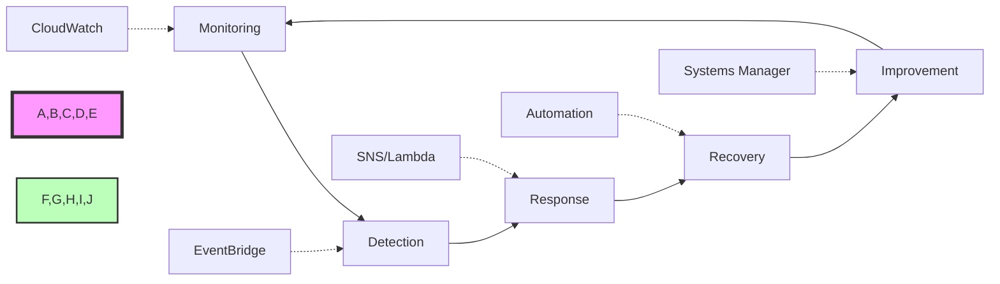

# AWS Monitoring and Management Questions and Answers

## 1. What is Amazon CloudWatch and its key components?

Amazon CloudWatch is a comprehensive monitoring and observability service that helps you monitor and troubleshoot your AWS resources and applications. It provides real-time monitoring, logging, and alerting capabilities to help maintain optimal performance and reliability.



### Key Components

1. **Metrics**
   - **Types**:
     - **AWS Service Metrics**:
       - EC2: CPU utilization, Network I/O, Disk I/O
       - RDS: CPU utilization, Memory usage, Disk usage
       - S3: Request count, Latency, Error rate
       - Lambda: Invocations, Duration, Error rate
       - VPC: Network traffic, Flow logs
     - **Custom Metrics**:
       - Application-specific metrics
       - Business metrics
       - Custom performance indicators
       - User-defined metrics

### Practical Example: Setting up CloudWatch Alarms and Metrics
```bash
# Publish a custom metric
aws cloudwatch put-metric-data \
    --metric-name RequestCount \
    --namespace MyApplication/Metrics \
    --value 100 \
    --unit Count \
    --dimensions Environment=Production

# Create a CloudWatch Alarm
aws cloudwatch put-metric-alarm \
    --alarm-name HighCPUAlarm \
    --metric-name CPUUtilization \
    --namespace AWS/EC2 \
    --statistic Average \
    --period 300 \
    --threshold 70 \
    --comparison-operator GreaterThanOrEqualToThreshold \
    --dimensions Name=InstanceId,Value=i-1234567890abcdef0 \
    --evaluation-periods 2 \
    --alarm-description "Alarm when server CPU exceeds 70%" \
    --alarm-actions arn:aws:sns:us-east-1:123456789012:MyTopic

# Create a CloudWatch Dashboard
aws cloudwatch put-dashboard \
    --dashboard-name MyApplicationDashboard \
    --dashboard-body file://dashboard.json

# Example dashboard.json
{
    "widgets": [
        {
            "type": "metric",
            "width": 12,
            "height": 6,
            "properties": {
                "metrics": [
                    [ "AWS/EC2", "CPUUtilization", "InstanceId", "i-1234567890abcdef0" ]
                ],
                "period": 300,
                "stat": "Average",
                "region": "us-east-1",
                "title": "EC2 CPU Utilization"
            }
        }
    ]
}
```

   - **Features**:
     - **Data Collection**:
       - Automatic collection from AWS services
       - Custom metrics publishing
       - High-resolution metrics (1-second granularity)
       - Extended metrics retention (up to 365 days)
     - **Data Processing**:
       - Metric math calculations
       - Dimension support (up to 10 dimensions)
       - Statistical calculations
       - Aggregation across dimensions
     - **Data Visualization**:
       - Real-time dashboards
       - Historical trends
       - Comparison views
       - Custom visualizations

2. **Logs**
   - **Types**:
     - **Application Logs**:
       - Application error logs
       - Access logs
       - Transaction logs
       - Audit logs
     - **System Logs**:
       - OS logs
       - Security logs
       - Audit logs
       - System events
     - **Custom Logs**:
       - User-defined logs
       - Application-specific logs
       - Business logs
     - **Service Logs**:
       - Lambda function logs
       - Container logs
       - API Gateway logs
       - CloudFront logs

   - **Features**:
     - **Log Management**:
       - Log groups (up to 20,000 per account)
       - Log streams (unlimited per group)
       - Retention policies (1-3653 days)
       - Log export to S3
     - **Log Processing**:
       - Log filtering
       - Log analysis
       - Log insights
       - Query capabilities
     - **Integration**:
       - CloudWatch Logs Agent
       - CloudWatch Logs API
       - CloudWatch Logs Insights
       - Third-party integrations

3. **Alarms**
   - **Types**:
     - **Metric Alarms**:
       - Simple threshold alarms
       - Statistical threshold alarms
       - Anomaly detection alarms
       - Step function alarms
     - **Composite Alarms**:
       - AND/OR conditions
       - Nested conditions
       - Cross-account alarms
       - Cross-region alarms
     - **Metric Math Alarms**:
       - Complex calculations
       - Multiple metrics
       - Statistical analysis
       - Custom formulas

   - **Features**:
     - **Thresholds**:
       - Static thresholds
       - Dynamic thresholds
       - Statistical thresholds
       - Custom thresholds
     - **Actions**:
       - SNS notifications
       - Auto Scaling actions
       - Lambda functions
       - EC2 actions
     - **States**:
       - OK
       - ALARM
       - INSUFFICIENT_DATA
       - PENDING

### Advanced Features

1. **Dashboards**
   - **Types**:
     - Custom dashboards
     - QuickSight dashboards
     - CloudWatch Metrics
     - Log insights
     - API dashboards
   - **Features**:
     - Widget customization
     - Real-time updates
     - Data visualization
     - Multiple views
     - Sharing capabilities
   - **Best Practices**:
     - Organized layout
     - Relevant metrics
     - Clear visualization
     - Regular updates
     - Access control

2. **Anomaly Detection**
   - **Features**:
     - Automatic detection
     - Custom thresholds
     - Historical analysis
     - Predictive alerts
   - **Benefits**:
     - Early warning
     - Performance optimization
     - Cost optimization
     - Resource optimization
   - **Use Cases**:
     - Performance monitoring
     - Cost monitoring
     - Security monitoring
     - Resource monitoring

3. **CloudWatch Insights**
   - **Features**:
     - Log analysis
     - Query capabilities
     - Pattern recognition
     - Performance analysis
   - **Benefits**:
     - Deep insights
     - Performance optimization
     - Security analysis
     - Cost optimization
   - **Use Cases**:
     - Log analysis
     - Security monitoring
     - Performance monitoring
     - Resource monitoring

### Best Practices

1. **Metric Collection**
   - **Implementation**:
     - Proper metric selection
     - Dimension configuration
     - Data retention
     - Cost optimization
   - **Best Practices**:
     - Relevant metrics
     - Proper dimensions
     - Appropriate retention
     - Cost optimization
   - **Example**:
     ```
     EC2 Metrics:
     - CPU utilization (5-minute intervals)
     - Network I/O (1-minute intervals)
     - Disk I/O (15-minute intervals)
     ```

2. **Log Management**
   - **Implementation**:
     - Log group configuration
     - Retention policies
     - Access controls
     - Cost optimization
   - **Best Practices**:
     - Proper log grouping
     - Appropriate retention
     - Access controls
     - Cost optimization
   - **Example**:
     ```
     Log Groups:
     - Application logs (30-day retention)
     - Security logs (90-day retention)
     - Audit logs (180-day retention)
     ```

3. **Alarm Configuration**
   - **Implementation**:
     - Proper thresholds
     - Multiple actions
     - Notification groups
     - Cost optimization
   - **Best Practices**:
     - Appropriate thresholds
     - Multiple actions
     - Notification groups
     - Cost optimization
   - **Example**:
     ```
     Alarm Configuration:
     - CPU > 80% for 5 minutes
     - Network I/O > 1000 Mbps
     - Error rate > 1%
     ```

### Real-World Use Cases

1. **Performance Monitoring**
   - **Implementation**:
     - Metrics collection
     - Log analysis
     - Alarm configuration
     - Dashboard creation
   - **Benefits**:
     - Performance optimization
     - Cost optimization
     - Resource optimization
     - Security monitoring
   - **Example**:
     ```
     Performance Monitoring:
     - EC2 CPU utilization
     - Network traffic
     - Disk I/O
     - Error rates
     ```

2. **Security Monitoring**
   - **Implementation**:
     - Log analysis
     - Alarm configuration
     - Security policies
     - Audit trails
   - **Benefits**:
     - Security optimization
     - Compliance monitoring
     - Threat detection
     - Incident response
   - **Example**:
     ```
     Security Monitoring:
     - Security group changes
     - IAM changes
     - VPC changes
     - Security events
     ```

3. **Cost Optimization**
   - **Implementation**:
     - Cost metrics
     - Usage metrics
     - Optimization policies
     - Cost alerts
   - **Benefits**:
     - Cost optimization
     - Resource optimization
     - Performance optimization
     - Security monitoring
   - **Example**:
     ```
     Cost Optimization:
     - Resource usage
     - Cost metrics
     - Optimization policies
     - Cost alerts
     ```

### Cost Optimization

1. **Metric Collection**
   - **Strategies**:
     - Appropriate metrics
     - Proper dimensions
     - Appropriate retention
     - Cost optimization
   - **Best Practices**:
     - Relevant metrics
     - Proper dimensions
     - Appropriate retention
     - Cost optimization
   - **Example Optimization**:
     ```
     Metric Collection:
     - Essential metrics only
     - Appropriate intervals
     - Appropriate retention
     ```

2. **Log Management**
   - **Strategies**:
     - Appropriate retention
     - Log compression
     - Log archiving
     - Cost optimization
   - **Best Practices**:
     - Appropriate retention
     - Log compression
     - Log archiving
     - Cost optimization
   - **Example Optimization**:
     ```
     Log Management:
     - Appropriate retention
     - Log compression
     - Log archiving
     ```

3. **Alarm Configuration**
   - **Strategies**:
     - Appropriate thresholds
     - Multiple actions
     - Notification groups
     - Cost optimization
   - **Best Practices**:
     - Appropriate thresholds
     - Multiple actions
     - Notification groups
     - Cost optimization
   - **Example Optimization**:
     ```
     Alarm Configuration:
     - Appropriate thresholds
     - Multiple actions
     - Notification groups
     ```

### Security Considerations

1. **Access Control**
   - **Implementation**:
     - IAM roles
     - Resource policies
     - Access controls
     - Security policies
   - **Best Practices**:
     - Least privilege
     - Regular audits
     - Access controls
     - Security policies
   - **Example**:
     ```
     Access Control:
     - IAM roles
     - Resource policies
     - Access controls
     - Security policies
     ```

2. **Data Protection**
   - **Implementation**:
     - Encryption
     - Access controls
     - Audit trails
     - Security policies
   - **Best Practices**:
     - Data encryption
     - Access controls
     - Audit trails
     - Security policies
   - **Example**:
     ```
     Data Protection:
     - Data encryption
     - Access controls
     - Audit trails
     - Security policies
     ```

3. **Compliance**
   - **Implementation**:
     - Audit trails
     - Security policies
     - Compliance reports
     - Security monitoring
   - **Best Practices**:
     - Regular audits
     - Security policies
     - Compliance reports
     - Security monitoring
   - **Example**:
     ```
     Compliance:
     - Audit trails
     - Security policies
     - Compliance reports
     - Security monitoring
     ```

### Integration Capabilities

1. **AWS Services**
   - **Integration**:
     - EC2
     - RDS
     - S3
     - Lambda
     - VPC
   - **Benefits**:
     - Comprehensive monitoring
     - Centralized management
     - Consistent monitoring
     - Security monitoring
   - **Example**:
     ```
     AWS Services:
     - EC2 monitoring
     - RDS monitoring
     - S3 monitoring
     - Lambda monitoring
     - VPC monitoring
     ```

2. **Third-Party Tools**
   - **Integration**:
     - Monitoring tools
     - Security tools
     - Logging tools
     - Analytics tools
   - **Benefits**:
     - Extended capabilities
     - Comprehensive monitoring
     - Advanced analytics
     - Security monitoring
   - **Example**:
     ```
     Third-Party Tools:
     - Monitoring tools
     - Security tools
     - Logging tools
     - Analytics tools
     ```

3. **Custom Applications**
   - **Integration**:
     - Custom metrics
     - Custom logs
     - Custom alarms
     - Custom dashboards
   - **Benefits**:
     - Custom monitoring
     - Custom analytics
     - Custom alerts
     - Custom dashboards
   - **Example**:
     ```
     Custom Applications:
     - Custom metrics
     - Custom logs
     - Custom alarms
     - Custom dashboards
     ```

---

Note: This comprehensive guide provides detailed information about Amazon CloudWatch features and best practices. For the most up-to-date specifications and pricing, refer to the AWS official documentation and pricing calculator.
     - Notification integration

4. **Dashboards**
   - **Types**:
     - Custom dashboards
     - QuickSight integration
     - CloudWatch Metrics
     - Log insights
   - **Features**:
     - Widget customization
     - Real-time updates
     - Data visualization
     - Multiple views
     - Sharing capabilities

### Best Practices
- Regular monitoring
- Alert configuration
- Log retention
- Metric collection
- Dashboard maintenance

## 2. Difference between Amazon CloudWatch and AWS CloudTrail

### CloudWatch
- **Purpose**:
  - Resource monitoring
  - Performance tracking
  - Real-time metrics
  - Log analysis
  - Alert generation

- **Features**:
  - Metrics collection
  - Log analysis
  - Alarms
  - Dashboards
  - Custom metrics

### CloudTrail
- **Purpose**:
  - API activity tracking
  - Audit logging
  - Security monitoring
  - Compliance
  - Change tracking

- **Features**:
  - API event logging
  - Trail configuration
  - Event filtering
  - Integration
  - Event history

### Key Differences
1. **Focus**:
   - CloudWatch: Performance
   - CloudTrail: Security

2. **Data Type**:
   - CloudWatch: Metrics
   - CloudTrail: Events

3. **Purpose**:
   - CloudWatch: Monitoring
   - CloudTrail: Auditing

## 3. What is AWS Systems Manager and its use cases?

AWS Systems Manager is a service that helps you manage your AWS infrastructure and applications.

### Key Features

1. **Operations**
   - **Functions**:
     - Run commands
     - Patch management
     - Inventory management
     - Maintenance windows
     - Session manager

2. **Automation**
   - **Features**:
     - Runbooks
     - Automation workflows
     - Step execution
     - Error handling
     - State management

3. **Monitoring**
   - **Features**:
     - Operations center
     - Resource groups
     - Compliance tracking
     - Change tracking
     - Incident management

### Use Cases
1. **Infrastructure Management**
   - Server management
   - Patch management
   - Configuration management
   - Maintenance scheduling
   - Incident response

2. **Automation**
   - Run commands
   - Deploy applications
   - Manage updates
   - Handle incidents
   - Scale operations

3. **Monitoring**
   - Resource tracking
   - Compliance monitoring
   - Change tracking
   - Performance monitoring
   - Security monitoring

## 4. Describe the concept of Amazon EventBridge (formerly CloudWatch Events)

EventBridge is a serverless event bus that connects applications together using events.

### Key Features

1. **Event Handling**
   - **Types**:
     - AWS service events
     - Custom events
     - Scheduled events
     - Partner events
   - **Features**:
     - Event patterns
     - Event rules
     - Event routing
     - Event filtering
     - Event transformation

2. **Integration**
   - **With**:
     - AWS services
     - External services
     - Custom applications
     - SaaS applications
   - **Features**:
     - Event bus
     - Event targets
     - Event patterns
     - Event rules
     - Event archives

3. **Scenarios**
   - **Use Cases**:
     - Event-driven architectures
     - Serverless applications
     - Event processing
     - Real-time processing
     - Integration scenarios

### Best Practices
- Event pattern design
- Security configuration
- Monitoring setup
- Error handling
- Cost optimization

## 5. What is AWS OpsWorks and how does it help with infrastructure management?

AWS OpsWorks is an application management service that helps you deploy and manage applications in the cloud.

### Key Features

1. **Infrastructure Management**
   - **Functions**:
     - Stack management
     - Layer management
     - Instance management
     - Deployment management
     - Configuration management

2. **Automation**
   - **Features**:
     - Chef recipes
     - Puppet modules
     - Custom cookbooks
     - Deployment recipes
     - Configuration recipes

3. **Integration**
   - **With**:
     - AWS services
     - Third-party tools
     - Custom applications
     - Monitoring services
     - Logging services

### Benefits
1. **Management**
   - Centralized control
   - Automated deployments
   - Configuration management
   - Resource optimization
   - Cost management

2. **Automation**
   - Automated scaling
   - Automated deployments
   - Automated updates
   - Automated backups
   - Automated monitoring

3. **Integration**
   - Service integration
   - Tool integration
   - Custom integration
   - Monitoring integration
   - Logging integration

## 6. Explain the purpose of AWS Config Rules

AWS Config Rules is a service that evaluates your AWS resources against desired configurations.

### Key Features

1. **Rules Management**
   - **Types**:
     - Managed rules
     - Custom rules
     - AWS managed rules
     - Third-party rules
   - **Features**:
     - Rule creation
     - Rule management
     - Rule evaluation
     - Rule updates
     - Rule monitoring

2. **Evaluation**
   - **Types**:
     - Periodic evaluation
     - Change-based evaluation
     - Scheduled evaluation
     - On-demand evaluation
   - **Features**:
     - Rule evaluation
     - Compliance tracking
     - Resource tracking
     - Change tracking
     - Notification integration

3. **Integration**
   - **With**:
     - AWS services
     - Third-party tools
     - Custom applications
     - Monitoring services
     - Logging services

### Best Practices
- Rule selection
- Rule configuration
- Evaluation frequency
- Notification setup
- Compliance monitoring

## 7. What is AWS CloudFormation and its benefits?

AWS CloudFormation is a service that helps you model and set up your AWS resources.

### Key Features

1. **Infrastructure as Code**
   - **Types**:
     - JSON templates
     - YAML templates
     - SAM templates
     - Nested stacks
     - Stack sets
   - **Features**:
     - Template creation
     - Stack creation
     - Stack updates
     - Stack deletion
     - Stack management

2. **Automation**
   - **Features**:
     - Automated deployments
     - Automated updates
     - Automated scaling
     - Automated backups
     - Automated monitoring

3. **Integration**
   - **With**:
     - AWS services
     - Third-party tools
     - Custom applications
     - CI/CD pipelines
     - Monitoring services

### Benefits
1. **Automation**
   - Automated deployments
   - Automated updates
   - Automated scaling
   - Automated backups
   - Automated monitoring

2. **Consistency**
   - Consistent deployments
   - Consistent updates
   - Consistent configurations
   - Consistent monitoring
   - Consistent security

3. **Management**
   - Stack management
   - Template management
   - Change management
   - Version management
   - Resource management

## 8. Describe the concept of AWS Service Catalog

AWS Service Catalog is a service that helps organizations control the use of AWS services and resources.

### Key Features

1. **Product Management**
   - **Types**:
     - AWS services
     - Custom products
     - Third-party products
     - Portfolio products
   - **Features**:
     - Product creation
     - Product management
     - Product sharing
     - Product updates
     - Product deletion

2. **Portfolio Management**
   - **Features**:
     - Portfolio creation
     - Portfolio management
     - Portfolio sharing
     - Portfolio updates
     - Portfolio deletion

3. **Integration**
   - **With**:
     - AWS services
     - Third-party tools
     - Custom applications
     - CI/CD pipelines
     - Monitoring services

### Benefits
1. **Control**
   - Service control
   - Usage control
   - Cost control
   - Security control
   - Compliance control

2. **Standardization**
   - Standard configurations
   - Standard deployments
   - Standard updates
   - Standard monitoring
   - Standard security

3. **Management**
   - Portfolio management
   - Product management
   - User management
   - Access management
   - Resource management

## 9. What is AWS Trusted Advisor and how does it help optimize AWS usage?

AWS Trusted Advisor is a service that helps you optimize your AWS infrastructure.

### Key Features

1. **Checks**
   - **Types**:
     - Cost optimization
     - Performance
     - Security
     - Fault tolerance
     - Service limits
   - **Features**:
     - Automated checks
     - Custom checks
     - Scheduled checks
     - On-demand checks
     - Check history

2. **Recommendations**
   - **Types**:
     - Cost optimization
     - Performance improvement
     - Security enhancement
     - Fault tolerance
     - Service limit management
   - **Features**:
     - Detailed recommendations
     - Actionable recommendations
     - Priority recommendations
     - Custom recommendations
     - Historical recommendations

3. **Integration**
   - **With**:
     - AWS services
     - Third-party tools
     - Custom applications
     - Monitoring services
     - Logging services

### Benefits
1. **Optimization**
   - Cost optimization
   - Performance optimization
   - Security optimization
   - Resource optimization
   - Configuration optimization

2. **Monitoring**
   - Check monitoring
   - Recommendation monitoring
   - Action monitoring
   - Status monitoring
   - History monitoring

3. **Management**
   - Check management
   - Recommendation management
   - Action management
   - Status management
   - History management

## 10. Explain the role of AWS Personal Health Dashboard

AWS Personal Health Dashboard is a service that provides you with relevant and timely information about the health of your AWS resources.

### Key Features

1. **Health Monitoring**
   - **Types**:
     - Service health
     - Account health
     - Resource health
     - Region health
     - Global health
   - **Features**:
     - Real-time monitoring
     - Historical monitoring
     - Custom monitoring
     - Alert monitoring
     - Status monitoring

2. **Alerts**
   - **Types**:
     - Service alerts
     - Account alerts
     - Resource alerts
     - Region alerts
     - Global alerts
   - **Features**:
     - Custom alerts
     - Scheduled alerts
     - On-demand alerts
     - Alert history
     - Alert management

3. **Integration**
   - **With**:
     - AWS services
     - Third-party tools
     - Custom applications
     - Monitoring services
     - Logging services

### Benefits
1. **Monitoring**
   - Real-time monitoring
   - Historical monitoring
   - Custom monitoring
   - Alert monitoring
   - Status monitoring

2. **Alerts**
   - Custom alerts
   - Scheduled alerts
   - On-demand alerts
   - Alert history
   - Alert management

3. **Management**
   - Health management
   - Alert management
   - Status management
   - History management
   - Configuration management

---

Note: This document provides a comprehensive overview of AWS monitoring and management services. For the most up-to-date specifications and pricing, refer to the AWS official documentation and pricing calculator.

## Monitoring Architecture Patterns

### Comprehensive Monitoring Solution



### Operational Excellence Framework



## Common Monitoring Interview Questions

### 1. How would you implement a comprehensive monitoring solution for a multi-tier application?
- Use CloudWatch for metrics collection from all application tiers
- Implement custom metrics for application-specific monitoring
- Set up CloudWatch Logs for centralized logging
- Configure alarms for critical thresholds
- Create dashboards for visibility
- Implement automated remediation with EventBridge and Lambda
- Use X-Ray for distributed tracing

### 2. What's the difference between CloudWatch and AWS Config?
- **CloudWatch**: 
  - Real-time monitoring and alerting
  - Metrics, logs, and events
  - Performance monitoring
  - Operational visibility
- **AWS Config**: 
  - Configuration tracking and auditing
  - Compliance validation
  - Resource relationship mapping
  - Historical configuration records
