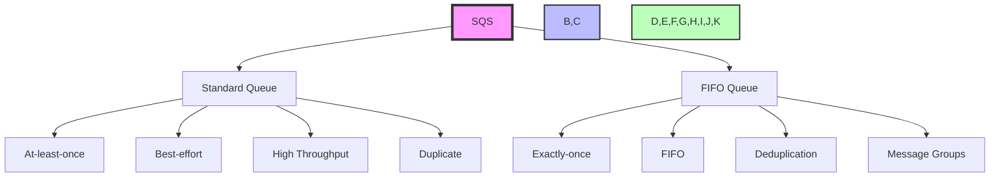
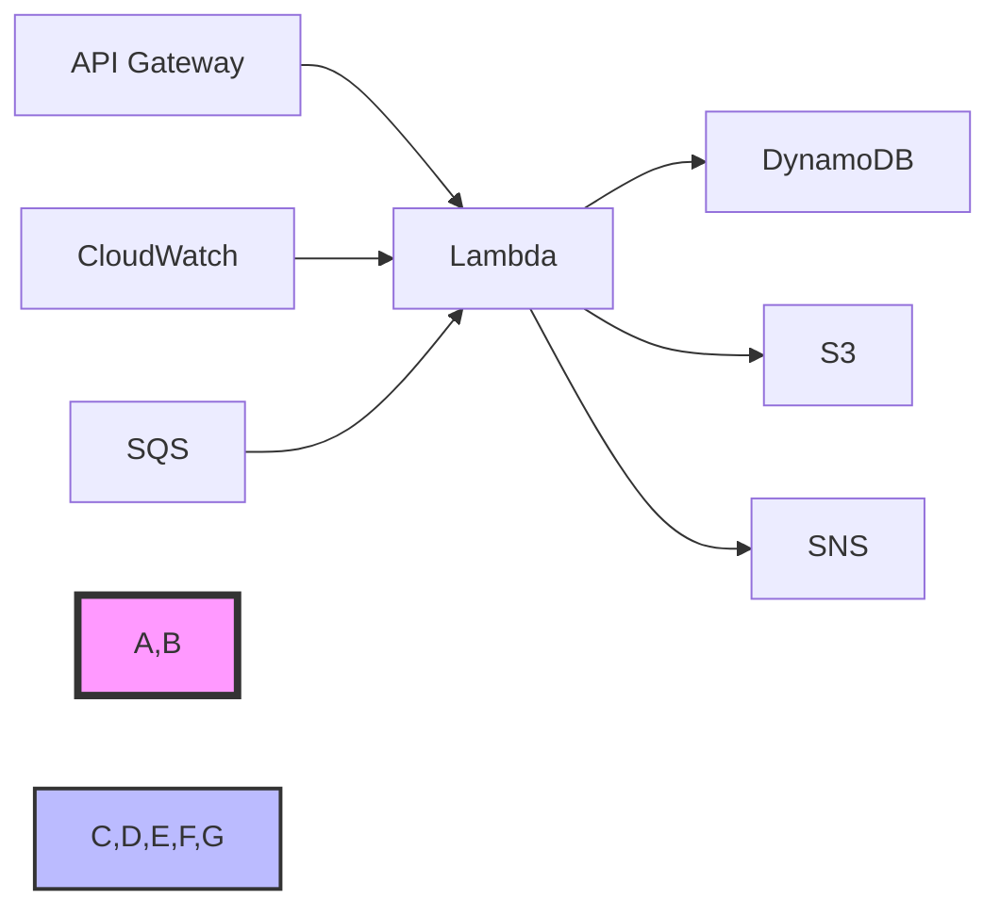

# AWS Application Integration and Serverless Questions and Answers

## 1. What is Amazon Simple Queue Service (SQS) and its use cases?

Amazon SQS is a fully managed message queuing service that enables you to decouple and scale microservices, distributed systems, and serverless applications.



### Key Features

1. **Queue Types**
   - **Standard Queue**:
     - At-least-once delivery
     - Best-effort ordering
     - High throughput
     - Duplicate messages
   - **FIFO Queue**:
     - Exactly-once processing
     - First-in-first-out
     - Message deduplication
     - Message groups

### Practical Example: Setting up SQS with Lambda
```yaml
# CloudFormation Template
Resources:
  MyQueue:
    Type: AWS::SQS::Queue
    Properties:
      QueueName: my-queue
      VisibilityTimeout: 30
      MessageRetentionPeriod: 86400

  MyLambdaFunction:
    Type: AWS::Lambda::Function
    Properties:
      FunctionName: process-sqs-messages
      Runtime: python3.8
      Handler: index.handler
      Code:
        ZipFile: |
          def handler(event, context):
              for record in event['Records']:
                  message = record['body']
                  print(f"Processing message: {message}")

  SQSPermission:
    Type: AWS::Lambda::Permission
    Properties:
      Action: "lambda:InvokeFunction"
      FunctionName: !Ref MyLambdaFunction
      Principal: "sqs.amazonaws.com"
      SourceArn: !GetAtt MyQueue.Arn

# Example Lambda function code (index.py)
import json

def handler(event, context):
    for record in event['Records']:
        message = json.loads(record['body'])
        print(f"Processing message: {message}")
        
        # Process the message
        process_message(message)
        
        # Delete the message from the queue
        receipt_handle = record['receiptHandle']
        queue_url = record['eventSourceARN']
        
        # Delete the message
        client.delete_message(
            QueueUrl=queue_url,
            ReceiptHandle=receipt_handle
        )

# Example SQS message producer
import boto3

sqs = boto3.client('sqs')
queue_url = 'your-queue-url'

# Send a message
response = sqs.send_message(
    QueueUrl=queue_url,
    MessageBody='Hello World',
    MessageGroupId='group1'
)
```

2. **Message Management**
   - **Features**:
     - Message retention
     - Message visibility
     - Message delay
     - Message attributes
     - Message filtering
   - **Best Practices**:
     - Proper retention
     - Visibility timeout
     - Message grouping
     - Dead letter queues
     - Error handling

3. **Integration**
   - **With**:
     - Lambda functions
     - SNS topics
     - EventBridge
     - Step Functions
     - Custom applications

### Use Cases

1. **Decoupling**
   - **Implementation**:
     - Microservices communication
     - Service decoupling
     - Event-driven architecture
     - Asynchronous processing
   - **Benefits**:
     - Scalability
     - Reliability
     - Flexibility
     - Performance
     - Cost optimization

2. **Batch Processing**
   - **Implementation**:
     - Data processing
     - File processing
     - Image processing
     - Video processing
   - **Benefits**:
     - High throughput
     - Scalability
     - Cost optimization
     - Performance
     - Reliability

3. **Workflows**
   - **Implementation**:
     - Multi-step processes
     - Complex workflows
     - Event-driven flows
     - State management
   - **Benefits**:
     - Flexibility
     - Scalability
     - Reliability
     - Performance
     - Cost optimization

## 2. Difference between Amazon SQS and Amazon Simple Notification Service (SNS)

### SQS (Queue Service)
- **Purpose**:
  - Message queuing
  - Message persistence
  - Message processing
  - Message delivery
- **Features**:
  - Message queue
  - Message retention
  - Message visibility
  - Message filtering
  - Message deduplication
- **Use Cases**:
  - Microservices communication
  - Batch processing
  - Workflows
  - Event-driven architecture

### SNS (Notification Service)
- **Purpose**:
  - Message broadcasting
  - Message distribution
  - Message delivery
  - Message notification
- **Features**:
  - Topic-based
  - Fan-out delivery
  - Message filtering
  - Message delivery
  - Message retention
- **Use Cases**:
  - Notifications
  - Event broadcasting
  - Message distribution
  - Integration
  - Monitoring

### Key Differences
1. **Message Delivery**
   - SQS: Pull-based
   - SNS: Push-based

2. **Message Processing**
   - SQS: Single consumer
   - SNS: Multiple consumers

3. **Message Retention**
   - SQS: 4 days
   - SNS: 15 minutes

4. **Use Cases**
   - SQS: Workflows
   - SNS: Notifications

## 3. What is AWS Lambda and its key features?

AWS Lambda is a serverless compute service that runs your code in response to events and automatically manages the underlying compute resources.

### Key Features

1. **Event-Driven**
   - **Triggers**:
     - S3 events
     - DynamoDB streams
     - API Gateway
     - EventBridge
     - SNS/SQS
   - **Benefits**:
     - Event-driven
     - Serverless
     - Cost-effective
     - Scalable
     - Reliable

2. **Runtime Support**
   - **Languages**:
     - Node.js
     - Python
     - Java
     - C#
     - Go
     - Ruby
   - **Features**:
     - Custom runtimes
     - Layer support
     - Environment variables
     - VPC access
     - IAM roles

3. **Performance**
   - **Features**:
     - Memory allocation
     - CPU allocation
     - Network bandwidth
     - Execution time
     - Cold start optimization

## 4. Describe the concept of Amazon API Gateway and its benefits

Amazon API Gateway is a fully managed service that makes it easy for developers to create, publish, maintain, monitor, and secure APIs.

### Key Features

1. **API Management**
   - **Features**:
     - API creation
     - API deployment
     - API versioning
     - API documentation
     - API monitoring
   - **Benefits**:
     - Centralized management
     - Consistent APIs
     - Secure APIs
     - Scalable APIs
     - Cost-effective

2. **Security**\n   - **Features**:
     - API keys
     - IAM roles
     - Cognito
     - OAuth 2.0
     - Custom authorizers
   - **Benefits**:
     - Secure APIs
     - Access control
     - Authentication
     - Authorization
     - Security monitoring

3. **Performance**
   - **Features**:
     - Caching
     - Rate limiting
     - Request validation
     - Response transformation
     - Integration optimization
   - **Benefits**:
     - High performance
     - Scalability
     - Cost optimization
     - Reliability
     - Flexibility

## 5. What is Amazon DynamoDB Streams and how does it work?

Amazon DynamoDB Streams captures table activity and makes it available for processing by applications that need to take action in response to table updates.

### Key Features

1. **Stream Records**
   - **Types**:
     - INSERT
     - MODIFY
     - REMOVE
     - NEW_IMAGE
     - OLD_IMAGE
   - **Features**:
     - Real-time updates
     - Record retention
     - Record filtering
     - Record processing
     - Record delivery

2. **Processing**
   - **Features**:
     - Lambda functions
     - Kinesis Data Streams
     - Custom applications
     - EventBridge
     - Step Functions
   - **Benefits**:
     - Real-time processing
     - Event-driven architecture
     - Data synchronization
     - Analytics
     - Monitoring

3. **Integration**
   - **With**:
     - Lambda functions
     - Kinesis Data Streams
     - EventBridge
     - Step Functions
     - Custom applications

## 6. Explain the purpose of AWS Step Functions

AWS Step Functions is a serverless workflow service that helps you coordinate the components of distributed applications and microservices using visual workflows.

### Key Features

1. **Workflow Types**
   - **Standard Workflows**:
     - Long-running workflows
     - Event-driven workflows
     - State management
     - Error handling
   - **Express Workflows**:
     - High throughput
     - Low latency
     - Event-driven
     - Real-time processing

2. **Workflow Management**
   - **Features**:
     - State management
     - Error handling
     - Retry policies
     - Timeout handling
     - Parallel execution
   - **Benefits**:
     - Reliability
     - Scalability
     - Performance
     - Cost optimization
     - Flexibility

3. **Integration**
   - **With**:
     - Lambda functions
     - DynamoDB
     - SNS/SQS
     - EventBridge
     - Custom applications

## 7. What is Amazon Kinesis and its use cases?

Amazon Kinesis is a platform for streaming data on AWS, offering powerful services for data ingestion, processing, and analytics.

### Key Features

1. **Data Streams**
   - **Types**:
     - Kinesis Data Streams
     - Kinesis Data Firehose
     - Kinesis Video Streams
     - Kinesis Data Analytics
   - **Features**:
     - Real-time data
     - Stream processing
     - Data ingestion
     - Data analytics
     - Data delivery

2. **Processing**
   - **Features**:
     - Stream processing
     - Data analytics
     - Data transformation
     - Data enrichment
     - Data delivery
   - **Benefits**:
     - Real-time processing
     - Scalability
     - Performance
     - Cost optimization
     - Flexibility

3. **Integration**
   - **With**:
     - Lambda functions
     - EventBridge
     - S3
     - Redshift
     - Custom applications

## 8. Describe the concept of AWS AppSync and its benefits

AWS AppSync is a managed service that helps you build GraphQL APIs that securely access, manipulate, and combine data from multiple sources.

### Key Features

1. **GraphQL API**
   - **Features**:
     - GraphQL support
     - Real-time subscriptions
     - Offline support
     - Caching
     - Authentication
   - **Benefits**:
     - Strong typing
     - Data validation
     - Real-time updates
     - Offline support
     - Performance

2. **Data Sources**
   - **Types**:
     - DynamoDB
     - Lambda
     - HTTP endpoints
     - Elasticsearch
     - Custom sources
   - **Features**:
     - Data integration
     - Data transformation
     - Data validation
     - Data caching
     - Data delivery

3. **Security**
   - **Features**:
     - API keys
     - IAM roles
     - Cognito
     - OAuth 2.0
     - Custom authorizers
   - **Benefits**:
     - Secure APIs
     - Access control
     - Authentication
     - Authorization
     - Security monitoring

## 9. What is Amazon EventBridge (formerly CloudWatch Events) and its role in serverless architectures?

Amazon EventBridge is a serverless event bus that connects applications together using events.

### Key Features

1. **Event Handling**
   - **Types**:
     - AWS service events
     - Custom events
     - Scheduled events
     - Partner events
   - **Features**:
     - Event patterns
     - Event rules
     - Event routing
     - Event filtering
     - Event transformation

2. **Integration**
   - **With**:
     - AWS services
     - External services
     - Custom applications
     - SaaS applications
     - Lambda functions
   - **Benefits**:
     - Event-driven architecture
     - Serverless integration
     - Real-time processing
     - Cost optimization
     - Scalability

3. **Serverless Architecture**
   - **Features**:
     - Event-driven
     - Serverless
     - Cost-effective
     - Scalable
     - Reliable
   - **Benefits**:
     - Event-driven architecture
     - Serverless integration
     - Real-time processing
     - Cost optimization
     - Scalability

## 10. Explain the concept of AWS Serverless Application Model (SAM)

AWS Serverless Application Model (SAM) is an open-source framework for building serverless applications on AWS.

### Key Features

1. **Application Definition**
   - **Features**:
     - YAML/JSON templates
     - Resource definition
     - Event sources
     - Environment variables
     - IAM roles
   - **Benefits**:
     - Simplified deployment
     - Consistent architecture
     - Cost optimization
     - Scalability
     - Reliability

2. **Deployment**
   - **Features**:
     - Package applications
     - Deploy applications
     - Update applications
     - Rollback applications
     - Monitor applications
   - **Benefits**:
     - Simplified deployment
     - Consistent architecture
     - Cost optimization
     - Scalability
     - Reliability

3. **Integration**
   - **With**:
     - Lambda functions
     - API Gateway
     - DynamoDB
     - SNS/SQS
     - EventBridge
   - **Benefits**:
     - Event-driven architecture
     - Serverless integration
     - Real-time processing
     - Cost optimization
     - Scalability

## Serverless Architecture Patterns



## Common Serverless Interview Questions

### 1. What are the key benefits of serverless architecture?
- **No server management**: Focus on code, not infrastructure
- **Auto-scaling**: Handles varying workloads automatically
- **Pay-per-use**: Only pay for actual compute time used
- **High availability**: Built-in redundancy and fault tolerance
- **Reduced time-to-market**: Faster development and deployment

### 2. What are the limitations of AWS Lambda?
- **Cold starts**: Initial invocation delay
- **Execution duration**: 15-minute maximum runtime
- **Memory limitations**: Up to 10GB RAM
- **Deployment package size**: 50MB zipped, 250MB unzipped
- **Temporary storage**: Limited to 512MB in /tmp

---

Note: This document provides a comprehensive overview of AWS application integration and serverless services. For the most up-to-date specifications and pricing, refer to the AWS official documentation and pricing calculator.
