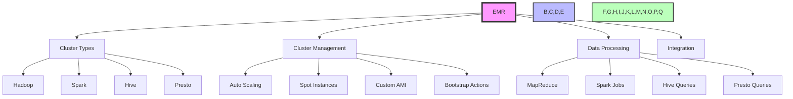
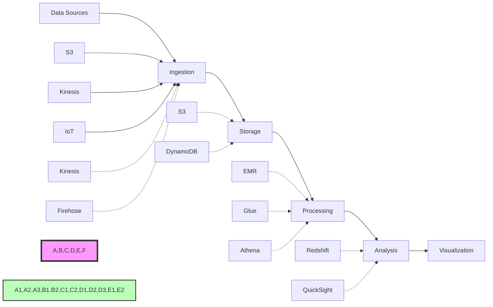

# AWS Data Analytics and Machine Learning Questions and Answers

## 1. What is Amazon Elastic MapReduce (EMR) and its key features?

Amazon EMR is a managed cluster platform that simplifies running big data frameworks, such as Apache Hadoop and Apache Spark, on AWS to process and analyze vast amounts of data. It's designed to handle petabyte-scale data processing and analytics workloads.



### Key Features

1. **Cluster Management**
   - **Types**:
     - **Hadoop clusters**:
       - HDFS storage
       - MapReduce processing
       - YARN resource management
       - Hadoop ecosystem components
     - **Spark clusters**:
       - In-memory processing
       - RDD support
       - Spark SQL
       - MLlib integration
     - **Hive clusters**:
       - SQL-like queries
       - Data warehousing
       - Schema management
       - Partitioning support
     - **Presto clusters**:
       - Interactive queries
       - SQL support
       - Real-time analysis
       - Multi-source querying

### Practical Example: Setting up EMR with Spark
```bash
# Create an EMR cluster with Spark
aws emr create-cluster \
    --name "Spark Cluster" \
    --release-label emr-6.2.0 \
    --instance-type m5.xlarge \
    --instance-count 3 \
    --applications Name=Spark \
    --ec2-attributes KeyName=MyKeyPair \
    --use-default-roles \
    --log-uri s3://my-log-bucket/emr-logs

# Submit a Spark job
aws emr add-steps --cluster-id j-1234567890123 \
    --steps Type=Spark,Name="Spark Word Count",ActionOnFailure=CONTINUE,Args=[--class,org.apache.spark.examples.SparkPi,s3://my-bucket/spark-examples.jar,10]

# Example Spark application (word_count.py)
from pyspark import SparkConf, SparkContext

def main():
    conf = SparkConf().setAppName("Word Count")
    sc = SparkContext(conf=conf)
    
    # Read data from S3
    text_file = sc.textFile("s3://my-bucket/input/data.txt")
    
    # Process the data
    counts = text_file.flatMap(lambda line: line.split()) \
                     .map(lambda word: (word, 1)) \
                     .reduceByKey(lambda a, b: a + b)
    
    # Save results to S3
    counts.saveAsTextFile("s3://my-bucket/output/wordcount")
    
if __name__ == "__main__":
    main()

# Example EMR bootstrap action (setup.sh)
#!/bin/bash

# Install additional packages
sudo yum install -y python3-pip
pip3 install numpy pandas

# Configure Spark
sed -i 's/spark.executor.memory=2g/spark.executor.memory=4g/' /etc/spark/conf/spark-defaults.conf
```

   - **Features**:
     - **Automatic scaling**:
       - Dynamic scaling
       - Instance groups
       - Spot instances
       - Scaling policies
     - **Spot instances**:
       - Cost optimization
       - Spot bidding
       - Spot fleet requests
       - Instance protection
     - **Custom AMIs**:
       - Custom configurations
       - Custom software
       - Security settings
       - OS customization
     - **Bootstrap actions**:
       - Custom scripts
       - Configuration management
       - Software installation
       - Environment setup
     - **Cluster customization**:
       - Instance types
       - Storage options
       - Network settings
       - Security groups

2. **Data Processing**
   - **Features**:
     - **MapReduce jobs**:
       - Data processing
       - Distributed computing
       - Fault tolerance
       - Job scheduling
     - **Spark jobs**:
       - In-memory processing
       - Batch processing
       - Real-time processing
       - Machine learning
     - **Hive queries**:
       - SQL-like queries
       - Data analysis
       - Data warehousing
       - Schema management
     - **Presto queries**:
       - Interactive queries
       - Real-time analysis
       - SQL support
       - Multi-source querying
     - **Custom applications**:
       - Custom code
       - Custom frameworks
       - Custom processing
       - Custom analytics

   - **Best Practices**:
     - **Cluster sizing**:
       - Instance selection
       - Storage optimization
       - Network configuration
       - Cost optimization
     - **Job optimization**:
       - Data partitioning
       - Job scheduling
       - Resource allocation
       - Performance tuning
     - **Security**:
       - IAM roles
       - VPC configuration
       - Encryption
       - Access control

3. **Integration**
   - **With**:
     - **S3**:
       - Data storage
       - Data processing
       - Data backup
       - Data archiving
     - **DynamoDB**:
       - Data integration
       - Data processing
       - Data analysis
       - Data storage
     - **Redshift**:
       - Data warehousing
       - Data analysis
       - Data processing
       - Data integration
     - **Kinesis**:
       - Data streaming
       - Data processing
       - Data analysis
       - Data delivery
     - **Custom data sources**:
       - RDBMS
       - NoSQL databases
       - File systems
       - Custom applications

### Advanced Features

1. **Cost Optimization**
   - **Strategies**:
     - Spot instances
     - Reserved instances
     - Instance groups
     - Auto scaling
   - **Best Practices**:
     - Proper instance selection
     - Cost monitoring
     - Resource optimization
     - Cost allocation
   - **Example**:
     ```
     Cost Optimization Strategy:
     - Use spot instances for non-critical workloads
     - Use reserved instances for predictable workloads
     - Implement auto scaling policies
     - Monitor resource utilization
     ```

2. **Performance Optimization**
   - **Strategies**:
     - Instance selection
     - Resource allocation
     - Job scheduling
     - Data partitioning
   - **Best Practices**:
     - Proper instance selection
     - Resource optimization
     - Job tuning
     - Data optimization
   - **Example**:
     ```
     Performance Optimization:
     - Use appropriate instance types
     - Optimize resource allocation
     - Implement proper partitioning
     - Tune job parameters
     ```

3. **Security**
   - **Features**:
     - IAM roles
     - VPC configuration
     - Encryption
     - Access control
   - **Best Practices**:
     - Proper IAM configuration
     - Network isolation
     - Data encryption
     - Access control
   - **Example**:
     ```
     Security Configuration:
     - Use IAM roles
     - Configure VPC
     - Enable encryption
     - Implement access control
     ```

### Real-World Use Cases

1. **Data Processing**
   - **Implementation**:
     - Batch processing
     - Real-time processing
     - Data transformation
     - Data enrichment
     - Data analysis
   - **Benefits**:
     - Scalability
     - Performance
     - Cost optimization
     - Flexibility
     - Reliability
   - **Example**:
     ```
     Data Processing Pipeline:
     - Data ingestion from S3
     - Data processing with Spark
     - Data analysis with Hive
     - Data storage in Redshift
     - Data visualization with QuickSight
     ```

2. **Analytics**
   - **Implementation**:
     - Data warehousing
     - Data analytics
     - Business intelligence
     - Data visualization
     - Data reporting
   - **Benefits**:
     - Scalability
     - Performance
     - Cost optimization
     - Flexibility
     - Reliability
   - **Example**:
     ```
     Analytics Pipeline:
     - Data ingestion from DynamoDB
     - Data processing with Presto
     - Data analysis with QuickSight
     - Data reporting with Athena
     - Data visualization with Redshift
     ```

### Best Practices

1. **Cluster Management**
   - **Implementation**:
     - Proper instance selection
     - Resource optimization
     - Cost monitoring
     - Performance tuning
     - Security configuration
   - **Best Practices**:
     - Use appropriate instance types
     - Implement auto scaling
     - Monitor resource utilization
     - Optimize job scheduling
     - Configure security properly
   - **Example**:
     ```
     Cluster Management:
     - Use spot instances for non-critical workloads
     - Implement auto scaling policies
     - Monitor resource utilization
     - Optimize job scheduling
     - Configure security properly
     ```

2. **Data Processing**
   - **Implementation**:
     - Data partitioning
     - Job scheduling
     - Resource allocation
     - Performance tuning
     - Cost optimization
   - **Best Practices**:
     - Proper data partitioning
     - Efficient job scheduling
     - Resource optimization
     - Performance tuning
     - Cost monitoring
   - **Example**:
     ```
     Data Processing:
     - Implement proper partitioning
     - Optimize job scheduling
     - Allocate resources efficiently
     - Tune performance parameters
     - Monitor cost metrics
     ```

3. **Integration**
   - **Implementation**:
     - Data integration
     - Data processing
     - Data analysis
     - Data delivery
     - Data visualization
   - **Best Practices**:
     - Proper data integration
     - Efficient data processing
     - Effective data analysis
     - Reliable data delivery
     - Clear data visualization
   - **Example**:
     ```
     Integration Pipeline:
     - Integrate with S3 for storage
     - Process data with Spark
     - Analyze data with Hive
     - Deliver data to Redshift
     - Visualize with QuickSight
     ```

### Cost Optimization

1. **Instance Selection**
   - **Strategies**:
     - Use appropriate instance types
     - Implement auto scaling
     - Use spot instances
     - Use reserved instances
   - **Best Practices**:
     - Proper instance selection
     - Resource optimization
     - Cost monitoring
     - Cost allocation
   - **Example**:
     ```
     Instance Selection:
     - Use appropriate instance types
     - Implement auto scaling
     - Use spot instances
     - Use reserved instances
     ```

2. **Resource Management**
   - **Strategies**:
     - Resource optimization
     - Cost monitoring
     - Cost allocation
     - Cost reporting
   - **Best Practices**:
     - Resource optimization
     - Cost monitoring
     - Cost allocation
     - Cost reporting
   - **Example**:
     ```
     Resource Management:
     - Optimize resource allocation
     - Monitor resource utilization
     - Allocate costs properly
     - Generate cost reports
     ```

3. **Job Optimization**
   - **Strategies**:
     - Job scheduling
     - Performance tuning
     - Cost optimization
     - Resource allocation
   - **Best Practices**:
     - Efficient job scheduling
     - Performance tuning
     - Cost optimization
     - Resource allocation
   - **Example**:
     ```
     Job Optimization:
     - Implement proper scheduling
     - Tune performance parameters
     - Optimize costs
     - Allocate resources efficiently
     ```

### Security Considerations

1. **Access Control**
   - **Implementation**:
     - IAM roles
     - VPC configuration
     - Security groups
     - Network ACLs
   - **Best Practices**:
     - Proper IAM configuration
     - Network isolation
     - Access control
     - Security monitoring
   - **Example**:
     ```
     Access Control:
     - Configure IAM roles
     - Set up VPC
     - Implement security groups
     - Monitor network ACLs
     ```

2. **Data Protection**
   - **Implementation**:
     - Data encryption
     - Access control
     - Audit trails
     - Security policies
   - **Best Practices**:
     - Data encryption
     - Access control
     - Audit trails
     - Security policies
   - **Example**:
     ```
     Data Protection:
     - Enable encryption
     - Implement access control
     - Maintain audit trails
     - Follow security policies
     ```

3. **Compliance**
   - **Implementation**:
     - Audit trails
     - Security policies
     - Compliance reports
     - Security monitoring
   - **Best Practices**:
     - Regular audits
     - Security policies
     - Compliance reports
     - Security monitoring
   - **Example**:
     ```
     Compliance:
     - Maintain audit trails
     - Follow security policies
     - Generate compliance reports
     - Monitor security continuously
     ```

### Integration Capabilities

1. **AWS Services**
   - **Integration**:
     - S3
     - DynamoDB
     - Redshift
     - Kinesis
     - Lambda
   - **Benefits**:
     - Comprehensive integration
     - Centralized management
     - Consistent integration
     - Security integration
     - Cost optimization
   - **Example**:
     ```
     AWS Services Integration:
     - Integrate with S3 for storage
     - Process data with Lambda
     - Analyze data with Redshift
     - Stream data with Kinesis
     - Store data in DynamoDB
     ```

2. **Third-Party Tools**
   - **Integration**:
     - Monitoring tools
     - Security tools
     - Analytics tools
     - Visualization tools
   - **Benefits**:
     - Extended capabilities
     - Comprehensive integration
     - Advanced analytics
     - Security integration
     - Cost optimization
   - **Example**:
     ```
     Third-Party Tools Integration:
     - Integrate monitoring tools
     - Use security tools
     - Implement analytics tools
     - Use visualization tools
     ```

3. **Custom Applications**
   - **Integration**:
     - Custom code
     - Custom frameworks
     - Custom processing
     - Custom analytics
   - **Benefits**:
     - Custom integration
     - Custom analytics
     - Custom processing
     - Custom visualization
     - Custom reporting
   - **Example**:
     ```
     Custom Applications Integration:
     - Integrate custom code
     - Use custom frameworks
     - Implement custom processing
     - Use custom analytics
     - Generate custom reports
     ```

---

Note: This comprehensive guide provides detailed information about Amazon EMR features and best practices. For the most up-to-date specifications and pricing, refer to the AWS official documentation and pricing calculator.

### Use Cases
1. **Data Processing**
   - **Implementation**:
     - Batch processing
     - Real-time processing
     - Data transformation
     - Data enrichment
     - Data analysis
   - **Benefits**:
     - Scalability
     - Performance
     - Cost optimization
     - Flexibility
     - Reliability

2. **Analytics**
   - **Implementation**:
     - Data warehousing
     - Data analytics
     - Business intelligence
     - Data visualization
     - Data reporting
   - **Benefits**:
     - Scalability
     - Performance
     - Cost optimization
     - Flexibility
     - Reliability

## 2. Difference between Amazon Redshift and Amazon Athena

### Redshift (Columnar Storage)
- **Purpose**:
  - Data warehousing
  - Analytics
  - Business intelligence
  - Reporting
  - Data analysis

- **Architecture**:
  - **Cluster-based**:
    - Managed cluster
    - Node-based
    - Storage and compute separation
    - High availability
  - **Scalability**:
    - Horizontal scaling
    - Vertical scaling
    - Auto scaling
    - Manual scaling

- **Features**:
  - **Columnar storage**:
    - Optimized for analytics
    - Compression
    - Partitioning
    - Distribution
  - **Massively parallel processing**:
    - Parallel queries
    - Distributed processing
    - Query optimization
    - Performance tuning
  - **SQL support**:
    - Standard SQL
    - Advanced SQL
    - Stored procedures
    - User-defined functions
  - **Integration**:
    - S3
    - DynamoDB
    - Kinesis
    - Lambda
    - Custom applications
  - **Security**:
    - IAM roles
    - VPC
    - Encryption
    - Row-level security
    - Column-level security

- **Use Cases**:
  - **Data warehousing**:
    - Large datasets
    - Complex queries
    - Historical data
    - Aggregation
  - **Analytics**:
    - Business intelligence
    - Data analysis
    - Reporting
    - Dashboards
  - **Business intelligence**:
    - Data visualization
    - Analytics
    - Reporting
    - Dashboards
  - **Reporting**:
    - Custom reports
    - Scheduled reports
    - Ad-hoc reports
    - Automated reports
  - **Data analysis**:
    - Complex queries
    - Data transformation
    - Data enrichment
    - Data analysis

### Athena (Serverless Query)
- **Purpose**:
  - Querying S3 data
  - Ad-hoc analysis
  - Data exploration
  - Quick queries
  - Data validation

- **Architecture**:
  - **Serverless**:
    - No infrastructure
    - Pay-per-query
    - Automatic scaling
    - No maintenance
  - **S3 Integration**:
    - Direct S3 queries
    - Partitioning
    - Compression
    - Data formats

- **Features**:
  - **Serverless**:
    - No infrastructure
    - Pay-per-query
    - Automatic scaling
    - No maintenance
  - **Pay-per-query**:
    - Cost optimization
    - Usage-based pricing
    - No upfront costs
    - Cost monitoring
  - **SQL support**:
    - Standard SQL
    - Query optimization
    - Query caching
    - Query history
  - **Integration**:
    - S3
    - Glue
    - QuickSight
    - Lambda
    - Custom applications
  - **Security**:
    - IAM roles
    - VPC endpoints
    - Encryption
    - Access control
    - Audit trails

- **Use Cases**:
  - **Ad-hoc queries**:
    - Quick queries
    - Data exploration
    - Data validation
    - Data monitoring
  - **Data exploration**:
    - Data discovery
    - Data analysis
    - Data validation
    - Data monitoring
  - **Quick analysis**:
    - Quick queries
    - Data validation
    - Data monitoring
    - Data exploration
  - **Data validation**:
    - Data quality
    - Data consistency
    - Data validation
    - Data monitoring
  - **Data monitoring**:
    - Data validation
    - Data quality
    - Data consistency
    - Data monitoring

### Key Differences
1. **Architecture**
   - **Redshift**:
     - Managed cluster
     - Node-based
     - Storage and compute separation
     - High availability
   - **Athena**:
     - Serverless
     - No infrastructure
     - Pay-per-query
     - Automatic scaling

2. **Cost Model**
   - **Redshift**:
     - Instance-based
     - Storage-based
     - Compute-based
     - Cost optimization
   - **Athena**:
     - Pay-per-query
     - Usage-based
     - No upfront costs
     - Cost monitoring

3. **Use Cases**
   - **Redshift**:
     - Data warehousing
     - Analytics
     - Business intelligence
     - Reporting
     - Data analysis
   - **Athena**:
     - Ad-hoc queries
     - Data exploration
     - Quick analysis
     - Data validation
     - Data monitoring

4. **Performance**
   - **Redshift**:
     - Optimized for large queries
     - Complex queries
     - Historical data
     - Aggregation
   - **Athena**:
     - Good for small to medium queries
     - Quick queries
     - Data exploration
     - Data validation
     - Data monitoring

5. **Scalability**
   - **Redshift**:
     - Horizontal scaling
     - Vertical scaling
     - Auto scaling
     - Manual scaling
   - **Athena**:
     - Automatic scaling
     - No infrastructure
     - Pay-per-query
     - Cost optimization

6. **Integration**
   - **Redshift**:
     - S3
     - DynamoDB
     - Kinesis
     - Lambda
     - Custom applications
   - **Athena**:
     - S3
     - Glue
     - QuickSight
     - Lambda
     - Custom applications

7. **Security**
   - **Redshift**:
     - IAM roles
     - VPC
     - Encryption
     - Row-level security
     - Column-level security
   - **Athena**:
     - IAM roles
     - VPC endpoints
     - Encryption
     - Access control
     - Audit trails

### Best Practices

1. **Redshift**
   - **Implementation**:
     - Proper cluster sizing
     - Storage optimization
     - Query optimization
     - Cost optimization
     - Security configuration
   - **Best Practices**:
     - Use appropriate instance types
     - Implement proper partitioning
     - Optimize queries
     - Monitor costs
     - Configure security properly
   - **Example**:
     ```
     Redshift Best Practices:
     - Use appropriate instance types
     - Implement proper partitioning
     - Optimize queries
     - Monitor costs
     - Configure security properly
     ```

2. **Athena**
   - **Implementation**:
     - Proper data organization
     - Query optimization
     - Cost optimization
     - Security configuration
     - Performance tuning
   - **Best Practices**:
     - Organize data properly
     - Optimize queries
     - Monitor costs
     - Configure security
     - Tune performance
   - **Example**:
     ```
     Athena Best Practices:
     - Organize data properly
     - Optimize queries
     - Monitor costs
     - Configure security
     - Tune performance
     ```

### Real-World Use Cases

1. **Redshift**
   - **Implementation**:
     - Data warehousing
     - Analytics
     - Business intelligence
     - Reporting
     - Data analysis
   - **Benefits**:
     - Scalability
     - Performance
     - Cost optimization
     - Flexibility
     - Reliability
   - **Example**:
     ```
     Redshift Use Case:
     - Data warehousing with S3
     - Analytics with QuickSight
     - Business intelligence with Looker
     - Reporting with Tableau
     - Data analysis with Python
     ```

2. **Athena**
   - **Implementation**:
     - Ad-hoc queries
     - Data exploration
     - Quick analysis
     - Data validation
     - Data monitoring
   - **Benefits**:
     - Cost optimization
     - Flexibility
     - Performance
     - Scalability
     - Reliability
   - **Example**:
     ```
     Athena Use Case:
     - Ad-hoc queries on S3
     - Data exploration with Glue
     - Quick analysis with QuickSight
     - Data validation with Lambda
     - Data monitoring with CloudWatch
     ```

---

Note: This comprehensive guide provides detailed information about the differences between Redshift and Athena. For the most up-to-date specifications and pricing, refer to the AWS official documentation and pricing calculator.

## 3. What is Amazon Kinesis Data Streams and its use cases?

Amazon Kinesis Data Streams is a managed service for real-time data ingestion and processing at massive scale, capable of handling hundreds of terabytes of data per hour from hundreds of thousands of sources.

### Key Features

1. **Data Streams**
   - **Types**:
     - **Data streams**:
       - Real-time data ingestion
       - Stream processing
       - Data retention
       - Data delivery
     - **Firehose streams**:
       - Data delivery
       - Data transformation
       - Data loading
       - Data storage
     - **Video streams**:
       - Video ingestion
       - Video processing
       - Video storage
       - Video delivery
     - **Analytics streams**:
       - Data analytics
       - Data processing
       - Data transformation
       - Data delivery

   - **Features**:
     - **Real-time data**:
       - Immediate ingestion
       - Immediate processing
       - Immediate delivery
       - Immediate analysis
     - **Stream processing**:
       - Real-time processing
       - Batch processing
       - Stream processing
       - Data analytics
     - **Data retention**:
       - 24 hours standard
       - 8760 hours extended
       - Data archiving
       - Data backup
     - **Data delivery**:
       - Real-time delivery
       - Batch delivery
       - Scheduled delivery
       - Custom delivery
     - **Data transformation**:
       - Data processing
       - Data enrichment
       - Data validation
       - Data delivery

2. **Processing**
   - **Features**:
     - **Real-time processing**:
       - Immediate processing
       - Immediate analysis
       - Immediate delivery
       - Immediate transformation
     - **Batch processing**:
       - Batch ingestion
       - Batch processing
       - Batch delivery
       - Batch transformation
     - **Stream processing**:
       - Real-time processing
       - Stream processing
       - Data analytics
       - Data delivery
     - **Data analytics**:
       - Real-time analytics
       - Batch analytics
       - Data analysis
       - Data visualization
     - **Data delivery**:
       - Real-time delivery
       - Batch delivery
       - Scheduled delivery
       - Custom delivery

   - **Best Practices**:
     - **Data ingestion**:
       - Proper data formatting
       - Proper data validation
       - Proper data delivery
       - Proper data backup
     - **Data processing**:
       - Proper data transformation
       - Proper data enrichment
       - Proper data validation
       - Proper data delivery
     - **Data delivery**:
       - Proper data formatting
       - Proper data validation
       - Proper data delivery
       - Proper data backup

3. **Integration**
   - **With**:
     - **Lambda**:
       - Real-time processing
       - Stream processing
       - Data transformation
       - Data delivery
     - **Redshift**:
       - Data warehousing
       - Data analytics
       - Data processing
       - Data delivery
     - **S3**:
       - Data storage
       - Data processing
       - Data analysis
       - Data delivery
     - **Elasticsearch**:
       - Data indexing
       - Data search
       - Data analytics
       - Data visualization
     - **Custom applications**:
       - Custom processing
       - Custom analytics
       - Custom delivery
       - Custom visualization

### Advanced Features

1. **Scalability**
   - **Strategies**:
     - Auto scaling
     - Manual scaling
     - Dynamic scaling
     - Cost optimization
   - **Best Practices**:
     - Proper scaling
     - Cost monitoring
     - Performance tuning
     - Resource optimization
   - **Example**:
     ```
     Scalability Strategy:
     - Implement auto scaling
     - Monitor resource utilization
     - Optimize performance
     - Control costs
     ```

2. **Performance**
   - **Strategies**:
     - Data partitioning
     - Resource allocation
     - Performance tuning
     - Cost optimization
   - **Best Practices**:
     - Proper partitioning
     - Resource optimization
     - Performance tuning
     - Cost monitoring
   - **Example**:
     ```
     Performance Optimization:
     - Implement proper partitioning
     - Optimize resource allocation
     - Tune performance parameters
     - Monitor costs
     ```

3. **Security**
   - **Features**:
     - IAM roles
     - VPC configuration
     - Encryption
     - Access control
   - **Best Practices**:
     - Proper IAM configuration
     - Network isolation
     - Data encryption
     - Access control
   - **Example**:
     ```
     Security Configuration:
     - Use IAM roles
     - Configure VPC
     - Enable encryption
     - Implement access control
     ```

### Real-World Use Cases

1. **Real-time Analytics**
   - **Implementation**:
     - Data ingestion
     - Stream processing
     - Real-time analytics
     - Data visualization
     - Data reporting
   - **Benefits**:
     - Real-time insights
     - Scalability
     - Performance
     - Cost optimization
     - Reliability
   - **Example**:
     ```
     Real-time Analytics Pipeline:
     - Data ingestion from IoT devices
     - Stream processing with Lambda
     - Real-time analytics with Kinesis Analytics
     - Data visualization with QuickSight
     - Data reporting with Redshift
     ```

2. **Data Processing**
   - **Implementation**:
     - Data transformation
     - Data enrichment
     - Data validation
     - Data delivery
     - Data storage
   - **Benefits**:
     - Scalability
     - Performance
     - Cost optimization
     - Flexibility
     - Reliability
   - **Example**:
     ```
     Data Processing Pipeline:
     - Data ingestion from S3
     - Data transformation with Lambda
     - Data enrichment with Glue
     - Data delivery to Redshift
     - Data storage in S3
     ```

### Best Practices

1. **Data Management**
   - **Implementation**:
     - Proper data formatting
     - Proper data validation
     - Proper data delivery
     - Proper data backup
   - **Best Practices**:
     - Use appropriate data formats
     - Implement proper validation
     - Configure proper delivery
     - Implement proper backup
   - **Example**:
     ```
     Data Management:
     - Use appropriate data formats
     - Implement proper validation
     - Configure proper delivery
     - Implement proper backup
     ```

2. **Processing**
   - **Implementation**:
     - Data transformation
     - Data enrichment
     - Data validation
     - Data delivery
     - Data storage
   - **Best Practices**:
     - Proper data transformation
     - Proper data enrichment
     - Proper data validation
     - Proper data delivery
     - Proper data storage
   - **Example**:
     ```
     Processing Pipeline:
     - Data transformation with Lambda
     - Data enrichment with Glue
     - Data validation with Athena
     - Data delivery to Redshift
     - Data storage in S3
     ```

3. **Integration**
   - **Implementation**:
     - Data integration
     - Data processing
     - Data analysis
     - Data delivery
     - Data visualization
   - **Best Practices**:
     - Proper data integration
     - Efficient data processing
     - Effective data analysis
     - Reliable data delivery
     - Clear data visualization
   - **Example**:
     ```
     Integration Pipeline:
     - Integrate with S3 for storage
     - Process data with Lambda
     - Analyze data with Kinesis Analytics
     - Deliver data to Redshift
     - Visualize with QuickSight
     ```

### Cost Optimization

1. **Resource Management**
   - **Strategies**:
     - Proper scaling
     - Cost monitoring
     - Performance tuning
     - Resource optimization
   - **Best Practices**:
     - Proper scaling
     - Cost monitoring
     - Performance tuning
     - Resource optimization
   - **Example**:
     ```
     Resource Management:
     - Implement proper scaling
     - Monitor resource utilization
     - Optimize performance
     - Control costs
     ```

2. **Data Management**
   - **Strategies**:
     - Data partitioning
     - Resource allocation
     - Performance tuning
     - Cost optimization
   - **Best Practices**:
     - Proper data partitioning
     - Resource optimization
     - Performance tuning
     - Cost monitoring
   - **Example**:
     ```
     Data Management:
     - Implement proper partitioning
     - Optimize resource allocation
     - Tune performance parameters
     - Monitor costs
     ```

3. **Processing**
   - **Strategies**:
     - Data transformation
     - Data enrichment
     - Data validation
     - Data delivery
     - Data storage
   - **Best Practices**:
     - Proper data transformation
     - Proper data enrichment
     - Proper data validation
     - Proper data delivery
     - Proper data storage
   - **Example**:
     ```
     Processing Optimization:
     - Implement proper transformation
     - Optimize data enrichment
     - Validate data properly
     - Configure proper delivery
     - Implement proper storage
     ```

### Security Considerations

1. **Access Control**
   - **Implementation**:
     - IAM roles
     - VPC configuration
     - Security groups
     - Network ACLs
   - **Best Practices**:
     - Proper IAM configuration
     - Network isolation
     - Access control
     - Security monitoring
   - **Example**:
     ```
     Access Control:
     - Configure IAM roles
     - Set up VPC
     - Implement security groups
     - Monitor network ACLs
     ```

2. **Data Protection**
   - **Implementation**:
     - Data encryption
     - Access control
     - Audit trails
     - Security policies
   - **Best Practices**:
     - Data encryption
     - Access control
     - Audit trails
     - Security policies
   - **Example**:
     ```
     Data Protection:
     - Enable encryption
     - Implement access control
     - Maintain audit trails
     - Follow security policies
     ```

3. **Compliance**
   - **Implementation**:
     - Audit trails
     - Security policies
     - Compliance reports
     - Security monitoring
   - **Best Practices**:
     - Regular audits
     - Security policies
     - Compliance reports
     - Security monitoring
   - **Example**:
     ```
     Compliance:
     - Maintain audit trails
     - Follow security policies
     - Generate compliance reports
     - Monitor security continuously
     ```

### Integration Capabilities

1. **AWS Services**
   - **Integration**:
     - Lambda
     - Redshift
     - S3
     - Elasticsearch
     - Custom applications
   - **Benefits**:
     - Comprehensive integration
     - Centralized management
     - Consistent integration
     - Security integration
     - Cost optimization
   - **Example**:
     ```
     AWS Services Integration:
     - Integrate with Lambda for processing
     - Use Redshift for analytics
     - Store data in S3
     - Index data in Elasticsearch
     - Build custom applications
     ```

2. **Third-Party Tools**
   - **Integration**:
     - Monitoring tools
     - Security tools
     - Analytics tools
     - Visualization tools
   - **Benefits**:
     - Extended capabilities
     - Comprehensive integration
     - Advanced analytics
     - Security integration
     - Cost optimization
   - **Example**:
     ```
     Third-Party Tools Integration:
     - Integrate monitoring tools
     - Use security tools
     - Implement analytics tools
     - Use visualization tools
     ```

3. **Custom Applications**
   - **Integration**:
     - Custom code
     - Custom frameworks
     - Custom processing
     - Custom analytics
   - **Benefits**:
     - Custom integration
     - Custom analytics
     - Custom processing
     - Custom visualization
     - Custom reporting
   - **Example**:
     ```
     Custom Applications Integration:
     - Integrate custom code
     - Use custom frameworks
     - Implement custom processing
     - Use custom analytics
     - Generate custom reports
     ```

---

Note: This comprehensive guide provides detailed information about Amazon Kinesis Data Streams features and best practices. For the most up-to-date specifications and pricing, refer to the AWS official documentation and pricing calculator.

### Use Cases
1. **Real-time Analytics**
   - **Implementation**:
     - Data ingestion
     - Stream processing
     - Real-time analytics
     - Data visualization
     - Data reporting
   - **Benefits**:
     - Real-time insights
     - Scalability
     - Performance
     - Cost optimization
     - Reliability

2. **Data Processing**
   - **Implementation**:
     - Data transformation
     - Data enrichment
     - Data validation
     - Data delivery
     - Data storage
   - **Benefits**:
     - Scalability
     - Performance
     - Cost optimization
     - Flexibility
     - Reliability

## 4. Describe the concept of Amazon Glue and its benefits

Amazon Glue is a fully managed extract, transform, and load (ETL) service that makes it easy to move data between your data stores, with built-in intelligence that automatically discovers your data and stores the associated metadata (e.g., table definition and schema) in the AWS Glue Data Catalog.

### Key Features

1. **Data Catalog**
   - **Features**:
     - **Data discovery**:
       - Automatic discovery
       - Schema detection
       - Data classification
       - Data profiling
     - **Schema management**:
       - Schema evolution
       - Versioning
       - Validation
       - Conversion
     - **Data classification**:
       - Type detection
       - Format detection
       - Pattern detection
       - Classification rules
     - **Data profiling**:
       - Statistical analysis
       - Data quality
       - Data validation
       - Data distribution
     - **Data lineage**:
       - Source tracking
       - Transformation tracking
       - Dependency tracking
       - Impact analysis

   - **Benefits**:
     - **Centralized catalog**:
       - Single source of truth
       - Consistent metadata
       - Easy discovery
       - Managed access
     - **Schema management**:
       - Version control
       - Schema evolution
       - Validation
       - Conversion
     - **Data discovery**:
       - Automatic discovery
       - Schema detection
       - Classification
       - Profiling
     - **Data classification**:
       - Type detection
       - Format detection
       - Pattern detection
       - Classification rules
     - **Data lineage**:
       - Source tracking
       - Transformation tracking
       - Dependency tracking
       - Impact analysis

2. **ETL Processing**
   - **Features**:
     - **Data transformation**:
       - Data cleaning
       - Data enrichment
       - Data conversion
       - Data validation
     - **Data validation**:
       - Data quality
       - Data consistency
       - Data completeness
       - Data accuracy
     - **Data enrichment**:
       - Data joining
       - Data aggregation
       - Data transformation
       - Data enhancement
     - **Data delivery**:
       - Real-time delivery
       - Batch delivery
       - Scheduled delivery
       - Custom delivery
     - **Data storage**:
       - S3 storage
       - Redshift storage
       - DynamoDB storage
       - Custom storage

   - **Benefits**:
     - **Automated ETL**:
       - Code generation
       - Job scheduling
       - Job monitoring
       - Job optimization
     - **Scalability**:
       - Auto scaling
       - Manual scaling
       - Resource optimization
       - Cost optimization
     - **Performance**:
       - Parallel processing
       - Distributed processing
       - Query optimization
       - Performance tuning
     - **Cost optimization**:
       - Resource optimization
       - Cost monitoring
       - Cost allocation
       - Cost reporting
     - **Reliability**:
       - Job recovery
       - Error handling
       - Retry policies
       - Monitoring

3. **Integration**
   - **With**:
     - **S3**:
       - Data ingestion
       - Data processing
       - Data storage
       - Data delivery
     - **Redshift**:
       - Data loading
       - Data transformation
       - Data analysis
       - Data delivery
     - **DynamoDB**:
       - Data ingestion
       - Data processing
       - Data storage
       - Data delivery
     - **RDS**:
       - Data extraction
       - Data transformation
       - Data loading
       - Data delivery
     - **Custom data sources**:
       - RDBMS
       - NoSQL databases
       - File systems
       - Custom applications

### Advanced Features

1. **Data Processing**
   - **Strategies**:
     - Data transformation
     - Data validation
     - Data enrichment
     - Data delivery
     - Data storage
   - **Best Practices**:
     - Proper data transformation
     - Proper data validation
     - Proper data enrichment
     - Proper data delivery
     - Proper data storage
   - **Example**:
     ```
     Data Processing Pipeline:
     - Extract data from RDS
     - Transform data with Glue
     - Validate data quality
     - Enrich data with additional data
     - Load data to Redshift
     ```

2. **ETL Optimization**
   - **Strategies**:
     - Job scheduling
     - Resource allocation
     - Performance tuning
     - Cost optimization
   - **Best Practices**:
     - Proper job scheduling
     - Resource optimization
     - Performance tuning
     - Cost monitoring
   - **Example**:
     ```
     ETL Optimization:
     - Schedule jobs properly
     - Allocate resources efficiently
     - Tune performance parameters
     - Monitor costs
     ```

3. **Data Quality**
   - **Features**:
     - Data validation
     - Data cleaning
     - Data enrichment
     - Data transformation
   - **Best Practices**:
     - Proper data validation
     - Proper data cleaning
     - Proper data enrichment
     - Proper data transformation
   - **Example**:
     ```
     Data Quality Pipeline:
     - Validate data quality
     - Clean data properly
     - Enrich data with additional data
     - Transform data for analysis
     ```

### Real-World Use Cases

1. **Data Integration**
   - **Implementation**:
     - Data extraction
     - Data transformation
     - Data loading
     - Data delivery
     - Data storage
   - **Benefits**:
     - Scalability
     - Performance
     - Cost optimization
     - Flexibility
     - Reliability
   - **Example**:
     ```
     Data Integration Pipeline:
     - Extract data from RDS
     - Transform data with Glue
     - Load data to Redshift
     - Deliver data to S3
     - Store data in DynamoDB
     ```

2. **Data Processing**
   - **Implementation**:
     - Data transformation
     - Data validation
     - Data enrichment
     - Data delivery
     - Data storage
   - **Benefits**:
     - Scalability
     - Performance
     - Cost optimization
     - Flexibility
     - Reliability
   - **Example**:
     ```
     Data Processing Pipeline:
     - Transform data with Glue
     - Validate data quality
     - Enrich data with additional data
     - Deliver data to Redshift
     - Store data in S3
     ```

### Best Practices

1. **Data Management**
   - **Implementation**:
     - Proper data formatting
     - Proper data validation
     - Proper data delivery
     - Proper data backup
   - **Best Practices**:
     - Use appropriate data formats
     - Implement proper validation
     - Configure proper delivery
     - Implement proper backup
   - **Example**:
     ```
     Data Management:
     - Use appropriate data formats
     - Implement proper validation
     - Configure proper delivery
     - Implement proper backup
     ```

2. **Processing**
   - **Implementation**:
     - Data transformation
     - Data enrichment
     - Data validation
     - Data delivery
     - Data storage
   - **Best Practices**:
     - Proper data transformation
     - Proper data enrichment
     - Proper data validation
     - Proper data delivery
     - Proper data storage
   - **Example**:
     ```
     Processing Pipeline:
     - Transform data with Glue
     - Enrich data with additional data
     - Validate data quality
     - Deliver data to Redshift
     - Store data in S3
     ```

3. **Integration**
   - **Implementation**:
     - Data integration
     - Data processing
     - Data analysis
     - Data delivery
     - Data visualization
   - **Best Practices**:
     - Proper data integration
     - Efficient data processing
     - Effective data analysis
     - Reliable data delivery
     - Clear data visualization
   - **Example**:
     ```
     Integration Pipeline:
     - Integrate with RDS for data
     - Process data with Glue
     - Analyze data with Redshift
     - Deliver data to S3
     - Visualize with QuickSight
     ```

### Cost Optimization

1. **Resource Management**
   - **Strategies**:
     - Proper scaling
     - Cost monitoring
     - Performance tuning
     - Resource optimization
   - **Best Practices**:
     - Proper scaling
     - Cost monitoring
     - Performance tuning
     - Resource optimization
   - **Example**:
     ```
     Resource Management:
     - Implement proper scaling
     - Monitor resource utilization
     - Optimize performance
     - Control costs
     ```

2. **Data Management**
   - **Strategies**:
     - Data partitioning
     - Resource allocation
     - Performance tuning
     - Cost optimization
   - **Best Practices**:
     - Proper data partitioning
     - Resource optimization
     - Performance tuning
     - Cost monitoring
   - **Example**:
     ```
     Data Management:
     - Implement proper partitioning
     - Optimize resource allocation
     - Tune performance parameters
     - Monitor costs
     ```

3. **Processing**
   - **Strategies**:
     - Data transformation
     - Data enrichment
     - Data validation
     - Data delivery
     - Data storage
   - **Best Practices**:
     - Proper data transformation
     - Proper data enrichment
     - Proper data validation
     - Proper data delivery
     - Proper data storage
   - **Example**:
     ```
     Processing Optimization:
     - Implement proper transformation
     - Optimize data enrichment
     - Validate data properly
     - Configure proper delivery
     - Implement proper storage
     ```

### Security Considerations

1. **Access Control**
   - **Implementation**:
     - IAM roles
     - VPC configuration
     - Security groups
     - Network ACLs
   - **Best Practices**:
     - Proper IAM configuration
     - Network isolation
     - Access control
     - Security monitoring
   - **Example**:
     ```
     Access Control:
     - Configure IAM roles
     - Set up VPC
     - Implement security groups
     - Monitor network ACLs
     ```

2. **Data Protection**
   - **Implementation**:
     - Data encryption
     - Access control
     - Audit trails
     - Security policies
   - **Best Practices**:
     - Data encryption
     - Access control
     - Audit trails
     - Security policies
   - **Example**:
     ```
     Data Protection:
     - Enable encryption
     - Implement access control
     - Maintain audit trails
     - Follow security policies
     ```

3. **Compliance**
   - **Implementation**:
     - Audit trails
     - Security policies
     - Compliance reports
     - Security monitoring
   - **Best Practices**:
     - Regular audits
     - Security policies
     - Compliance reports
     - Security monitoring
   - **Example**:
     ```
     Compliance:
     - Maintain audit trails
     - Follow security policies
     - Generate compliance reports
     - Monitor security continuously
     ```

### Integration Capabilities

1. **AWS Services**
   - **Integration**:
     - S3
     - Redshift
     - DynamoDB
     - RDS
     - Custom applications
   - **Benefits**:
     - Comprehensive integration
     - Centralized management
     - Consistent integration
     - Security integration
     - Cost optimization
   - **Example**:
     ```
     AWS Services Integration:
     - Integrate with S3 for storage
     - Process data with Glue
     - Analyze data with Redshift
     - Store data in DynamoDB
     - Build custom applications
     ```

2. **Third-Party Tools**
   - **Integration**:
     - Monitoring tools
     - Security tools
     - Analytics tools
     - Visualization tools
   - **Benefits**:
     - Extended capabilities
     - Comprehensive integration
     - Advanced analytics
     - Security integration
     - Cost optimization
   - **Example**:
     ```
     Third-Party Tools Integration:
     - Integrate monitoring tools
     - Use security tools
     - Implement analytics tools
     - Use visualization tools
     ```

3. **Custom Applications**
   - **Integration**:
     - Custom code
     - Custom frameworks
     - Custom processing
     - Custom analytics
   - **Benefits**:
     - Custom integration
     - Custom analytics
     - Custom processing
     - Custom visualization
     - Custom reporting
   - **Example**:
     ```
     Custom Applications Integration:
     - Integrate custom code
     - Use custom frameworks
     - Implement custom processing
     - Use custom analytics
     - Generate custom reports
     ```

---

Note: This comprehensive guide provides detailed information about Amazon Glue features and best practices. For the most up-to-date specifications and pricing, refer to the AWS official documentation and pricing calculator.

## 5. What is Amazon SageMaker and how does it help with machine learning?

Amazon SageMaker is a fully managed service that provides developers and data scientists with the ability to build, train, and deploy machine learning (ML) models at scale.

### Key Features

1. **Model Building**
   - **Features**:
     - Jupyter notebooks
     - Pre-built algorithms
     - Custom algorithms
     - Model training
     - Model deployment
   - **Benefits**:
     - Simplified development
     - Pre-built algorithms
     - Custom algorithms
     - Scalability
     - Performance

2. **Model Training**
   - **Features**:
     - Automatic model tuning
     - Distributed training
     - Model validation
     - Model optimization
     - Model deployment
   - **Benefits**:
     - Automated training
     - Scalability
     - Performance
     - Cost optimization
     - Reliability

3. **Model Deployment**
   - **Features**:
     - Real-time inference
     - Batch inference
     - Model hosting
     - Model monitoring
     - Model updating
   - **Benefits**:
     - Real-time inference
     - Batch inference
     - Scalability
     - Performance
     - Cost optimization

## 6. Explain the purpose of Amazon QuickSight

Amazon QuickSight is a fast, cloud-powered business intelligence (BI) service that makes it easy to build visualizations, perform ad-hoc analysis, and quickly get business insights from your data.

### Key Features

1. **Data Visualization**
   - **Features**:
     - Interactive dashboards
     - Visual analytics
     - Data exploration
     - Data discovery
     - Data sharing
   - **Benefits**:
     - Interactive dashboards
     - Visual analytics
     - Data exploration
     - Data discovery
     - Data sharing

2. **Data Sources**
   - **Types**:
     - S3
     - Redshift
     - RDS
     - DynamoDB
     - Custom data sources
   - **Features**:
     - Data integration
     - Data transformation
     - Data validation
     - Data delivery
     - Data storage

3. **Integration**
   - **With**:
     - S3
     - Redshift
     - RDS
     - DynamoDB
     - Custom applications

## 7. What is AWS Data Pipeline and its role in data processing?

AWS Data Pipeline is a web service that helps you reliably process and move data between different AWS compute and storage services, as well as on-premises data sources, at specified intervals.

### Key Features

1. **Data Processing**
   - **Features**:
     - Data movement
     - Data transformation
     - Data validation
     - Data delivery
     - Data scheduling
   - **Benefits**:
     - Automated processing
     - Scalability
     - Performance
     - Cost optimization
     - Reliability

2. **Scheduling**
   - **Features**:
     - Time-based scheduling
     - Event-based scheduling
     - Custom scheduling
     - Schedule management
     - Schedule monitoring
   - **Benefits**:
     - Automated scheduling
     - Flexibility
     - Performance
     - Cost optimization
     - Reliability

3. **Integration**
   - **With**:
     - S3
     - Redshift
     - DynamoDB
     - RDS
     - Custom data sources

## 8. Describe the concept of Amazon Rekognition and its use cases

Amazon Rekognition is a service that makes it easy to add image and video analysis to your applications using proven, highly scalable, deep learning technology.

### Key Features

1. **Image Analysis**
   - **Features**:
     - Face detection
     - Object detection
     - Scene detection
     - Text detection
     - Custom labels
   - **Benefits**:
     - Image analysis
     - Face detection
     - Object detection
     - Scene detection
     - Text detection

2. **Video Analysis**
   - **Features**:
     - Face tracking
     - Object tracking
     - Scene tracking
     - Text tracking
     - Custom tracking
   - **Benefits**:
     - Video analysis
     - Face tracking
     - Object tracking
     - Scene tracking
     - Text tracking

3. **Integration**
   - **With**:
     - S3
     - Lambda
     - Kinesis
     - Custom applications
     - Third-party tools

### Use Cases
1. **Content Moderation**
   - **Implementation**:
     - Image moderation
     - Video moderation
     - Content filtering
     - Content classification
     - Content monitoring
   - **Benefits**:
     - Content safety
     - Content filtering
     - Content classification
     - Content monitoring
     - Cost optimization

2. **Face Recognition**
   - **Implementation**:
     - Face detection
     - Face comparison
     - Face search
     - Face verification
     - Face tracking
   - **Benefits**:
     - Face recognition
     - Face comparison
     - Face search
     - Face verification
     - Face tracking

## 9. What is Amazon Comprehend and how does it help with natural language processing?

Amazon Comprehend is a natural language processing (NLP) service that uses machine learning to find insights and relationships in text.

### Key Features

1. **Text Analysis**
   - **Features**:
     - Sentiment analysis
     - Entity recognition
     - Key phrase extraction
     - Language detection
     - Custom entities
   - **Benefits**:
     - Text analysis
     - Sentiment analysis
     - Entity recognition
     - Key phrase extraction
     - Language detection

2. **Document Processing**
   - **Features**:
     - Document analysis
     - Document classification
     - Document summarization
     - Document translation
     - Document processing
   - **Benefits**:
     - Document analysis
     - Document classification
     - Document summarization
     - Document translation
     - Document processing

3. **Integration**
   - **With**:
     - S3
     - Lambda
     - Kinesis
     - Custom applications
     - Third-party tools

## 10. Explain the concept of Amazon Forecast and its benefits

Amazon Forecast is a fully managed service that uses machine learning to deliver highly accurate forecasts.

### Key Features

1. **Forecast Generation**
   - **Features**:
     - Time series forecasting
     - Custom forecasting
     - Automatic forecasting
     - Forecast optimization
     - Forecast validation
   - **Benefits**:
     - Accurate forecasting
     - Custom forecasting
     - Automatic forecasting
     - Forecast optimization
     - Forecast validation

2. **Data Processing**
   - **Features**:
     - Data ingestion
     - Data transformation
     - Data validation
     - Data delivery
     - Data storage
   - **Benefits**:
     - Data processing
     - Data transformation
     - Data validation
     - Data delivery
     - Data storage

3. **Integration**
   - **With**:
     - S3
     - Lambda
     - Kinesis
     - Custom applications
     - Third-party tools

---

Note: This document provides a comprehensive overview of AWS data analytics and machine learning services. For the most up-to-date specifications and pricing, refer to the AWS official documentation and pricing calculator.

## Data Analytics Architecture Patterns



## Common Data Analytics Interview Questions

### 1. What is the difference between EMR and Glue?
- **EMR**: Managed Hadoop framework for processing large datasets
  - More control over configuration
  - Supports multiple frameworks (Spark, Hive, Presto)
  - Requires more management
- **Glue**: Serverless ETL service
  - Fully managed with minimal configuration
  - Automatic schema discovery
  - Pay only for resources used during job execution

### 2. When would you choose Redshift over Athena?
- **Redshift**: For complex queries on structured data with predictable workloads
  - Better for frequent, complex queries
  - Optimized for data warehousing
  - Requires capacity planning
- **Athena**: For ad-hoc queries on S3 data with variable workloads
  - Serverless, pay-per-query model
  - No infrastructure to manage
  - Direct query on S3 data
