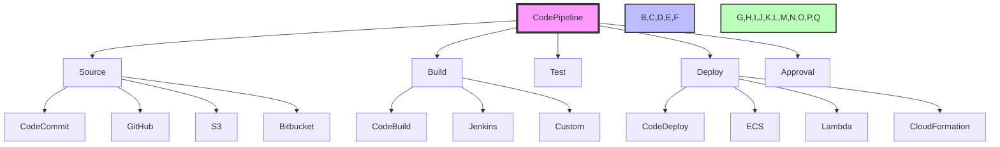

# AWS Deployment and DevOps Services

## 1. What is AWS CodePipeline and its key features?

AWS CodePipeline is a fully managed continuous integration and continuous delivery (CI/CD) service that helps automate your release processes, enabling you to model, visualize, and automate the steps required to release your software. It integrates with various AWS services and third-party tools to create automated release pipelines.



### Key Features

1. **Pipeline Components**
   - **Source**:
     - **CodeCommit**:
       - Secure Git-based repositories
       - Branch management
       - Pull requests
       - Code review capabilities
     - **GitHub**:
       - Webhook integration
       - Pull request detection
       - Branch protection
     - **S3**:
       - Artifact storage
       - Version control
       - Access control
     - **Bitbucket**:
       - Repository integration
       - Branch tracking
       - Pull request handling

### Practical Example: Setting up a CI/CD Pipeline
```yaml
# CodePipeline configuration
Resources:
  MyPipeline:
    Type: AWS::CodePipeline::Pipeline
    Properties:
      RoleArn: !GetAtt CodePipelineRole.Arn
      Stages:
        - Name: Source
          Actions:
            - Name: SourceAction
              ActionTypeId:
                Category: Source
                Owner: AWS
                Provider: CodeCommit
                Version: '1'
              Configuration:
                RepositoryName: !Ref CodeCommitRepo
                BranchName: main
              OutputArtifacts:
                - Name: SourceOutput

        - Name: Build
          Actions:
            - Name: BuildAction
              ActionTypeId:
                Category: Build
                Owner: AWS
                Provider: CodeBuild
                Version: '1'
              Configuration:
                ProjectName: !Ref CodeBuildProject
              InputArtifacts:
                - Name: SourceOutput
              OutputArtifacts:
                - Name: BuildOutput

        - Name: Deploy
          Actions:
            - Name: DeployAction
              ActionTypeId:
                Category: Deploy
                Owner: AWS
                Provider: CodeDeploy
                Version: '1'
              Configuration:
                ApplicationName: !Ref CodeDeployApp
                DeploymentGroupName: !Ref CodeDeployGroup
              InputArtifacts:
                - Name: BuildOutput

# CodeBuild buildspec.yml
version: 0.2

phases:
  install:
    runtime-versions:
      nodejs: 14
    commands:
      - npm install

  build:
    commands:
      - npm run build

artifacts:
  files:
    - '**/*'
  base-directory: dist

# CodeDeploy AppSpec.yml
version: 0.0
Resources:
  - TargetService:
      Type: AWS::ECS::Service
      Properties:
        TaskDefinition: !Ref TaskDefinition
        LoadBalancerInfo:
          ContainerName: my-app
          ContainerPort: 80

# Example deployment script
import boto3

def deploy_application():
    # Initialize clients
    codepipeline = boto3.client('codepipeline')
    codedeploy = boto3.client('codedeploy')
    
    # Start deployment
    response = codedeploy.create_deployment(
        applicationName='MyApp',
        deploymentGroupName='MyGroup',
        revision={
            'revisionType': 'S3',
            's3Location': {
                'bucket': 'my-deployment-bucket',
                'key': 'artifacts.zip',
                'bundleType': 'zip'
            }
        }
    )
    
    # Monitor deployment
    deployment_id = response['deploymentId']
    while True:
        status = codedeploy.get_deployment(
            deploymentId=deployment_id
        )['deploymentInfo']['status']
        
        if status in ['Succeeded', 'Failed']:
            break
            
        time.sleep(30)
    
    return status
```

   - **Build**:
     - **CodeBuild**:
       - Fully managed build service
       - Multiple build environments
       - Custom build specifications
     - **Jenkins**:
       - Custom build jobs
       - Pipeline as code
       - Plugin integration
     - **Custom Providers**:
       - Custom build scripts
       - Third-party build tools
       - Custom build environments

   - **Test**:
     - **Automated Testing**:
       - Unit tests
       - Integration tests
       - Performance tests
     - **Manual Testing**:
       - Test environments
       - Test data management
       - Test result tracking
     - **Integration Testing**:
       - API testing
       - Load testing
       - Security testing

   - **Deploy**:
     - **CodeDeploy**:
       - Blue/green deployments
       - Canary deployments
       - In-place deployments
     - **ECS**:
       - Container deployments
       - Service updates
       - Task definitions
     - **Lambda**:
       - Function updates
       - Alias management
       - Version control
     - **CloudFormation**:
       - Stack creation
       - Stack updates
       - Stack deletion

2. **Pipeline Management**
   - **Visual Pipeline Editor**:
     - **Interface Features**:
       - Drag-and-drop stage creation
       - Real-time validation
       - Pipeline visualization
       - Stage configuration
     - **Pipeline Structure**:
       - Source stages
       - Build stages
       - Test stages
       - Deploy stages
       - Approval stages

   - **Approval Actions**:
     - **Manual Approvals**:
       - Human verification
       - Team approval
       - Business sign-off
     - **Lambda Approvals**:
       - Custom approval logic
       - Automated checks
       - API integrations
     - **Custom Workflows**:
       - Custom approval rules
       - Notification systems
       - External integrations

   - **Pipeline Monitoring**:
     - **Execution History**:
       - Pipeline runs
       - Stage execution
       - Action execution
       - Error tracking
     - **Stage Status**:
       - In-progress stages
       - Completed stages
       - Failed stages
       - Stopped stages
     - **Error Tracking**:
       - Error classification
       - Error resolution
       - Error prevention

3. **Integration**
   - **AWS Services**:
     - **CloudFormation**:
       - Stack management
       - Change sets
       - Stack updates
     - **CodeDeploy**:
       - Deployment groups
       - Deployment strategies
       - Application revisions
     - **CodeBuild**:
       - Build projects
       - Build specifications
       - Build environments
     - **Lambda**:
       - Function management
       - Version control
       - Alias management

   - **Third-Party Tools**:
     - **Jenkins**:
       - Pipeline integration
       - Plugin support
       - Custom jobs
     - **GitHub**:
       - Webhook integration
       - Pull request handling
       - Branch protection
     - **Bitbucket**:
       - Repository integration
       - Pull request handling
       - Branch management
     - **Custom Tools**:
       - Custom integrations
       - API access
       - Custom workflows

### Advanced Features

1. **Pipeline Configuration**
   - **Stage Configuration**:
     - Action types
     - Action providers
     - Action inputs
     - Action outputs
   - **Action Configuration**:
     - Action properties
     - Action permissions
     - Action settings
     - Action validation
   - **Pipeline Settings**:
     - Pipeline name
     - Pipeline description
     - Pipeline role
     - Pipeline permissions

2. **Pipeline Execution**
   - **Trigger Types**:
     - Code changes
     - Manual triggers
     - Scheduled triggers
     - External triggers
   - **Execution Order**:
     - Stage order
     - Action order
     - Parallel execution
     - Sequential execution
   - **Execution Control**:
     - Stage gates
     - Action gates
     - Approval gates
     - Error handling

3. **Pipeline Security**
   - **IAM Integration**:
     - Pipeline roles
     - Action roles
     - Resource permissions
     - Cross-account access
   - **Encryption**:
     - S3 encryption
     - KMS integration
     - SSL/TLS
     - Data protection
   - **Access Control**:
     - Resource policies
     - IAM policies
     - Organization policies
     - Service control policies

### Best Practices

1. **Pipeline Design**
   - **Stage Organization**:
     - Clear stage separation
     - Logical stage ordering
     - Stage dependencies
     - Stage validation
   - **Action Configuration**:
     - Proper action settings
     - Action validation
     - Action testing
     - Action monitoring
   - **Pipeline Testing**:
     - Pipeline validation
     - Pipeline testing
     - Pipeline debugging
     - Pipeline optimization

2. **Pipeline Management**
   - **Monitoring**:
     - Pipeline metrics
     - Stage metrics
     - Action metrics
     - Error metrics
   - **Logging**:
     - Pipeline logs
     - Stage logs
     - Action logs
     - Error logs
   - **Alerting**:
     - Pipeline alerts
     - Stage alerts
     - Action alerts
     - Error alerts

3. **Pipeline Security**
   - **Access Control**:
     - Proper permissions
     - Role separation
     - Resource isolation
     - Security validation
   - **Data Protection**:
     - Encryption
     - Data validation
     - Data integrity
     - Data security
   - **Audit Trails**:
     - Pipeline changes
     - Stage changes
     - Action changes
     - Security changes

### Real-World Example
```yaml
pipeline:
  name: MyWebAppPipeline
  roleArn: arn:aws:iam::123456789012:role/CodePipelineRole
  artifactStore:
    type: S3
    location: my-pipeline-artifacts
  stages:
    - name: Source
      actions:
        - name: SourceAction
          actionTypeId:
            category: Source
            owner: AWS
            provider: CodeCommit
            version: '1'
          configuration:
            RepositoryName: my-web-app
            BranchName: main
            PollForSourceChanges: true
          outputArtifacts:
            - name: SourceOutput

    - name: Build
      actions:
        - name: BuildAction
          actionTypeId:
            category: Build
            owner: AWS
            provider: CodeBuild
            version: '1'
          configuration:
            ProjectName: web-app-build
            EnvironmentVariables:
              - name: ENVIRONMENT
                value: production
                type: PLAINTEXT
          inputArtifacts:
            - name: SourceOutput
          outputArtifacts:
            - name: BuildOutput

    - name: Test
      actions:
        - name: TestAction
          actionTypeId:
            category: Test
            owner: AWS
            provider: Lambda
            version: '1'
          configuration:
            FunctionName: test-function
            UserParameters: "--environment production"
          inputArtifacts:
            - name: BuildOutput

    - name: Deploy
      actions:
        - name: DeployAction
          actionTypeId:
            category: Deploy
            owner: AWS
            provider: CodeDeploy
            version: '1'
          configuration:
            ApplicationName: web-app
            DeploymentGroupName: production
            FileExistsBehavior: OVERWRITE
          inputArtifacts:
            - name: BuildOutput

    - name: Approval
      actions:
        - name: ManualApproval
          actionTypeId:
            category: Approval
            owner: AWS
            provider: Manual
            version: '1'
          configuration:
            NotificationArn: arn:aws:sns:region:account-id:topic-name
            CustomData: "Production deployment approval"
            ExternalEntityLink: "https://example.com/deployment"
```

## 2. Difference between AWS CodeCommit and AWS CodeDeploy

### AWS CodeCommit
- **Purpose**: Secure Git-based source code repository service
- **Key Features**:
  - Private Git repositories
  - Integration with IAM
  - Branch management
  - Pull requests
  - Code review capabilities
- **Use Cases**:
  - Source code storage
  - Version control
  - Code collaboration
  - CI/CD integrations

### AWS CodeDeploy
- **Purpose**: Automated application deployment service
- **Key Features**:
  - Deployment strategies:
    - In-place
    - Blue/green
    - Canary
  - Multi-environment support
  - Rollback capabilities
  - Health checks
- **Use Cases**:
  - Application deployments
  - Infrastructure updates
  - Blue/green deployments
  - Canary releases

### Example Integration
```yaml
# CodeCommit to CodeDeploy Pipeline
pipeline:
  source:
    provider: CodeCommit
    repository: my-app
    branch: main
  deploy:
    provider: CodeDeploy
    application: my-app
    deploymentGroup: production
    strategy: blue-green
```

## 3. What is AWS CodeBuild and how does it work?

AWS CodeBuild is a fully managed build service that compiles source code, runs tests, and produces software packages ready for deployment.

### Key Features

1. **Build Environments**
   - **Managed Environments**:
     - Linux
     - Windows
     - Custom Docker images
   - **Build Specifications**:
     - YAML-based build files
     - Environment variables
     - Build commands
     - Artifacts configuration

2. **Build Process**
   - **Phases**:
     - Install
     - Pre-build
     - Build
     - Post-build
   - **Artifacts**:
     - Build outputs
     - Test reports
     - Logs
     - Deployment packages

3. **Integration**
   - **Source Providers**:
     - CodeCommit
     - GitHub
     - S3
     - Bitbucket
   - **Deployment Targets**:
     - CodeDeploy
     - ECS
     - Lambda
     - S3

### Build Specification Example
```yaml
version: 0.2

phases:
  install:
    runtime-versions:
      nodejs: 14
    commands:
      - echo Installing dependencies...
      - npm install
  build:
    commands:
      - echo Building the application...
      - npm run build
  post_build:
    commands:
      - echo Build completed on `date`

artifacts:
  files:
    - '**/*'
```

## 4. AWS CodeStar and its benefits

AWS CodeStar is a cloud-based service that helps teams quickly develop, build, and deploy applications on AWS.

### Key Features

1. **Project Management**
   - **Project Templates**:
     - Web applications
     - Microservices
     - Serverless applications
   - **Integrated Tools**:
     - Code repository
     - Build system
     - Deployment system
     - Issue tracking

2. **Team Collaboration**
   - **Access Control**:
     - IAM integration
     - Team roles
     - Permission management
   - **Communication**:
     - Issue tracking
     - Code reviews
     - Chat integration

3. **Development Environment**
   - **IDE Integration**:
     - AWS Cloud9
     - Visual Studio
     - Eclipse
   - **Custom Environments**:
     - Local development
     - Cloud-based IDEs
     - Container-based environments

### Example Project Setup
```yaml
project:
  name: MyWebApp
  template: web-app
  repository:
    name: my-web-app
    provider: CodeCommit
  build:
    provider: CodeBuild
    specifications: web-app-buildspec.yml
  deploy:
    provider: CodeDeploy
    environment: production
```

## 5. AWS X-Ray and its role in application debugging

AWS X-Ray helps developers analyze and debug production, distributed applications, such as those built using a microservices architecture.

### Key Features

1. **Tracing**
   - **Request Tracing**:
     - End-to-end tracing
     - Request analysis
     - Performance metrics
   - **Service Maps**:
     - Visual representation
     - Dependency analysis
     - Performance insights

2. **Analysis**
   - **Performance Metrics**:
     - Latency analysis
     - Error rates
     - Request patterns
   - **Anomaly Detection**:
     - Performance anomalies
     - Error patterns
     - Traffic spikes

3. **Integration**
   - **AWS Services**:
     - Lambda
     - API Gateway
     - ECS
     - DynamoDB
   - **Custom Applications**:
     - SDK integration
     - Custom tracing
     - Custom metrics

### Example Tracing
```yaml
xray:
  tracing:
    enabled: true
    sampling:
      rules:
        - fixed_target: 1
          rate: 0.1
          http_method: GET
          url_path: /api/
  insights:
    enabled: true
    insights_target: 100
```

## 6. AWS CloudFormation Nested Stacks

Nested stacks allow you to break down large CloudFormation templates into smaller, more manageable pieces.

### Key Features

1. **Stack Organization**
   - **Parent Stack**:
     - Main template
     - Stack references
     - Parameter passing
   - **Child Stacks**:
     - Reusable templates
     - Independent updates
     - Isolated resources

2. **Benefits**
   - **Modularity**:
     - Reusable components
     - Independent updates
     - Better organization
   - **Scalability**:
     - Large deployments
     - Resource grouping
     - Parallel updates

3. **Integration**
   - **Parameter Passing**:
     - Cross-stack parameters
     - Output references
     - Stack exports
   - **Resource Sharing**:
     - Shared resources
     - Cross-stack references
     - Resource dependencies

### Example Template
```yaml
Resources:
  MainStack:
    Type: AWS::CloudFormation::Stack
    Properties:
      TemplateURL: !Sub
        - https://${S3Bucket}/${S3Key}
        - S3Bucket: !Ref S3Bucket
          S3Key: child-stack.yaml
      Parameters:
        Environment: !Ref Environment
        VpcId: !Ref VpcId
```

## 7. AWS OpsWorks for Chef Automate

OpsWorks for Chef Automate is a service that helps you deliver infrastructure as code using Chef.

### Key Features

1. **Infrastructure Management**
   - **Chef Automate**:
     - Configuration management
     - Policy enforcement
     - Compliance tracking
   - **Chef Server**:
     - Node management
     - Cookbook management
     - Policy management

2. **Deployment**
   - **Environment Management**:
     - Layer management
     - Instance management
     - Stack management
   - **Deployment Strategies**:
     - Rolling updates
     - Blue/green
     - Canary

3. **Monitoring**
   - **Compliance**:
     - Policy enforcement
     - Audit trails
     - Compliance reports
   - **Operations**:
     - Node status
     - Deployment status
     - Resource usage

### Example Configuration
```yaml
chef:
  environment: production
  run_list:
    - recipe[web::app]
    - recipe[db::server]
  attributes:
    web:
      port: 80
      environment: production
    db:
      version: 5.7
      backup_enabled: true
```

## 8. AWS Systems Manager Parameter Store

Parameter Store is a secure, hierarchical store for configuration data management and secrets.

### Key Features

1. **Parameter Types**
   - **String**:
     - Plain text parameters
     - Configuration values
     - Application settings
   - **SecureString**:
     - Encrypted values
     - Secrets
     - Sensitive data
   - **StringList**:
     - List of values
     - Multiple parameters
     - Configuration arrays

2. **Management**
   - **Version Control**:
     - Parameter versions
     - Rollback capabilities
     - Change history
   - **Access Control**:
     - IAM integration
     - Resource policies
     - Parameter permissions

3. **Integration**
   - **AWS Services**:
     - Lambda
     - EC2
     - ECS
     - CloudFormation
   - **Custom Applications**:
     - SDK integration
     - API access
     - CLI access

### Example Usage
```yaml
parameters:
  database:
    username: /prod/db/username
    password: /prod/db/password
    host: /prod/db/host
    port: /prod/db/port

# Secure parameter
/secure/api/key: securestring
```

## 9. AWS CloudFormation Drift Detection

Drift detection helps identify differences between the current state of your stack resources and the last known state of the stack.

### Key Features

1. **Detection**
   - **Resource Types**:
     - EC2 instances
     - Security groups
     - IAM roles
     - S3 buckets
   - **Detection Methods**:
     - Automatic detection
     - Manual detection
     - Scheduled detection

2. **Analysis**
   - **Drift Types**:
     - Property changes
     - Configuration changes
     - Resource changes
   - **Reporting**:
     - Drift status
     - Changed properties
     - Resource details

3. **Remediation**
   - **Update Stack**:
     - Apply changes
     - Rollback changes
     - Update resources
   - **Documentation**:
     - Change history
     - Audit trails
     - Compliance reports

### Example Detection
```yaml
drift:
  resources:
    - EC2Instance
    - SecurityGroup
    - IAMRole
  schedule:
    interval: 24h
    enabled: true
```

## 10. AWS CodePipeline Approval Actions

Approval actions allow you to add manual or automated approval steps in your CI/CD pipeline.

### Key Features

1. **Approval Types**
   - **Manual Approvals**:
     - Human verification
     - Team approval
     - Business sign-off
   - **Automated Approvals**:
     - Lambda functions
     - Custom logic
     - API integrations

2. **Approval Process**
   - **Approval Rules**:
     - Custom conditions
     - Time limits
     - Required approvals
   - **Notification**:
     - Email notifications
     - Slack integration
     - Custom notifications

3. **Integration**
   - **Pipeline Stages**:
     - Pre-deployment
     - Post-deployment
     - Critical changes
   - **Custom Actions**:
     - Lambda functions
     - API endpoints
     - Custom workflows

### Example Pipeline
```yaml
pipeline:
  stages:
    - name: Approval
      actions:
        - type: ManualApproval
          configuration:
            notificationArn: arn:aws:sns:region:account-id:topic-name
            customData: "Production deployment"
            externalEntityLink: "https://example.com/deployment"
```

---

Note: This comprehensive guide provides detailed information about AWS deployment and DevOps services. For the most up-to-date specifications and pricing, refer to the AWS official documentation and pricing calculator.
