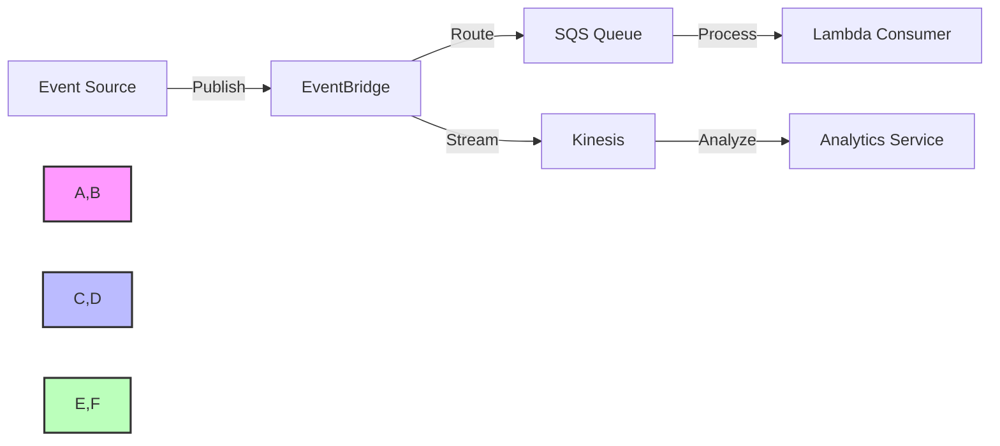

# System Architecture Diagram

```mermaid
graph TD
    subgraph "AWS Cloud"
        subgraph "Frontend Layer"
            A[React App] -->|HTTPS| B[Amplify Hosting]
        end
        
        subgraph "Application Layer"
            C[API Gateway] -->|HTTP| D[ALB]
            D -->|HTTP| E[Spring Boot Service 1]
            D -->|HTTP| F[Spring Boot Service 2]
            G[Spring Boot Service N]
        end
        
        subgraph "Data Layer"
            H[RDS PostgreSQL] -->|Database| I[Read Replica]
        end
        
        subgraph "Security & Monitoring"
            J[IAM Roles] -->|Access Control| K[Security Groups]
            L[CloudWatch] -->|Monitoring| M[X-Ray]
        end
        
        subgraph "CI/CD Pipeline"
            N[CodePipeline] -->|Build| O[CodeBuild]
            O -->|Deploy| P[ECS]
            O -->|Deploy| B
        end
    end

    %% Connections
    B -->|API Requests| C
    C -->|Load Balancing| D
    D -->|Service Discovery| E
    D -->|Service Discovery| F
    D -->|Service Discovery| G
    E -->|Database Operations| H
    F -->|Database Operations| H
    G -->|Database Operations| H
    H -->|Read Operations| I
    N -->|Source Code| O
    O -->|Container Images| P
    P -->|Service Updates| E
    P -->|Service Updates| F
    P -->|Service Updates| G
    
    %% Styling
    classDef default fill:#f9f,stroke:#333,stroke-width:2px;
    classDef aws fill:#333,stroke:#333,stroke-width:2px;
    classDef frontend fill:#f9f,stroke:#333,stroke-width:2px;
    classDef backend fill:#9f9,stroke:#333,stroke-width:2px;
    classDef database fill:#99f,stroke:#333,stroke-width:2px;
    classDef security fill:#f99,stroke:#333,stroke-width:2px;
    classDef pipeline fill:#9ff,stroke:#333,stroke-width:2px;
    
    class A,B frontend
    class C,D,E,F,G backend
    class H,I database
    class J,K,L,M security
    class N,O,P pipeline
```



## Architecture Components Breakdown

### Frontend Layer
- React application hosted on AWS Amplify
- Served via HTTPS
- Static assets cached using CloudFront
- Connected to backend via API Gateway

### Application Layer
- Multiple Spring Boot microservices
- Load balanced using Application Load Balancer (ALB)
- API Gateway for request routing
- Service discovery enabled
- Auto-scaling based on demand

### Data Layer
- PostgreSQL database on RDS
- Read replica for scaling reads
- Multi-AZ deployment for high availability
- Automated backups enabled

### Security & Monitoring
- IAM roles for access control
- Security groups for network isolation
- CloudWatch for monitoring and logging
- X-Ray for distributed tracing
- WAF for web application protection

### CI/CD Pipeline
- CodePipeline for automated deployments
- CodeBuild for building and testing
- ECS for container orchestration
- Automated testing and validation
- Rollback capabilities

## Data Flow

1. User requests reach React frontend via HTTPS
2. Frontend makes API calls to API Gateway
3. Requests are load balanced across microservices
4. Microservices communicate with PostgreSQL
5. Read operations use read replica
6. Logs and metrics are sent to CloudWatch
7. X-Ray traces request flow
8. Security groups enforce network isolation

## Security Boundaries

1. Public Internet → Amplify (HTTPS)
2. Amplify → API Gateway (VPC)
3. API Gateway → ALB (Private)
4. ALB → Microservices (Private)
5. Microservices → RDS (Private)

This architecture provides a scalable, secure, and maintainable deployment model for Spring Boot microservices with React frontend on AWS.

## Scalability Patterns

### Horizontal Scaling
- Auto-scaling groups for ECS tasks based on CPU/memory metrics
- Read replicas for PostgreSQL to scale read operations
- Connection pooling with PgBouncer for database connection management

### Vertical Scaling
- Instance type selection based on workload characteristics
- Memory optimization for JVM-based Spring Boot applications
- Database instance class selection based on workload analysis

## Resilience Patterns

### Circuit Breaker
- Implementation using Spring Cloud Circuit Breaker
- Fallback mechanisms for service failures
- Retry policies with exponential backoff

```java
@CircuitBreaker(name = "serviceA", fallbackMethod = "serviceFallback")
public String callServiceA() {
    return restTemplate.getForObject("/service-a/data", String.class);
}

public String serviceFallback(Exception e) {
    return "Fallback response due to: " + e.getMessage();
}
```

### Bulkhead Pattern
- Isolation of service dependencies
- Thread pool segregation for critical services
- Resource allocation based on service priority

## Data Management Strategy

### Data Partitioning
- Horizontal partitioning (sharding) for high-volume tables
- Vertical partitioning for specialized access patterns
- Time-based partitioning for historical data

### Caching Strategy
- Application-level caching with Spring Cache
- Distributed caching with Amazon ElastiCache
- Cache invalidation patterns and TTL policies

```java
@Cacheable(value = "products", key = "#id")
public Product getProductById(Long id) {
    return productRepository.findById(id)
        .orElseThrow(() -> new ProductNotFoundException(id));
}
```

## API Management Strategy

### API Versioning
- URI path versioning (/api/v1/resources)
- Header-based versioning (Accept-Version: v1)
- Content negotiation for backward compatibility

### API Documentation
- OpenAPI/Swagger integration
- API changelog maintenance
- Developer portal for API consumers

```java
@Configuration
@OpenAPIDefinition(
    info = @Info(
        title = "Microservices API",
        version = "1.0",
        description = "API for Spring Boot microservices"
    )
)
public class OpenApiConfig {
}
```

## Event-Driven Architecture Components

### Event Sources
- Database change data capture (CDC)
- User actions and system events
- Scheduled and time-based events

### Event Processing
- AWS EventBridge for event routing
- SQS for reliable message delivery
- Kinesis for real-time stream processing


